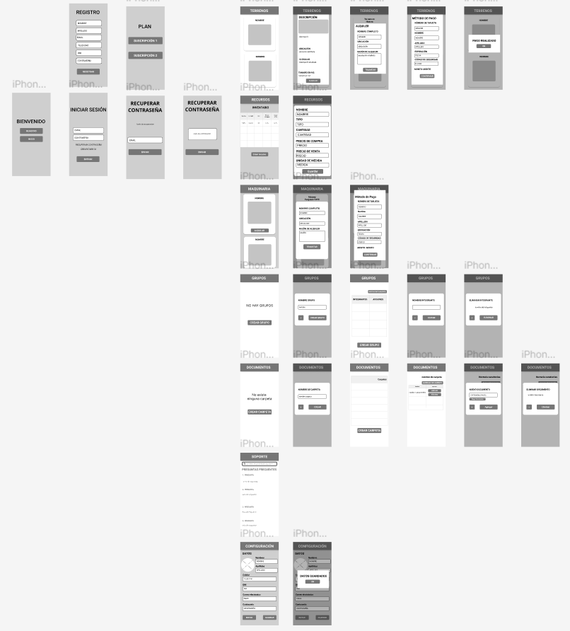

<div align="center">


**Carrera:** Ingeniería de Software

**Nombre del curso:** Aplicaciones Web

**Sección:** SW53

**Nombre del profesor:** Alex Humberto Sánchez Ponce

### Informe TB1

**Nombre del startup:** AgriSynth Group

**Nombre del producto:** CropSphere

**Mes y año:** Abril 2024

**Ciclo:** 2024-01


| Nombre de los Integrantes            |   Código    |
|--------------------------------------|-------------|
| Johan Karl Bottger Salazar           | U202210735  |
| Diego Rafael Cisneros Tafur          | U20221a715  |
| Miguel Ángel Huamán Cataño           | U202120615  |
| Mario Joaquin Lopez Acuña            | U202116250  |
| Marcelo Sebastian Neyra Santa Cruz   | U202217241  |
| Nestor Hernan Velarde Gonzales       | U20211c221  |

</div>

## Registro de Versiones del Informe

<table>
    <tr>
        <th>Versión</th>
        <th>Fecha</th>
        <th>Autor</th>
        <th>Descripción de modificación</th>
    </tr>
    <tr>
        <td>TB1</td>
        <td>03/09/2024</td>
        <td>
            <p> 
                Johan Karl Bottger Salazar <br>
                Diego Rafael Cisneros Tafur <br>
                Miguel Ángel Huamán Cataño <br>
                Mario Joaquin Lopez Acuña <br>
                Marcelo Sebastian Neyra Santa Cruz <br>
                Nestor Hernan Velarde Gonzales <br>
            </p>
        </td>
        <td>
            <p>
                Capítulo 1 <br>
                Capítulo 2 <br>
                Capítulo 3 <br>
                Capítulo 4 <br>
                Capítulo 5 <br>
            </p>
        </td>
    </tr>
</table>

## Project Report Collaboration Insights

**Enlace del Project Report: [Repositorio de Github](https://github.com/orgs/upc-pre-202402-si732-sw72-agrisynth/repositories)**

## Contenido
- [Capítulo I: Introducción](#cap1) 
	- [1.1. Startup Profile](#startup)
		- [1.1.1. Descripción de la Startup](#startup-descripcion)
		- [1.1.2. Perfiles de integrantes del equipo](#perfiles)
	- [1.2. Solution Profile](#solution-profile)
		- [1.2.1 Antecedentes y problemática](#antecedentes)
		- [1.2.2 Lean UX Process](#lean-ux-process)
			- [1.2.2.1. Lean UX Problem Statements](#problem-statements)
			- [1.2.2.2. Lean UX Assumptions](#assumptions)
			- [1.2.2.3. Lean UX Hypothesis Statements](#hypothesis)
			- [1.2.2.4. Lean UX Canvas](#lean-ux-canvas)
	- [1.3. Segmentos objetivos](#segmentos-objetivos)
- [Capítulo II: Requirements Elicitation & Analysis](#cap2)
	- [2.1. Competidores](#competidores)
		- [2.1.1. Análisis competitivo](#analisis-competitivo)
		- [2.1.2. Estrategias y tácticas frente a competidores](#estrategias-competidores)
	- [2.2. Entrevistas](#entrevistas)
		- [2.2.1. Diseño de entrevistas](#diseño-entrevistas)
		- [2.2.2. Registro de entrevistas](#registro-entrevistas)
		- [2.2.3. Análisis de entrevistas](#analisis-dentrevistas)
  - [2.3 Needfinding](#need-finding)
    - [2.3.1. User Personas](#user-personas)
    - [2.3.2. User Task Matrix](#user-task-matrix)
    - [2.3.3 User Journey Mapping](#user-journey-mapping)
    - [2.3.4. Empathy Mapping](#empathy-mapping)
    - [2.3.5 As-Is Scenario Mapping](#as-is)
- [Capítulo III: Requirements Specification](#cap3)
    - [3.1 To-be Scenario Mapping](#to-be)
    - [3.2 User Stories](#user-stories)
    - [3.3. Product Backlog](#product-backlog)
    - [3.4. Impact Mapping](#impact-mapping)
- [Capítulo IV: Product Design](#cap4)
    - [4.1. Style Guidelines](#style-guidelines)
        - [4.1.1. General Style Guidelines](#style-general)
        - [4.1.2. Web Style Guidelines](#style-web)
        - [4.1.3. Mobile Style Guidelines](#style-mobile)
            - [4.1.3.1. iOS Mobile Style Guidelines](#style-ios)
            - [4.1.3.2. Android Mobile Style Guidelines](#style-android)
    - [4.2. Information Architecture](#information-architecture)
        - [4.2.1. Organization Systems](#organization-systems)
        - [4.2.2. Labeling Systems](#labeling-systems)
        - [4.2.3. SEO Tags and Meta Tags](#tags)
        - [4.2.4. Searching Systems](#searching-systems)
        - [4.2.5. Navigation Systems](#navigation-systems)
    - [4.3. Landing Page UI Design](#landing-page-ui)
        - [4.3.1. Landing Page Wireframe](#landing-page-wireframe)
        - [4.3.2. Landing Page Mock-up](#landing-page-mockup)
    - [4.4. Mobile Applications UX/UI Design](#mobile-ui)
        - [4.4.1. Mobile Applications Wireframes](#mobile-wireframe)
        - [4.4.2. Mobile Applications Wireflow Diagrams](#mobile-wireflow)
        - [4.4.3. Mobile Applications Mock-ups](#mobile-mockup)
        - [4.4.4. Mobile Applications User Flow Diagrams](#mobile-userflow)
    - [4.5. Mobile Applications Prototyping](#mobile-prototype)
        - [4.5.1. Android Mobile Applications Prototyping](#android-prototype)
        - [4.5.2. iOS Mobile Applications Prototyping](#ios-prototype)
    - [4.6. Web Applications UX/UI Design](#web-ui)
        - [4.6.1. Web Applications Wireframes](#web-wireframe)
        - [4.6.2. Web Applications Wireflow Diagrams](#web-wireflow)
        - [4.6.3. Web Applications Mock-ups](#web-mockup)
        - [4.6.4. Web Applications User Flow Diagrams](#web-userflow)
    - [4.7. Web Applications Prototyping](#web-prototype)
    - [4.8. Domain-Driven Software Architecture](#c4)
        - [4.8.1. Software Architecture Context Diagram](#c4-context)
        - [4.8.2. Software Architecture Container Diagrams](#c4-container)
        - [4.8.3. Software Architecture Components Diagrams](#c4-components)
    - [4.9. Software Object-Oriented Design](#class)
        - [4.9.1. Class Diagrams](#class-diagram)
        - [4.9.2. Class Dictionary](#class-dictionary)
    - [4.10. Database Design](#database)
        - [4.10.1. Relational/Non-Relational Database Diagram](#database-diagram)
- [Capítulo V: Product Implementation](#cap5)
    - [5.1. Software Configuration Management](#software-configuration-management)
        - [5.1.1. Software Development Environment Configuration](#software-development)
        - [5.1.2. Source Code Management](#software-code-management)
        - [5.1.3. Source Code Style Guide & Conventions](#style-convetions)
        - [5.1.4. Software Deployment Configuration](#software-deployment)
    - [5.2. Product Implementation & Deployment](#product-deployment)
        - [5.2.1. Sprint Backlogs](#sprint-backlogs)
        - [5.2.2. Implemented Landing Page Evidence](#landing-page-deployment)
        - [5.2.3. Implemented Frontend-Web Application Evidence](#frontend-deployment)
        - [5.2.4. Implemented Native-Mobile Application Evidence](#mobile-deployment)
        - [5.2.5. Implemented RESTful API and/or Serverless Backend Evidence](#backend-deployment)
        - [5.2.6. RESTful API documentation](#api-documentation)
        - [5.2.7. Team Collaboration Insights](#team-insights)
    - [5.3. Video About-the-Product](#product-video)


# Student Outcome

<table>
    <tr>
        <th>Criterio Específico</th>
        <th>Acciones Realizadas</th>
        <th>Conclusiones</th>
    </tr>
    <tr>
        <td>
            <p>
                4.c.1 Reconoce responsabilidad ética y profesional en situaciones de ingeniería de software
            </p>
        </td>
        <td>
            <p>
                <strong>TB1</strong> <br>
                Johan Karl Bottger Salazar <br>
                Capitulo 1, 2 y 3<br>
                Diego Rafael Cisneros Tafur <br>
                Capitulo 2 y 3 <br>
                Miguel Ángel Huamán Cataño <br>
                Capitulo 2 y 4 <br>
                Mario Joaquin Lopez Acuña <br>
                Capitulo 4 y 5<br>
                Marcelo Sebastian Neyra Santa Cruz <br>
                Capitulo 4 y 5 <br>
                Nestor Hernan Velarde Gonzales <br>
                Capitulo 4 y 5 <br>
            </p>
        </td>
        <td>
            <p>
                <strong>TB1</strong> <br>
                En esta primera entrega, se ha reutilizado un trabajo realizado en el ciclo anterior por nuestro grupo de trabajo. Reconocemos que el uso de código de otras personas sin su permiso no es correcto éticamente, por lo que se le ha informado a aquellas personas que ya no participan en el grupo acerca del uso de las aplicaciones y reportes. Dichas personas aceptaron la prepuesta y nos otorgaron el permiso de utilizar el repositorio como base para las pruebas realizadas en este curso
            </p>
        </td>
    </tr>
    <tr>
        <td>
            <p>
                4.c.2 Emite juicios informados considerando el impacto de las soluciones de ingeniería de software en contextos globales, económicos, ambientales y sociales
            </p>
        </td>
        <td>
            <p>
                <strong>TB1</strong> <br>
                Johan Karl Bottger Salazar <br>
                Landing Page <br>
                Diego Rafael Cisneros Tafur <br>
                Aplicación Web (Frontend) <br>
                Miguel Ángel Huamán Cataño <br>
                Aplicación Web (Backend) <br>
                Mario Joaquin Lopez Acuña <br>
                Aplicación Web (Backend) <br>
                Marcelo Sebastian Neyra Santa Cruz <br>
                Aplicación Web (Frontend) <br>
                Nestor Hernan Velarde Gonzales <br>
                Aplicación Web (Frontend) <br>
            </p>
        </td>
        <td>
            <p>
                <strong>TB1</strong> <br>
                Se realizaron las aplicaciones web que se utilizarán durante todo el ciclo del curso. Estas aplicaciones fueron especialmente diseñadas para contrarrestar uno de los mayores problemas con las que los segmentos objetivos cuentan, falta de organización. Se espera que en las siguientes entregas se comprueben la validez de nuestras aplicaciones y qué tan efectivas realmente podrán ser en implementarlas
            </p>
        </td>
    </tr>
</table>

## <a name="cap1"></a> Capítulo I: Introducción
### <a name="startup"></a> 1.1. Startup Profile
#### <a name="startup-descripcion"></a> 1.1.1. Descripción de la Startup
AgriSynth Group emerge como una startup visionaria de Lima, Perú, fundada por estudiantes de la Universidad Peruana de Ciencias Aplicadas (UPC). Nuestro propósito es revolucionar la industria agrícola, aprovechando el poder de las soluciones de software para enfrentar los desafíos más persistentes que suceden en el campo. 

**¿Qué es AgriSynth Group?** Somos una incubadora de innovación tecnológica dedicada a la digitalización de la agricultura, con el objetivo de hacerla más eficiente, sostenible y rentable para todos los actores involucrados.

Nuestro enfoque reside en la intersección de la tecnología y la tierra. Creemos que el futuro de la agricultura depende de su capacidad para adaptarse, innovar y crecer mediante el uso de herramientas digitales. La clave de nuestro éxito es nuestra dedicación a comprender las necesidades reales del agricultor moderno, fusionándolas con soluciones software intuitivas y accesibles. Esto implica no solo mejorar los procesos agrícolas actuales, sino también anticipar las tendencias futuras del sector, asegurando que nuestros clientes siempre estén a la vanguardia.

Lo que hace única a nuestra startup es nuestro compromiso con el desarrollo sostenible. A través de nuestra tecnología, buscamos reducir el impacto ambiental de las prácticas agrícolas, mejorando, al mismo tiempo, su productividad y eficiencia. Nuestros proyectos se centran en soluciones que permiten a los agricultores gestionar mejor sus recursos, desde el agua hasta el suelo, y los insumos, con el fin de maximizar sus rendimientos mientras cuidan el planeta.

- **Mision:** Proveer soluciones innovadoras que transformen y mejoren la gestión agrícola, facilitando la transición hacia prácticas más eficientes y sostenibles.
- **Vision:** Consolidarnos como líderes en la innovación tecnológica agrícola, impulsando el progreso del sector hacia un futuro donde la tecnología y la sostenibilidad vayan de la mano para el beneficio de la comunidad global.

#### <a name="perfiles"></a> 1.1.2. Perfiles de integrantes del equipo

<table>
  <tr>
    <th colspan="2">Johan Karl Bottger Salazar</th>
  </tr>
  <tr>
    <td>  </td>
    <td> Soy Johan Bottger, estoy en mi sexto ciclo de la carrera Ingeniería de Software en la UPC. Tengo conocimientos en los lenguajes C++, Python, JavaScript y HTML. Tengo gran interés en las metodologías ágiles por lo que en un futuro quisiera dedicarme a su implementación. </td>
  </tr>
  <tr>
    <th colspan="2">Diego Rafael Cisneros Tafur</th>
  </tr>
  <tr>
    <td>  </td>
    <td> Soy estudiante de Ingeniería de Software en la Universidad Peruana de Ciencias Aplicadas (UPC), con dominio en lenguajes de programación como C++, Rust, Python, TypeScript y JavaScript. Poseo un sólido conocimiento en estructuras de datos, lo que me permite desarrollar soluciones eficientes y optimizadas. Además, tengo un interés particular en ciberseguridad y programación competitiva, áreas en las que continuamente busco mejorar mis habilidades y aplicar mis conocimientos para resolver desafíos complejos. </td>
  </tr>
  <tr>
    <th colspan="2">Miguel Ángel Huamán Cataño</th>
  </tr>
  <tr>
    <td>  </td>
    <td> Mi nombre es Miguel Ángel Huamán Cataño, tengo 20 años y soy estudiante de Ingeniería de Software. Soy una persona que disfruta trabajar con empeño para alcanzar mis objetivos, nunca me rindo a pesar de los momentos difíciles, y haré todo lo posible para seguir mejorando en este largo camino de ser un buen profesional. </td>
  </tr>
  <tr>
    <th colspan="2">Mario Joaquin Lopez Acuña</th>
  </tr>
  <tr>
    <td>  </td>
    <td> Mi nombre es Mario Joaquin Lopez Acuña, estoy cursando la carrera de Ingeniería de Software en la UPC. Estoy trabajando para convertirme en una persona que propone soluciones eficientes y resolver las diferentes adversidades que se van a presentar mediante avance en la carrera y en el futuro profesional.
 </td>
  </tr>
  <tr>
    <th colspan="2">Marcelo Sebastian Neyra Santa Cruz</th>
  </tr>
  <tr>
    <td>  </td>
    <td> Mi nombre es Marcelo Sebastian Neyra Santa Cruz, Actualmente estudio la carrera de ingeniería de software en la universidad de Ciencias Aplicadas – UPC. Entre mis habilidades, podemos destacar el buen uso de C++ y HTML. Me considero como una persona perseverante, trabajadora y amable. Mi sueño/meta es convertirme en un desarrollador de videojuegos en la empresa Nintendo </td>
  </tr>
  <tr>
    <th colspan="2">Nestor Hernan Velarde Gonzales</th>
  </tr>
  <tr>
    <td>  </td>
    <td> Mi nombre es Néstor Velarde, actualmente estudiante de la carrera de Ingeniería de Software de 6to ciclo en la UPC. Mi compromiso con mi grupo es mantener un ambiente colaborativo y trabajo en equipo. Me gusta aprender nuevas herramientas y tecnologías de desarrollo. Tengo experiencia desarrollando pequeños proyectos basados en sistemas de electrónica y sé programación en Python, C++, Arduino, Logo soft. </td>
  </tr>
</table>

### <a name="solution-profile"></a> 1.2. Solution Profile
CropSphere de AgriSynth es una solución integral de software que transforma la gestión agrícola mediante la optimización del uso de insumos y maquinaria, y la mejora en la comunicación y planificación de proyectos. Permite un control eficiente de inventarios y seguimiento de adquisiciones, asegurando la máxima eficacia en el uso de recursos y reduciendo desperdicios. Además, facilita la planificación y el mantenimiento de maquinaria agrícola, mejora la comunicación entre partes interesadas y ofrece análisis detallados para la toma de decisiones estratégicas en la siembra, cultivo y cosecha. Nuestro producto de software es clave para una agricultura más productiva y sostenible.

#### <a name="antecedentes"></a> 1.2.1 Antecedentes y problemática 
##### Antecedentes y problemática

###### Problemática:
En el sector agrícola, nos enfrentamos al desafío de gestionar recursos como semillas, fertilizantes y maquinaria de manera ineficiente. Esta situación se complica por la comunicación fragmentada entre los actores y la falta de análisis de datos para tomar decisiones adecuadas. Como resultado, hay un uso no óptimo de insumos, desperdicio y periodos de inactividad en maquinaria, afectando la productividad y sostenibilidad de las explotaciones agrícolas. La respuesta tardía a incidentes críticos y la planificación inadecuada de cultivos disminuyen la eficiencia y rentabilidad del sector.

###### Las “5W y 2H”

###### WHAT
- **¿Cuál es el problema?**
  La gestión ineficiente de recursos en la agricultura se manifiesta en el control inadecuado de insumos y maquinaria, así como en una comunicación inefectiva entre los actores del proceso agrícola y una deficiente planificación y seguimiento de cultivos.
- **¿Cuál es la relación con la persona en cuestión?**
  Los agricultores se ven afectados en su capacidad de optimizar productividad y sostenibilidad, conduciendo a un desperdicio de recursos, inactividad en maquinaria, y reacciones tardías a problemas del cultivo.

###### WHEN
- **¿Cuándo sucede el problema?**
  A lo largo del ciclo agrícola, desde la planificación hasta la cosecha, particularmente cuando se toman decisiones con información desactualizada o incompleta.
- **¿Cuándo utiliza el cliente el producto?**
  CropSphere se usa durante todo el ciclo de cultivo para la planificación, monitoreo, y toma de decisiones operativas y estratégicas en tiempo real.

###### WHERE
- **¿Dónde está el cliente cuando usa el producto?**
  El cliente puede estar en el campo o fuera de él y utiliza CropSphere gracias a su accesibilidad móvil y web.
- **¿A dónde se dirige?**
  Los agricultores avanzan hacia una agricultura más tecnificada y sostenible con decisiones basadas en datos precisos y actualizados.
- **¿Dónde surge el problema?**
  En el campo, donde la gestión ineficaz y la falta de datos precisos impactan la productividad y sostenibilidad.

###### WHO
- **¿Quiénes están involucrados?**
  Agricultores, técnicos agrónomos, gestores de fincas, y proveedores de insumos y maquinaria agrícola.
- **¿Quién lo utilizará?**
  CropSphere es para agricultores, gestores de fincas y equipos técnicos.
- **¿A quiénes les sucede el problema?**
  Afecta principalmente a agricultores y gestores que buscan optimizar operaciones pero enfrentan obstáculos en la gestión de recursos y comunicación.

###### WHY
- **¿Cuál es la causa del problema?**
  La ausencia de herramientas tecnológicas integradas que faciliten una gestión eficiente, comunicación efectiva y análisis de datos para decisiones informadas.

###### HOW
- **¿Cómo usan mi producto?**
  Los usuarios de CropSphere gestionan insumos, planifican la maquinaria, comunican con el equipo y analizan datos en un espacio integrado y accesible.
- **¿Cuál es la relación con la persona en cuestión?**
  Los agricultores enfrentan desafíos para optimizar productividad y sostenibilidad por la gestión ineficiente.

#### HOW MUCH
  Las estadísticas muestran que, aunque Perú importa una variedad de bienes, el azúcar ha mostrado un crecimiento significativo en las importaciones durante el año 2022. Concretamente, el azúcar experimentó un crecimiento del 185% en comparación con períodos anteriores, superando los $60 millones en importaciones, siendo Brasil el principal proveedor con una participación del 49%​​ (FAOSTAT,2022). 

A pesar de este incremento en las importaciones de azúcar, Perú no figura entre los 20 principales importadores mundiales de este producto. Esta situación destaca una oportunidad potencial para mejorar la eficiencia en la producción y gestión del azúcar dentro del país, lo cual podría beneficiarse significativamente del uso de tecnología en la optimización de los procesos de este sector. 

CropSphere, nuestro innovador producto de software, está específicamente diseñado para enfrentar los desafíos del sector agrícola en Perú, como la gestión ineficiente de recursos en la producción de caña de azúcar. Este software ofrece una solución integral que mejora la utilización de semillas, fertilizantes y maquinaria, facilita la comunicación eficaz entre los distintos actores del sector y proporciona análisis de datos precisos para la toma de decisiones en tiempo real. Al optimizar la planificación de cultivos y responder proactivamente a incidentes críticos, CropSphere incrementa significativamente la productividad y sostenibilidad de las explotaciones agrícolas, reduciendo el desperdicio y aumentando la rentabilidad. Así, con CropSphere, Perú no solo puede disminuir su dependencia de las importaciones de azúcar, sino también posicionarse como un competidor destacado en el mercado global de este producto.


#### <a name="lean-ux-process"></a> 1.2.2 Lean UX Process.
  ##### <a name="problem-statements"></a> 1.2.2.1. Lean UX Problem Statements.
  - **Problem Statement 1:** 
En nuestro contexto, se identifica una necesidad crucial por optimizar el uso de recursos en la agricultura. La correcta gestión de insumos como semillas, fertilizantes y pesticidas, junto con la eficiente planificación del uso de maquinaria agrícola, son aspectos fundamentales para incrementar la productividad y sostenibilidad de los cultivos.

Hemos detectado que la falta de herramientas integradas para una gestión eficaz de estos recursos conlleva a un uso ineficiente de los mismos, resultando en desperdicios significativos y un impacto negativo en la rentabilidad de las explotaciones agrícolas.

¿Cómo podemos mejorar la gestión de insumos y maquinaria agrícola para reducir desperdicios y aumentar la rentabilidad de las explotaciones agrícolas?

- **Problem Statement 2:**
En el mismo entorno, emerge otra problemática relacionada con la comunicación y la toma de decisiones basadas en datos precisos. La capacidad para reaccionar rápidamente ante incidentes que pueden afectar los cultivos, como plagas o enfermedades, depende de un flujo de información transparente y de análisis de datos agrícolas en tiempo real. 
Actualmente, la falta de plataformas que facilitan este intercambio de información y análisis de datos de manera efectiva limita la capacidad de respuesta de los agricultores, afectando la productividad y sostenibilidad de las explotaciones.
¿Cómo facilitamos un flujo de información más transparente y el análisis de datos agrícolas en tiempo real para mejorar la capacidad de respuesta ante incidentes en los cultivos?

  ##### <a name="assumptions"></a> 1.2.2.2. Lean UX Assumptions.
  ###### Supuestos en la Gestión de Proyectos
Los supuestos, o "assumptions" en inglés, desempeñan un papel crucial en la identificación de los riesgos del proyecto y en estimular la expresión de opiniones y la participación activa del equipo de trabajo.

###### User Outcomes

- **¿Quién es el usuario?**
  Agricultores y gestores de fincas agrícolas que buscan mejorar la eficiencia y sostenibilidad de sus operaciones.

- **¿Dónde encaja nuestro producto en su trabajo o vida?**
  Nuestro producto se integra en las operaciones diarias de la gestión agrícola, ofreciendo una solución para la planificación, ejecución, y análisis de actividades agrícolas.

- **¿Qué problemas tiene que resolver nuestro producto?**
  La ineficiencia en la gestión de recursos agrícolas, comunicación deficiente entre los involucrados, y la falta de datos precisos para la toma de decisiones.

- **¿Cuándo y cómo es nuestro producto usado?**
  Durante todo el ciclo de cultivo, desde la planificación hasta la cosecha, accesible vía web para permitir una gestión en tiempo real.

- **¿Cómo debe verse nuestro producto y cómo comportarse?**
  Con un diseño claro y amigable que facilite su uso en el campo, ofreciendo datos y análisis de forma comprensible y accionable, fomentando decisiones informadas.

###### Business Outcomes

- **Creo que mis clientes necesitan:**
  Una herramienta eficaz para optimizar la gestión de recursos en la agricultura, mejorando la rentabilidad y sostenibilidad de sus explotaciones.

- **Estas necesidades se pueden resolver con:**
  Una plataforma integral que ofrezca gestión de insumos y maquinaria, comunicación efectiva entre actores del proceso agrícola, y análisis de datos en tiempo real para la toma de decisiones.

- **Mis clientes iniciales son:**
  Agricultores, gestores de fincas agrícolas, y equipos técnicos en el sector agrícola.

- **El valor #1 que un cliente quiere de mi servicio es:**
  La optimización y eficiencia en la gestión de recursos agrícolas.

- **El cliente también puede obtener estos beneficios adicionales:**
  Mejor comunicación entre actores involucrados, respuesta rápida a incidentes críticos y acceso a análisis de datos para planificación futura.

- **Voy a adquirir la mayoría de mis clientes a través de:**
  Estrategias de marketing digital dirigidas al sector agrícola, ferias agrícolas, y colaboraciones con asociaciones agrícolas.

- **Haré dinero a través de:**
  Modelos de suscripción adaptados a las necesidades y tamaño de cada explotación agrícola.

- **Mi competencia principal en el mercado serán:**
  Otras aplicaciones de gestión agrícola y herramientas de análisis de datos.

- **Los venceremos debido a:**
  Nuestra integración única de gestión de recursos, comunicación efectiva, y análisis de datos en una sola plataforma.

- **Mi mayor riesgo de producto es:**
  La resistencia al cambio y la adopción de nuevas tecnologías por parte del sector agricultor.

- **Resolveremos esto a través de:**
  Demostraciones en el campo, casos de estudio de éxito, y capacitaciones que resalten los beneficios tangibles y el retorno de inversión al usar nuestra plataforma.


  ##### <a name="hypothesis"></a> 1.2.2.3. Lean UX Hypothesis Statements
	
- **Creemos** que al ofrecer una gestión integrada de insumos agrícolas en nuestra plataforma nos permitirá reducir el desperdicio de recursos y optimizar la producción. <br>**Sabremos** que hemos tenido éxito. <br> **Cuando** los agricultores reduzcan en un 20% el desperdicio de insumos y aumenten la productividad de sus cultivos.

- **Creemos** que al proporcionar un sistema de comunicación efectiva entre todos los actores involucrados en el proceso agrícola nos permitirá mejorar la coordinación y ejecución de las tareas agrícolas.<br> **Sabremos** que hemos tenido éxito<br>**Cuando** más del 80% de los usuarios reporten mejoras significativas en la coordinación de tareas y reducción de tiempos muertos.

- **Creemos** que al integrar análisis de datos y recomendaciones en tiempo real para la toma de decisiones nos permitirá a los agricultores reaccionar de manera proactiva ante condiciones adversas y oportunidades.<br>**Sabremos** que hemos tenido éxito<br>**Cuando** los agricultores logren incrementar sus rendimientos en un 15% gracias a la implementación de acciones basadas en análisis de datos.

- **Creemos** que al facilitar la planificación del alquiler y uso de maquinaria agrícola a través de nuestro producto nos permitirá maximizar la eficiencia y reducir costos operativos para los agricultores.<br>**Sabremos** que hemos tenido éxito<br>**Cuando** observemos una reducción del 25% en el tiempo muerto de maquinaria y un ahorro de costos operativos en más del 30% entre nuestros usuarios.

  ##### <a name="lean-ux-canvas"></a> 1.2.2.4. Lean UX Canvas.
  
<table><tr><th valign="top"><p><b>Business Problem</b> </p><p>El principal desafío que aborda nuestra startup es la ineficiencia en la gestión de recursos agrícolas, que resulta en desperdicio de insumos y una comunicación deficiente entre los actores del sector. Esto conduce a decisiones subóptimas, impactando negativamente la productividad y la sostenibilidad de las explotaciones agrícolas.</p></th><th rowspan="2" valign="top"><p><b>Solutions</b> </p><p>Desarrollaremos una plataforma que integre funcionalidades de gestión de insumos y maquinaria, un sistema de comunicación entre los involucrados en el proceso agrícola, y herramientas de análisis de datos que provean insights en tiempo real. Esta solución facilitará una planificación más precisa y una mejor respuesta a incidentes críticos.</p></th><th valign="top"><p><b>Business Outcomes</b>  </p><p>Nuestro objetivo es convertirnos en la herramienta preferida para la gestión agrícola, evidenciado por un aumento en la adopción de nuestra plataforma, mejora en la eficiencia operativa de nuestros usuarios, y una contribución positiva hacia la sostenibilidad ambiental. El éxito se medirá a través del crecimiento de usuarios activos, la reducción del desperdicio de recursos y el feedback positivo de la comunidad agrícola.</p></th></tr>
<tr><td valign="top"><p><b>Users</b> </p><p>Nuestros usuarios son agricultores, gestores de fincas agrícolas, y equipos técnicos, quienes buscan optimizar el uso de recursos como semillas, fertilizantes, y maquinaria, y mejorar la coordinación de sus actividades agrícolas. Están motivados por la necesidad de aumentar la eficiencia y rentabilidad de sus operaciones.</p></td><td valign="top"><p><b>Users Outcomes & Benefits</b> </p><p>Los usuarios se beneficiarán de un manejo más eficiente de sus recursos, lo que se traducirá en operaciones agrícolas más rentables y sostenibles. Tendrán acceso a una comunicación fluida y datos precisos para tomar decisiones informadas, mejorando su capacidad para responder a desafíos y aprovechar oportunidades.</p></td></tr>
<tr><td valign="top"><p><b>Hypothesis</b> </p><p>Creemos que al proporcionar una plataforma integrada que ofrezca gestión eficiente de insumos y maquinaria, comunicación efectiva y análisis de datos para la toma de decisiones, facilitaremos a los usuarios la optimización de sus operaciones. Esto les permitirá reducir desperdicios, mejorar la productividad y adoptar prácticas más sostenibles.</p></td><td valign="top"><p><b>What’s the most important thing we need to learn first?</b> </p><p>Lo más importante que necesitamos aprender es cómo nuestra solución puede adaptarse a las diversas necesidades de nuestros usuarios en términos de escala, tipo de cultivo y recursos disponibles. Esto es clave para asegurar la relevancia y usabilidad de nuestra plataforma en diferentes contextos agrícolas.</p></td><td valign="top"><p><b>What’s the least amount of work we need to do to learn the next most important thing?</b>  </p><p>Para avanzar, implementaremos una versión MVP de nuestra plataforma con funcionalidades básicas de gestión de insumos, comunicación y análisis de datos. Realizaremos pruebas piloto con un grupo selecto de usuarios para recoger sus experiencias, sugerencias y la eficacia de las herramientas ofrecidas en mejorar sus operaciones agrícolas.</p></td></tr>
</table>


### <a name="segmentos-objetivos"></a> 1.3. Segmentos objetivo
**Segmentos objetivo**
   Nuestro segmento objetivo está compuesto por dos tipos de usuarios:

- **Ingenieros Agrónomos que Asesoran a Agricultores**

  Ingenieros agrónomos y profesionales del sector agrícola se enfrentan al desafío de proporcionar asesoramiento basado en datos precisos y actualizados para mejorar los rendimientos y sostenibilidad de las explotaciones agrícolas que asesoran. Estos expertos buscan herramientas que les permitan recopilar, analizar y compartir información de manera eficiente con los agricultores. Nuestra solución ofrece una plataforma integrada que facilita la gestión de datos de cultivo, la planificación de recursos y la comunicación efectiva con sus clientes. Esto les permite ofrecer recomendaciones más precisas y fundamentadas, mejorando así las prácticas agrícolas y contribuyendo a una mayor productividad y sostenibilidad en el campo.

- **Empresas Agrícolas de Gran Escala** 

  Las empresas agrícolas de gran escala gestionan extensas áreas de cultivo y enfrentan el reto de maximizar la productividad mientras mantienen prácticas sostenibles. Estas corporaciones, que representan una parte significativa de la producción agrícola, buscan constantemente tecnologías avanzadas que optimicen sus operaciones y mejoren la toma de decisiones. Nuestra plataforma les ofrece análisis de datos en tiempo real, gestión eficiente de recursos y comunicación mejorada entre equipos, lo cual puede incrementar su eficiencia operativa y rentabilidad sustancialmente. Con nuestra solución, pueden esperar una reducción notable en desperdicios y una mejora en la gestión de insumos y maquinaria, apoyando así una agricultura más productiva y eco-amigable.


## <a name="cap2"></a> Capítulo II: Requirements Elicitation & Analysis
### <a name="competidores"></a> 2.1. Competidores
- FieldView: FieldView, de The Climate Corporation, es una plataforma líder en agricultura digital que ofrece una amplia gama de herramientas de análisis y visualización de datos para ayudar a los agricultores a optimizar sus operaciones. Permite a los usuarios recopilar datos detallados sobre sus cultivos en tiempo real, integrando información sobre el clima, la salud del suelo, y el rendimiento de los cultivos. Con su fuerte enfoque en la utilización de datos para mejorar la toma de decisiones agrícolas, FieldView ayuda a los agricultores a aumentar la eficiencia, reducir los costos de insumos y maximizar los rendimientos de sus cultivos.

- Granular: Granular es una de las soluciones de gestión agrícola más completas del mercado, diseñada para ayudar a los agricultores y a las empresas agrícolas a aumentar su rentabilidad y productividad. Ofrece funcionalidades como gestión de operaciones agrícolas, análisis financiero y de rendimiento, y planificación de cultivos. Granular destaca por su capacidad para proporcionar una vista integrada de la granja, permitiendo a los usuarios gestionar sus recursos de manera más efectiva, tomar decisiones basadas en datos y mejorar la sostenibilidad de sus prácticas agrícolas.
- AgriWebb: AgriWebb es una plataforma de gestión ganadera integral que transforma la manera en que los productores de ganado gestionan sus operaciones. A través de un enfoque sencillo pero poderoso, AgriWebb permite a los agricultores monitorear el rendimiento del ganado, gestionar inventarios, registrar actividades de manejo y analizar la salud financiera de sus explotaciones. Su tecnología de punta facilita la toma de decisiones estratégicas para mejorar la eficiencia operativa, optimizar el bienestar animal y aumentar la rentabilidad general de las explotaciones ganaderas.
#### <a name="analisis-competitivo"></a> 2.1.1. Análisis competitivo

  <table><tr><th colspan="6" valign="top"><b>Competitive Analysis Landscape</b></th></tr>
<tr><td rowspan="2" valign="top"><b>¿Por qué llevar a cabo este análisis?</b></td><td colspan="5" valign="top">¿De qué manera podríamos ser una opción preferencial para nuestro público objetivo en comparación a los competidores?</td></tr>
<tr><td colspan="5" valign="top">Para comparar las características tanto internas como externas de los productos que compiten con nosotros.</td></tr>
<tr><td colspan="2"></td><td valign="top">CropSphere</td><td valign="top">AgriWebb</td><td valign="top">Granular</td><td valign="top"><p>FieldView</p><p></p><p></p></td></tr>
<tr><td rowspan="2"><b>Perfil</b></td><td><b>Overview</b></td><td valign="top"><p>Plataforma innovadora que integra gestión de recursos, análisis de datos y comunicación para agricultura eficiente y sostenible.</p><p></p></td><td valign="top">Plataforma de gestión ganadera que mejora eficiencia operativa y rentabilidad.	</td><td valign="top">Solución integral de gestión agrícola para aumentar rentabilidad y productividad.	</td><td valign="top">Plataforma de agricultura digital que ofrece análisis y visualización de datos para la optimización de operaciones agrícolas.</td></tr>
<tr><td><b>Ventaja competitiva ¿Qué valor ofrece a los clientes?</b></td><td valign="top"><p>Integración de asesoramiento agronómico con tecnología avanzada para decisiones basadas en datos.</p><p></p></td><td valign="top">Especialización en gestión ganadera con enfoque en bienestar animal y rentabilidad.	</td><td valign="top">Visión integrada de la granja con análisis financiero y de rendimiento.</td><td valign="top">Uso intensivo de datos climáticos y del suelo para decisiones agrícolas.</td></tr>
<tr><td rowspan="2"><p><b>Perfil</b></p><p>` `<b>de Marketing</b></p></td><td><b>Mercado objetivo</b></td><td colspan="4" valign="top">Agricultores y empresas agrícolas de mediana a gran escala.</td></tr>
<tr><td><b>Estrategias de marketing</b></td><td valign="top">Enfoque en demostraciones en campo, talleres con ingenieros agrónomos y presencia en ferias agrícolas.</td><td valign="top">Redes sociales, colaboraciones con asociaciones ganaderas y ferias del sector.</td><td valign="top">Marketing digital, demostraciones de producto y casos de estudio.</td><td valign="top">Publicidad digital, asociaciones con empresas agrícolas y eventos del sector.</td></tr>
<tr><td rowspan="3"><b>Perfil de Producto</b></td><td><b>Productos & Servicios</b></td><td valign="top"><p>Gestión de recursos agrícolas, análisis de datos, comunicación efectiva entre actores del sector.</p><p></p></td><td valign="top"><p>Monitoreo de ganado, gestión de inventarios, análisis financiero.</p><p></p></td><td valign="top">Gestión de operaciones, análisis financiero, planificación de cultivos.</td><td valign="top">Herramientas de análisis de datos, visualización de cultivos, y gestión climática.</td></tr>
<tr><td><b>Precios & Costos</b></td><td valign="top">Modelo de suscripción flexible basado en la escala de operación y servicios requeridos.</td><td valign="top">Modelo de suscripción adaptable al tamaño de la explotación ganadera.</td><td valign="top">Suscripción con paquetes ajustados al tamaño de la explotación.</td><td valign="top">Basado en suscripción, con diferentes niveles según las características.</td></tr>
<tr><td><b>Canales de distribución (Web y/o Móvil)</b></td><td colspan="4" valign="top"><p></p><p>Únicamente cuentan con aplicación web</p></td></tr>
<tr><td rowspan="4"><b>Análisis SWOT</b></td><td><b>Fortalezas</b> </td><td valign="top">Integración de asesoramiento y tecnología. </td><td valign="top">Especialización en ganadería. </td><td valign="top">Integración de gestión financiera. </td><td valign="top">Uso de big data. </td></tr>
<tr><td><b>Debilidades</b> </td><td valign="top">Necesidad de alta personalización.</td><td valign="top">Menos aplicable a cultivos. </td><td valign="top">Complejidad para pequeñas explotaciones. </td><td valign="top">Enfoque limitado a cultivos. </td></tr>
<tr><td><b>Oportunidades</b> </td><td valign="top">Tecnología emergente en agricultura. </td><td valign="top"><p></p><p>Bienestar animal como tendencia. </p></td><td valign="top">Diversificación de servicios. </td><td valign="top">Expansión a mercados emergentes. </td></tr>
<tr><td><b>Amenazas</b></td><td valign="top">Resistencia al cambio en agricultores tradicionales.</td><td valign="top">Volatilidad de mercados ganaderos.</td><td valign="top">Competencia tecnológica.</td><td valign="top">Cambio climático.</td></tr>
</table>


#### <a name="estrategias-competidores"></a> 2.1.2. Estrategias y tácticas frente a competidores

- **Alianza Estratégicas con Institutos Agronómicos:** Formar alianzas con institutos y universidades agronómicas para co-desarrollar módulos educativos integrados en CropSphere, promoviendo su uso como herramienta educativa y práctica.
- **Programa de Embajadores de Innovación:** Crear un programa de embajadores con ingenieros agrónomos y líderes de opinión en el sector agrícola que promuevan CropSphere en sus comunidades y redes profesionales.
- **Integración de Funcionalidades de IA para Predicciones de Cultivos:** Desarrollar e integrar funcionalidades avanzadas de inteligencia artificial para proporcionar predicciones precisas sobre cultivos y condiciones del suelo, diferenciándonos por la capacidad predictiva.
- **Plataforma de Comunicación Colaborativa:** Lanzar una plataforma dentro de CropSphere que facilite la comunicación y colaboración directa entre agricultores y asesores, incluyendo foros y asesorías en vivo.
- **Experiencia de Usuario Personalizada:** Diseñar la interfaz y experiencia de usuario de CropSphere para ser altamente personalizable, asegurando que cada usuario pueda adaptar la plataforma a sus necesidades específicas de manera intuitiva.
	

### <a name="entrevistas"></a> 2.2. Entrevistas
En este punto presentaremos los resultados de las entrevistas realizadas a los usuarios objetivos
 #### <a name="diseño-entrevistas"></a> 2.2.1. Diseño de entrevistas<br><br>
 Para realizar los componentes elaboramos las preguntas para obtener información de nuestros segmentos objetivos mediante las entrevistas.
 ***Preguntas Generales:***
   1. ¿Cómo te llamas?
   1. ¿Qué edad tienes?
   1. ¿Cuál es tu profesión?
   1. ¿Cuáles son los principales desafíos que enfrenta en su gestión agrícola actualmente?
   1. ¿Qué tecnologías o soluciones digitales está utilizando actualmente para enfrentar estos desafíos?
   1. ¿Cómo evalúa la efectividad de las soluciones tecnológicas que ha implementado?
   1. ¿Qué características considera imprescindibles en una solución de software agrícola?
   1. ¿Cómo cree que la tecnología podría mejorar la sostenibilidad y la productividad en la agricultura?


 ***Preguntas específicas:***

**Segmento objetivo:** Ingenieros Agrónomos que Asesoran a Agricultores

1. ¿Cómo gestiona la comunicación y colaboración con  los agricultores que asesora?
1. ¿Existen barreras que dificultan el intercambio efectivo de información y recomendaciones?
1. ¿Cuáles son los principales obstáculos que encuentra para la adopción de nuevas tecnologías entre los agricultores a los que asesora?
1. ¿Cómo personalizar sus recomendaciones basadas en la tecnología para adaptarse a las diferentes necesidades de los agricultores?
1. ¿Cómo recopila y utiliza el feedback de los agricultores para mejorar sus servicios de asesoramiento?

**Segmento objetivo:**  Empresas Agrícolas de Gran Escala

1. ¿Cómo gestiona y analiza los datos agrícolas para tomar decisiones estratégicas?
1. ¿Qué tipo de datos le resultan más valiosos y por qué?
1. ¿Cómo asegura la eficiencia operativa a medida que escala sus operaciones agrícolas?
1. ¿Qué desafíos enfrenta al integrar nuevas tecnologías en sus operaciones a gran escala?
1. ¿De qué manera íntegra prácticas de sostenibilidad en sus operaciones y qué impacto han tenido?
1. ¿Cómo mide y comunica los resultados de sus esfuerzos de sostenibilidad a stakeholders internos y externos?

### <a name="registro-entrevistas"></a> 2.2.2 Registro de entrevistas
Link del video de las entrevistas: [Video de Entrevistas](link)

- **Segmento Objetivo: Ingenieros Agrónomos que asesoran a agricultores:**

  - **Entrevista 1:**
    Entrevistador: Marcelo Neyra
    Entrevistado: Giancarlo Stefano Romero Paredes
    Minutos del video: 
    Duración: 5:20 minutos
    Resumen de la entrevista: Giancarlo Romero, un ingeniero agrónomo practicante de la empresa “AgriCorp”, nos cuenta que uno de sus principales problemas es la variabilidad climática. Este problema, no solo le arruina sus cultivos, sino que también le complica la administración de estos. En cuanto a los dispositivos electrónicos que utiliza, menciona que hace uso de diversas aplicaciones de dispositivos móviles, al igual que un calendario. Giancarlo también menciona que los requerimientos más importantes de una aplicación para la gestión agrícola son que sea sencilla de utilizar, que cuente con todas las herramientas necesarias y que pueda ser utilizada sin una red Wi-Fi.

### <a name="analisis-entrevistas"></a> 2.2.3 Análisis de entrevistas

- **Segmento objetivo: Ingenieros Agrónomos que Asesoran a Agricultores**
  Los ingenieros agrónomos que asesoran a agricultores se enfrentan a desafíos como la variabilidad climática, la escasez de recursos y los altos costos de insumos, apostando por la sostenibilidad y la innovación tecnológica para mejorar la productividad agrícola. Estos profesionales valoran soluciones tecnológicas accesibles y fáciles de usar, capaces de funcionar en áreas con conectividad limitada, como apps, SMS, Excel y Notion, y enfatizan la importancia de mantener una comunicación efectiva y personalizada con los agricultores, superando barreras de señal y resistencia al cambio. A través de la personalización de recomendaciones y la recopilación de feedback, demuestran un compromiso con la mejora continua y la adaptación a los desafíos del sector, representando una visión integral que combina cuidado ambiental, eficiencia y avance tecnológico en la agricultura.


- **Segmento objetivo: Empresas Agrícolas de Gran Escala** 
  Las entrevistas revelan un panorama desafiante pero alentador en el ámbito de la gestión agrícola, donde se destacan problemas comunes como el control de plagas, la gestión de recursos y la necesidad de prácticas agrícolas sostenibles. A pesar de la diversidad en el uso de tecnología, desde herramientas básicas como Excel hasta sistemas avanzados de análisis de datos, la brecha tecnológica entre los agricultores sigue siendo un obstáculo significativo. La comunicación efectiva, tanto dentro de los equipos agrícolas como con los agricultores, emerge como un factor crucial para mejorar la eficiencia y la productividad en el campo. En este contexto, es evidente la necesidad de soluciones tecnológicas que sean accesibles, integrales y capaces de abordar los desafíos específicos de la agricultura moderna.


## <a name="need-finding"></a> 2.3. Needfinding
Con el propósito de desarrollar una app que satisfaga las necesidades particulares de los usuarios, AgriSynth Group llevará a cabo la identificación del User persona, User Task Matrix, User Journey Maps y Empathy Mapping.

### <a name="user-personas"></a> 2.3.1. User Personas

Para esta sección se han creado personajes ficticios, cada uno diseñado para representar a un segmento específico de usuarios. La información utilizada para desarrollar estos "User personas" proviene de entrevistas previas realizadas a cada segmento objetivo. Estas entrevistas tenían como objetivo comprender mejor a las personas a las que se dirige la aplicación. Se consideraron datos demográficos, metas, motivaciones, frustraciones, marcas relacionadas con el tema de la aplicación, canales digitales más utilizados, entre otros. La creación de esta sección se llevó a cabo utilizando la plataforma UXPressia.

- **Segmento objetivo: Ingenieros Agrónomos que Asesoran a Agricultores**


- **Segmento objetivo: Empresas Agrícolas de Gran Escala**


### <a name="user-task-matrix"></a> 2.3.2. User Task Matrix

En esta sección se presenta el user task matrix, herramienta centrada en los segmentos objetivos, que nos permitirá identificar las tareas y objetivos claves de los usuarios. Además, nos permitirá priorizar características y funcionalidades al momento de realizar el product backlog. Para la frecuencia se han considerado cinco opciones:nunca ,casi nunca, a veces, a menudo ,siempre; y para la importancia tres opciones: bajo, medio, alto".
En relación con la matriz de tareas de los usuarios, podemos identificar tanto las tareas de mayor frecuencia como las de mayor importancia, así como las diferencias y similitudes entre los diferentes tipos de usuarios.


<table><tr><th rowspan="2" valign="top"><b><i>User task Matrix</i></b></th><th colspan="2" valign="top"><b><i>Carlos Bustamante</i></b></th><th colspan="2" valign="top"><p><b><i>Juan Bernal</i></b> </p><p><b><i></i></b></p></th></tr>
<tr><td valign="top"><b><i>Frecuencia</i></b> </td><td valign="top"><b><i>Importancia</i></b></td><td valign="top"><b><i>Frecuencia</i></b> </td><td valign="top"><b><i>Importancia</i></b></td></tr>
<tr><td>Recopilar datos de cultivo</td><td><b><i>A menudo</i></b></td><td><b><i>Alta</i></b></td><td><b><i>Nunca</i></b></td><td><b><i>Medio</i></b></td></tr>
<tr><td>Analizar datos de cultivo</td><td><b><i>Siempre</i></b></td><td><b><i>Alta</i></b></td><td><b><i>Nunca</i></b></td><td><b><i>Baja</i></b></td></tr>
<tr><td>Compartir información con agricultores/ingenieros agrónomos/gerentes general de la empresa</td><td><b><i>Siempre</i></b></td><td><b><i>Medio</i></b></td><td><b><i>Nunca</i></b></td><td><b><i>Medio</i></b></td></tr>
<tr><td>Accesibilidad y permisos de trabajo</td><td><b><i>Siempre</i></b></td><td><b><i>Medio</i></b></td><td><b><i>Siempre</i></b></td><td><b><i>Alta</i></b></td></tr>
<tr><td>Optimización de operaciones</td><td><b><i>Siempre</i></b></td><td><b><i>Mdia</i></b></td><td><b><i>Nunca</i></b></td><td><b><i>Alta</i></b></td></tr>
<tr><td>Gestión de insumos y maquinaria	</td><td><b><i>Siempre</i></b></td><td><b><i>Alta</i></b></td><td><b><i>A veces</i></b></td><td><b><i>Alta</i></b></td></tr>
<tr><td>Alquiler y Compra de maquinaria</td><td><b><i>Siempre</i></b></td><td><b><i>Medio</i></b></td><td><b><i>A veces</i></b></td><td><b><i>Medio</i></b></td></tr>
<tr><td>Mejora en la toma de decisiones</td><td><b><i>Siempre</i></b></td><td><b><i>Baja</i></b></td><td><b><i>Casi nunca</i></b></td><td><b><i>Baja</i></b></td></tr>
<tr><td>Creación de grupos</td><td><b><i>A veces</i></b></td><td><b><i>Alta</i></b></td><td><b><i>Siempre</i></b></td><td><b><i>Baja</i></b></td></tr>
<tr><td>Detalles de datos estadísticos</td><td><b><i>Siempre</i></b></td><td><b><i>Alta</i></b></td><td><b><i>Siempre</i></b></td><td><b><i>Alta</i></b></td></tr>
</table>

**Para los Ingenieros Agrónomos que Asesoran a Agricultores, las tareas más frecuentes e importantes incluyen:**

- Analizar datos de cultivo: Esta tarea es esencial para proporcionar recomendaciones precisas a los agricultores y mejorar los rendimientos agrícolas.
- Gestión de insumos y maquinaria: La eficiente gestión de recursos es crucial para optimizar la producción agrícola y garantizar prácticas sostenibles.
- Detalles de datos estadísticos: La capacidad de acceder y comprender datos estadísticos específicos ayuda a los ingenieros agrónomos a tomar decisiones fundamentadas y mejorar sus servicios de asesoramiento.

**Por otro lado, para las Empresas Agrícolas de Gran Escala, dirigidas por gerentes generales, las tareas más frecuentes e importantes son:**

- Accesibilidad y permisos de trabajo: La garantía de que los empleados tengan acceso adecuado a la plataforma y los datos, con permisos bien definidos, es fundamental para mantener la seguridad y la eficiencia operativa.

- Detalles de datos estadísticos: Al igual que los ingenieros agrónomos, los gerentes generales valoran la capacidad de acceder a datos estadísticos detallados para respaldar la toma de decisiones estratégicas en la gestión de la empresa.

Es importante destacar que ambas categorías de usuarios comparten la necesidad de acceder a detalles específicos de datos estadísticos. Sin embargo, la gestión de insumos y maquinaria es una tarea más relevante para los ingenieros agrónomos, mientras que la accesibilidad y los permisos de trabajo son más críticos para los gerentes generales de las empresas agrícolas de gran escala. Estas diferencias reflejan las distintas responsabilidades y prioridades de cada grupo de usuarios dentro del contexto de la solución ofrecida.

### <a name="user-journey-mapping"></a> 2.3.3. User Journey Mapping


En esta sección, explicaremos en detalle los user journey mapping para dos tipos de usuarios distintos: los Ingenieros Agrónomos que Asesoran a Agricultores y las Empresas Agrícolas de Gran Escala. Estos mapas proporcionarán una visión exhaustiva de cómo cada segmento de usuario interactúa con la plataforma, desde su primer contacto hasta su uso continuo y el análisis de resultados. Mejoraremos la presentación de estos mapas, destacando las etapas clave y las necesidades específicas de cada usuario para garantizar una comprensión clara y concisa de su experiencia a lo largo de su viaje:

- Para los Ingenieros Agrónomos que Asesoran a Agricultores, el viaje comienza con el registro en la plataforma, seguido de la recopilación de datos de cultivo crucial para ofrecer asesoramiento informado a los agricultores. A través del análisis de datos y la comunicación efectiva, estos profesionales supervisan el progreso de las explotaciones agrícolas, adaptando sus estrategias según sea necesario para optimizar los resultados obtenidos.

- Para las Empresas Agrícolas de Gran Escala se embarcan en un viaje que abarca desde la identificación de necesidades hasta la implementación y el monitoreo continuo de una plataforma tecnológica. Desde el registro inicial hasta el seguimiento y evaluación de resultados, estas empresas utilizan herramientas avanzadas para mejorar la toma de decisiones, optimizar las operaciones y maximizar la rentabilidad en un entorno agrícola en constante cambio.

A lo largo de este recorrido, tanto los Ingenieros Agrónomos como las Empresas Agrícolas se enfrentan a desafíos y oportunidades únicas, pero comparten un objetivo común: utilizar la tecnología para mejorar la eficiencia, la productividad y la sostenibilidad en el sector agrícola.

- **Segmento: Ingenieros Agrónomos que Asesoran a Agricultores**


[**https://uxpressia.com/w/DeRZM/m/5td8l](https://uxpressia.com/w/DeRZM/m/5td8l)** 

- **Segmento: Empresas Agrícolas de Gran Escala**


[**https://uxpressia.com/w/DeRZM/m/vNTpp](https://uxpressia.com/w/DeRZM/m/vNTpp)** 


### <a name="empathy-mapping"></a> 2.3.4. Empathy Mapping

En esta sección se aborda el Empathy Mapping, una herramienta esencial para elaborar perfiles detallados de los user personas y profundizar en la comprensión de su perspectiva y experiencia. Cada user persona se analiza a través de cinco elementos cruciales: lo que el usuario ve, escucha,dice, hace y siente. Además, se identifican los problemas (pains) y beneficios (gains) de acuerdo con una serie de preguntas estratégicas:¿Qué preocupaciones o desafíos enfrenta el usuario en su trabajo diario?¿Qué mejoras o soluciones podrían resolver los problemas identificados?¿Qué argumentos podrían persuadir al usuario de que nuestra solución es la mejor opción para satisfacer sus necesidades profesionales?

*Segmento objetivo: Ingenieros Agrónomos que Asesoran a Agricultores*


[**https://uxpressia.com/w/DeRZM/p/oj8l0](https://uxpressia.com/w/DeRZM/p/oj8l0)** 


*Segmento objetivo: Empresas Agrícolas de Gran Escala*


[**https://uxpressia.com/w/DeRZM/p/C8egI](https://uxpressia.com/w/DeRZM/p/C8egI)** 

### <a name="as-is"></a> 2.3.5. As-is Scenario Mapping
En esta sección, se expondrá el As-is Scenario Mapping para cada uno de los segmentos objetivo, con el propósito de identificar y comprender los puntos de interacción entre los usuarios y el software de gestión agrícola. Este proceso implica la preparación, la generación de ideas de manera individual, la revisión y la identificación de las fases relevantes como columnas en la herramienta designada. Además, se nombrarán estas fases y se etiquetarán las áreas tanto positivas como negativas para los usuarios, identificando también las áreas de conocimiento aún por explorar.

*As-is Scenario mapping: Ingenieros Agrónomos que Asesoran a Agricultores*


*As-is Scenario mapping: Empresas Agrícolas de Gran Escala* 


<https://miro.com/welcomeonboard/dDdyWmRYWjB0MHM0dk1GbFQxU3RVdHY2aUpyV2xFSzlzWUtHcGtuOE02bWFSNVRJRXU5aTFsZnVmekdQRWd1dHwzNDU4NzY0NTUxNzYxNjYxMjg2fDI=?share_link_id=176300122658> 

# <a name="cap3"></a> CAPÍTULO III: REQUIREMENTS SPECIFICATION

## <a name="to-be"></a>  3.1. To-Be Scenario Maping

En esta sección, se presentan los To-be Scenario Mapping para ambos segmentos objetivos, donde se establece la visión de la experiencia de usuario ideal al resolver los puntos de dolor y necesidades identificados en los As-is Scenario Mapping previos. Este proceso implica la elaboración de una visión optimizada de las interacciones entre los usuarios y el software de gestión agrícola, enfocándose en la mejora continua y la satisfacción del usuario.

**To-be Scenario mapping: Ingenieros Agrónomos que Asesoran a Agricultores**


**To-be Scenario mapping: Empresas Agrícolas de Gran Escala** 


<https://miro.com/welcomeonboard/dDdyWmRYWjB0MHM0dk1GbFQxU3RVdHY2aUpyV2xFSzlzWUtHcGtuOE02bWFSNVRJRXU5aTFsZnVmekdQRWd1dHwzNDU4NzY0NTUxNzYxNjYxMjg2fDI=?share_link_id=176300122658> 

## <a name="user-stories"></a> 3.2. User Stories

Para definir la dificultad de cada User Story, hemos decidido utilizar la escala Fibonacci (1;2;3;5;8)

|<a name="_hlk163383929"></a>**Epic / Story ID**|**Título**|**Descripción**|**Criterios de Aceptación**|**Relacionado con (EPIC ID)**|
| - | - | - | - | - |
|<p>**Epic 1**</p><p>Como usuario, quiero poder registrarme e iniciar sesión para acceder a todas las funcionalidades que me ofrece la aplicación</p>|||||
|EP1 / US01|Registro de un nuevo usuario|<p>Como usuario nuevo</p><p></p><p>Quiero poder registrarme en la aplicación </p><p></p><p>Para acceder a todas las funcionalidades que ofrece la aplicación</p>|<p>**Escenario 1: Entrada al entorno “Registro de usuario”**</p><p>Dado que el usuario es nuevo</p><p>Y se encuentra en el entorno “Inicio Sesión”</p><p>Cuando el usuario presione en el botón “Crear cuenta”</p><p>Entonces se le redirige al usuario al entorno “Registro de usuario”</p><p></p><p>**Escenario 2: Registro de usuario exitoso**</p><p>Dado que el usuario se encuentra en el entorno “Registro de Usuario”</p><p>Cuando el usuario ingrese sus datos personales correctamente</p><p>Entonces se muestra un mensaje de confirmación, indicando la creación de la cuenta</p><p>Y se redirige al usuario a la pantalla de “Inicio Sesión”</p><p></p><p>**Escenario 3: Registro con correo electrónico ya registrado**</p><p>Dado que el usuario se encuentra en el entorno “Registro de Usuario”</p><p>Cuando el usuario ingresa sus datos personales correctamente</p><p>Y la dirección de correo electrónico ingresada ya está registrada en el sistema</p><p>Entonces se muestra un mensaje de error, indicando que el correo electrónico ya está registrado</p><p></p><p>**Escenario 4: Registro con datos incompletos**</p><p>Dado que el usuario se encuentra en el entorno “Registro de Usuario”</p><p>Cuando el usuario intente registrar una cuenta sin proporcionar todos sus datos personales</p><p>Entonces se muestra un mensaje de error, indicando que se deben llenar todos los campos</p><p></p><p>**Escenario 5: Registro con un nombre de usuario prohibido**</p><p>Dado que el usuario se encuentra en el entorno “Registro de Usuario”</p><p>Cuando el usuario intente registrar una cuenta con un nombre de usuario prohibido</p><p>Entonces se muestra un mensaje de error, indicando que el nombre de usuario no está disponible</p><p></p><p>**Escenario 6: Registro con una edad inválida**</p><p>Dado que el usuario se encuentra en el entorno “Registro de Usuario”</p><p>Cuando el usuario intente registrar una cuenta con una edad inválida</p><p>Entonces se muestra un mensaje de error, indicando que la edad es inválida</p><p></p><p>**Escenario 7: Registro con una contraseña débil**</p><p>Dado que el usuario se encuentra en el entorno “Registro de Usuario”</p><p>Cuando el usuario intente registrar una cuenta con una contraseña muy débil</p><p>Entonces se muestra un mensaje de error, indicando que la contraseña no puede utilizarse</p>|1|
|EP1 / US02|Acceso de usuarios|<p>Como usuario con una cuenta existente</p><p></p><p>Quiero poder iniciar sesión en la aplicación </p><p></p><p>Para acceder a mi cuenta dentro de la aplicación</p>|<p>**Escenario 1: Inicio de sesión exitoso**</p><p>Dado que el usuario se encuentra en el entorno “Inicio sesión”</p><p>Cuando el usuario ingrese su dirección de correo electrónico y contraseña válidos</p><p>Entonces se redirige al usuario a la página principal de la aplicación</p><p></p><p>**Escenario 2: Inicio de sesión con correo electrónico inválido**</p><p>Dado que el usuario se encuentra en el entorno “Inicio sesión”</p><p>Cuando el usuario ingrese su dirección de correo electrónico y contraseña</p><p>Y la dirección de correo electrónico no esté guardada en el servidor</p><p>Entonces se muestra un mensaje de error, indicando que el correo electrónico o la contraseña es incorrecta</p><p></p><p>**Escenario 3: Inicio de sesión con contraseña incorrecta**</p><p>Dado que el usuario se encuentra en el entorno “Inicio sesión”</p><p>Cuando el usuario ingrese su dirección de correo electrónico</p><p>Y el usuario ingrese una contraseña incorrecta</p><p>Entonces se muestra un mensaje de error</p><p></p><p>**Escenario 4: Inicio de sesión con datos incompletos**</p><p>Dado que el usuario se encuentra en el entorno “Inicio sesión”</p><p>Cuando el usuario presione el botón “Ingresar” sin haber proporcionado una contraseña o dirección de correo electrónico</p><p>Entonces se muestra un mensaje de error, indicando que debe ingresar todos los datos para ingresar</p>|1|
|EP1 / US03|Recuperación de Contraseña|<p>Como usuario</p><p>Quiero poder restablecer mi contraseña</p><p>Para poder ingresar nuevamente a mi cuenta</p>|<p>**Escenario 1: Ingreso al entorno “Recuperar Contraseña”**</p><p>Dado que el usuario se encuentra en la página “Inicio sesión”</p><p>Cuando el usuario dé clic en "Olvidé mi contraseña"</p><p>Entonces se redirige al usuario al entorno “Recuperar Contraseña”</p><p></p><p>**Escenario 2: Recuperación con dirección de correo electrónico válido**</p><p>Dado que el usuario se encuentra en el entorno “Recuperar Contraseña”</p><p>Cuando el usuario escriba una dirección de correo electrónico registrada en el sistema</p><p>Entonces se muestra el entorno “Nueva Contraseña”</p><p></p><p>**Escenario 3: Recuperación con dirección de correo electrónico inválido**</p><p>Dado que el usuario se encuentra en el entorno “Recuperar Contraseña”</p><p>Cuando el usuario proporcione una dirección de correo electrónico que no se encuentra actualmente registrada en el sistema</p><p>Entonces se muestra un mensaje de error, indicando que la dirección de correo electrónico no está registrada en el sistema</p><p></p><p>**Escenario 4: Restablecimiento de contraseña exitoso** </p><p>Dado que el usuario se encuentra en la página “Nueva Contraseña”</p><p>Cuando el usuario ingresa una nueva contraseña</p><p>Entonces se muestra un mensaje de confirmación, indicando que la contraseña se ha restablecido correctamente</p><p>Y se redirige al usuario a la página “Inicio Sesión”</p><p></p><p>**Escenario 5: Restablecimiento de contraseña con la misma contraseña que la original**</p><p>Dado que el usuario se encuentra en la página “Recuperar Contraseña”</p><p>Cuando el usuario ingresa una contraseña igual a la que actualmente está utilizando</p><p>Entonces se muestra un mensaje de error, indicando que no puede cambiarse a la misma contraseña que está actualmente en uso</p><p></p><p>**Escenario 6: Restablecimiento de contraseña sin proporcionar una contraseña**</p><p>Dado que el usuario se encuentra en el entorno “Nueva contraseña”</p><p>Cuando el usuario presiona el botón “Confirmar” sin haber ingresado una contraseña</p><p>Entonces se muestra un mensaje de error, indicando que debe ingresar una nueva contraseña</p>|1|
|<p>**Epic 2**</p><p>Como usuario, quiero poder crear recursos de trabajo para conocer siempre los recursos que se están utilizando</p>|||||
|EP2 / US01|Creación de un recurso|<p>Como usuario</p><p></p><p>Quiero poder crear entornos de los recursos que tengo</p><p></p><p>Para conocer a los detalles de cada uno de ellos</p>|<p>**Escenario 1: Ingreso al entorno “Crear Recurso”**</p><p>Dado que el usuario se encuentra en el entorno “Recursos”</p><p>Cuando el usuario presione el botón “Crear Nuevo Recurso”</p><p>Entonces se redirige al usuario al entorno “Crear Recurso”</p><p></p><p>**Escenario 2: Creación de recurso exitosa**</p><p>Dado que el usuario se encuentra en el entorno “Crear recurso”</p><p>Cuando el usuario ingrese todos los detalles obligatorios del recurso</p><p>Y el usuario llene opcionalmente la descripción del recurso</p><p>Y da clic en “Crear Recurso”</p><p>Entonces el recurso creado aparecerá en el entorno “Recursos”</p><p>Y se muestra un mensaje de confirmación, indicando que el recurso se creó satisfactoriamente</p><p></p><p>**Escenario 3: Creación de recurso con nombre inválido**</p><p>Dado que el usuario se encuentra en el entorno “Crear recurso”</p><p>Cuando el usuario ingrese un nombre inválido para el recurso</p><p>Y ingrese todos los detalles obligatorios</p><p>Y da clic en “Crear Recurso”</p><p>Entonces el recurso creado aparecerá un mensaje de error, indicando que el recurso no puede tener un nombre inválido</p><p></p><p>**Escenario 4: Creación de recurso con nombre duplicado**</p><p>Dado que el usuario se encuentra en el entorno “Crear recurso”</p><p>Cuando el usuario ingrese un nombre que es igual a otro recurso ya registrado</p><p>Y ingrese todos los detalles obligatorios</p><p>Y da clic en “Crear Recurso”</p><p>Entonces el recurso creado aparecerá un mensaje de error, indicando que ya hay otro recurso con el mismo nombre</p><p></p><p>**Escenario 5: Creación de recurso sin llenar todos los campos obligatorios**</p><p>Dado que el usuario se encuentra en el entorno “Crear recurso”</p><p>Cuando el usuario intente crear un recurso sin especificar todos los campos obligatorios</p><p>Y da clic en “Crear Recurso”</p><p>Entonces se muestra un mensaje de error, indicando que no se han llenado todos los campos obligatorios</p><p></p><p>**Escenario 6: Creación de recurso con una cantidad, precio de venta o precio de compra inválido**</p><p>Dado que el usuario se encuentra en el entorno “Crear recurso”</p><p>Cuando el usuario intente crear un recurso con una cantidad, precio de venta o precio de compra inválido</p><p>Entonces se muestra un mensaje de error, indicando el valor es inválido</p><p></p>|2|
|EP2 / US02|Creación de un ícono para un recurso|<p>Como usuario</p><p></p><p>Quiero poder crear un ícono para un recurso</p><p></p><p>Para no tener la necesidad de contar con una imagen para crear un recurso</p>|<p>**Escenario 1: Creación de recurso con un ícono**</p><p>Dado que el usuario se encuentra en el entorno “Crear recurso”</p><p>Cuando el usuario seleccione “Utilizar Ícono”</p><p>Entonces se aparece la ventana “Íconos”</p><p></p><p>**Escenario 2: Elección de un ícono para el recurso**</p><p>Dado que el usuario se encuentra en la ventana “Íconos”</p><p>Cuando el usuario seleccione uno de los íconos predeterminados</p><p>Entonces el ícono elegido sustituirá a la imagen referencial del recurso elegido</p><p></p>|2|
|EP2 / US03|Creación de un gráfico para un recurso|<p>Como usuario</p><p></p><p>Quiero poder visualizar gráficos de los recursos</p><p></p><p>Para conocer con mayor claridad la importancia del recurso</p>|<p>**Escenario 1: Elección sobre generación de gráfica**</p><p>Dado que el usuario se encuentra en el entorno “Crear Recurso”</p><p>Cuando el usuario presione el botón “¿Generar Gráfica?” del detalle adicional agregado</p><p>Entonces intercambiará entre “Sí” y “No”, según la opción actual del botón</p><p></p><p>**Escenario 2: Tipo de gráfica del recurso**</p><p>Dado que el usuario ha presionado el botón “¿Generar Gráfica?” </p><p>Y actualmente el botón está en el estado “sí”</p><p>Cuando el usuario seleccione los tipos de gráficas disponibles a utilizar</p><p>Entonces las gráficas seleccionadas serán utilizadas cuando se cree el recurso</p>|2|
|<p>**Epic 3**</p><p>Como usuario, quiero editar el estado de un recurso para que su información esté al día</p>|||||
|EP3 / US01|Edición de un recurso|<p>Como usuario</p><p></p><p>Quiero poder editar un recurso ya hecho </p><p></p><p>Para actualizar los datos a los actuales</p>|<p>**Escenario 1: Cambio de detalles**</p><p>Dado que el usuario se encuentra en el entorno “Recursos”</p><p>Cuando el usuario seleccione y cambie uno de los detalles del recurso</p><p>Entonces los cambios realizados se guardarán</p><p></p><p>**Escenario 2: Cambio a un valor inválido**</p><p>Dado que el usuario se encuentra en el entorno “Recursos”</p><p>Cuando el usuario seleccione a alguno de los campos de cualquier recurso</p><p>Y cambie el valor a uno inválido</p><p>Entonces se muestra un mensaje de error, indicando que no se puede cambiar el valor a un número inválido</p>|3|
|EP3 / US02|Borrado de recurso|<p>Como usuario</p><p></p><p>Quiero poder borrar un recurso </p><p></p><p>Para indicar que ya no se está utilizando dicho recurso</p>|<p>**Escenario 1: Ingreso al entorno “Borrar Recurso”**</p><p>Dado que el usuario se encuentra en el entorno “Recursos”</p><p>Cuando el usuario de clic en un recurso ya creado</p><p>Y presione el botón “Borrar un Recurso”</p><p>Entonces aparece la ventana “Borrar un Recurso”</p><p></p><p>**Escenario 2: Borrar Recurso**</p><p>Dado que el usuario se encuentra en el entorno “Borrar un recurso”</p><p>Cuando el usuario presione el botón “Eliminar Definitivamente”</p><p>Entonces el recurso seleccionado es borrado</p><p></p><p>**Escenario 3: Borrar todos los Recursos**</p><p>Dado que el usuario se encuentra en el entorno “Recursos”</p><p>Cuando el usuario presione el botón “Eliminar todos los recursos”</p><p>Entonces se muestra un mensaje, indicando que la eliminación de recursos es definitiva y no puede ser deshecha</p><p></p><p>**Escenario 4: Confirmación de Borrado**</p><p>Dado que el usuario se encuentra en el mensaje de borrado definitivo</p><p>Cuando el usuario presione el botón “Eliminar de todos modos”</p><p>Entonces se muestra un mensaje de confirmación, indicando que todos los recursos fueron eliminados</p>|3|
|<p>**Epic 4**</p><p>Como usuario, quiero poder alquilar y comprar terrenos y maquinarias desde la aplicación para facilitar y acelerar el proceso</p>|||||
|EP4 / US01|Visualizar detalles de Maquinaria|<p>Como usuario</p><p></p><p>Quiero visualizar los detalles de las maquinarias</p><p></p><p>Para conocer si es que vale la pena adquirirlas mediante un alquiler o compra</p>|<p>**Escenario 1: Ingreso al entorno “Maquinaria”**</p><p>Dado que el usuario se encuentra en la página principal</p><p>Cuando el usuario de clic en “Maquinaria”</p><p>Entonces se redirige al usuario al entorno “Maquinarias”</p><p></p><p>**Escenario 2: Elección de maquinaria con el buscador**</p><p>Dado que el usuario se encuentra en el entorno “Maquinaria”</p><p>Cuando el usuario escriba en el buscador</p><p>Y dé clic en “Buscar”</p><p>Entonces aparecerán todas las maquinarias que coincidan con lo escrito</p><p></p><p>**Escenario 3: Detalles de Maquinaria**</p><p>Dado que el usuario se encuentra en el entorno “Maquinaria”</p><p>Cuando el usuario seleccione una maquinaria</p><p>Entonces aparecerán la ventana “Detalles de Maquinaria”, indicando todos los detalles importantes de la maquinaria en cuestión</p>|4|
|EP4 / US02|Visualizar detalles de Terrenos|<p>Como usuario</p><p></p><p>Quiero visualizar los detalles de los terrenos</p><p></p><p>Para conocer si es que vale la pena adquirirlos mediante un alquiler o compra</p>|<p>**Escenario 1: Ingreso al entorno “Terreno”**</p><p>Dado que el usuario se encuentra en la página principal</p><p>Cuando el usuario de clic en “Terrenos”</p><p>Entonces se redirige al usuario al entorno “Terrenos”</p><p></p><p>**Escenario 2: Elección de maquinaria con el buscador**</p><p>Dado que el usuario se encuentra en el entorno “Terrenos”</p><p>Cuando el usuario escriba en el buscador</p><p>Y dé clic en “Buscar”</p><p>Entonces aparecerán todos los terrenos que coincidan con lo escrito</p><p></p><p>**Escenario 3: Detalles de Terreno**</p><p>Dado que el usuario se encuentra en el entorno “Maquinaria”</p><p>Cuando el usuario seleccione una maquinaria</p><p>Entonces aparecerán la ventana “Detalles de Terreno”, indicando todos los detalles importantes de la maquinaria en cuestión</p>|4|
|EP4 / US03|Alquiler y Compra de Maquinaria o Terreno|<p>Como usuario</p><p></p><p>Quiero poder realizar los trámites necesarios para la compra o alquiler de maquinarias o terrenos a través de la página web</p><p></p><p>Para poder pagar desde cualquier parte del mundo</p>|<p>**Escenario 1: Ingreso al entorno “Trámite”**</p><p>Dado que el usuario se encuentra en el entorno “Detalles de Terreno” o “Detalles de Maquinaria”</p><p>Cuando el usuario haga clic en “Alquilar” o en “Comprar”</p><p>Entonces aparecerán la ventana “Trámite”</p><p></p><p>**Escenario 2: Inicio de Trámite**</p><p>Dado que el usuario se encuentra en el entorno “Trámite”</p><p>Cuando el usuario llene todos los campos</p><p>Y el usuario seleccione el botón “Iniciar Trámite”</p><p>Entonces aparecerá la ventana “Método de Pago”, indicando el procedimiento de pago para el trámite</p><p></p><p>**Escenario 3: Método de Pago**</p><p>Dado que el usuario se encuentra en la ventana “Método de pago”</p><p>Y el usuario ha completado todos los campos obligatorios de la ventana</p><p>Cuando el usuario dé clic en “Confirmar”</p><p>Entonces se mostrará un mensaje de confirmación, indicando que el trámite se ha completado satisfactoriamente</p>||
|<p>**Epic 5**</p><p>Como usuario, quiero visualizar gráficos estadísticos de los recursos, maquinarias y terrenos para conocer la variación de precios en el tiempo de estos</p>|||||
|EP05 / US01|Visualización de Estadísticas de Recursos|<p>Como usuario</p><p></p><p>Quiero poder las estadísticas básicas de todos mis recursos </p><p></p><p>Para conocer la viabilidad de negocio del recurso</p>|<p>**Escenario 1: Ingreso al entorno “Estadísticas”**</p><p>Dado que el usuario se encuentra en la página principal</p><p>Cuando el usuario dé clic en “Estadísticas”</p><p>Entonces se redirige al usuario al entorno “Estadísticas”</p><p></p><p>**Escenario 2: Ingreso al entorno “Estadísticas de recurso”**</p><p>Dado que el usuario se encuentra en el entorno “Estadísticas”</p><p>Cuando el usuario dé clic en el recurso que quiera ver sus estadísticas</p><p>Entonces se redirige al usuario al entorno “Estadísticas de recurso”</p><p></p><p>**Escenario 3: Estadísticas sobre el precio de venta o compra**</p><p>Dado que el usuario se encuentra en “Estadísticas de recurso”</p><p>Cuando el usuario dé clic en “Precio de Venta” o “Precio de Compra”</p><p>Entonces aparecerá un gráfico lineal, indicando cómo ha ido cambiado el precio solicitado en el tiempo</p><p></p><p>**Escenario 4: Comparación de precios de compra y venta**</p><p>Dado que el usuario se encuentra en “Estadísticas de recurso”</p><p>Cuando el usuario dé clic en “Comparación de Precios de Compra y Venta”</p><p>Entonces aparecerá un gráfico lineal, indicando cómo ha ido cambiado el precio de compra y venta en el tiempo</p><p></p><p>**Escenario 5: Comparación con otras estadísticas**</p><p>Dado que el usuario se encuentra en “Estadísticas de recurso”</p><p>Cuando el usuario dé clic en “Comparación con…”</p><p>Entonces aparecerá un menú de opciones con las opciones “Cantidad” y los detalles adicionales que fueron marcados para aparecer en gráficos estadísticos</p>|5|
|EP5 / US02|Comparación de Precios de Terrenos y Maquinaria|<p>Como usuario</p><p></p><p>Quiero poder comparar los precios de la maquinaria o terrenos </p><p></p><p>Para saber cuáles son los que me convienen comprar o alquilar</p>|<p>**Escenario 1: Ingreso al entorno “Comparación de Precios” de Maquinarias**</p><p>Dado que el usuario se encuentra en el entorno “Maquinarias”</p><p>Y ha seleccionado una maquinaria</p><p>Cuando el usuario dé clic en el “Comparar Precios”</p><p>Entonces se redirige al usuario al entorno “Comparación de Precios”</p><p></p><p>**Escenario 2: Comparación de Precios de Maquinarias por un filtro**</p><p>Dado que el usuario se encuentra en el entorno “Comparación de Precios”</p><p>Cuando el usuario elija un filtro</p><p>Y de clic en “Comparar”</p><p>Entonces aparecerá un gráfico, comparando los precios de hasta 10 maquinarias, según el filtro elegido por el usuario </p><p></p><p>**Escenario 3: Ingreso al entorno “Comparación de Precios” de Terrenos**</p><p>Dado que el usuario se encuentra en el entorno “Terrenos”</p><p>Y ha seleccionado un terreno</p><p>Cuando el usuario dé clic en el “Comparar Precios”</p><p>Entonces se redirige al usuario al entorno “Comparación de Precios”</p><p></p><p>**Escenario 4: Comparación de Precios de Terrenos por un filtro**</p><p>Dado que el usuario se encuentra en el entorno “Comparación de Precios”</p><p>Cuando el usuario elija un filtro</p><p>Y de clic en “Comparar”</p><p>Entonces aparecerá un gráfico, comparando los precios de hasta 10 terrenos, según el filtro elegido por el usuario</p>|5|
|<p>**Epic 6**</p><p>Como usuario, poder crear y gestionar grupos de trabajo para trabajar colaborativamente con mis compañeros</p>|||||
|EP06 / US01|Creación de grupo de Trabajo|<p>Como usuario</p><p></p><p>Quiero poder crear un grupo de trabajo </p><p></p><p>Para compartir con mis compañeros de trabajo los recursos utilizados y sus estadísticas</p>|<p>**Escenario 1: Ingreso al entorno “Grupos”**</p><p>Dado que el usuario se encuentra en la página principal</p><p>Cuando el usuario presione el botón “Grupos”</p><p>Entonces se redirige al usuario al entorno “Grupos”</p><p></p><p>**Escenario 2: Ingreso al entorno “Crear Grupo”**</p><p>Dado que el usuario se encuentra en el entorno “Grupos”</p><p>Cuando el usuario presione el botón “Crear Grupo”</p><p>Entonces se redirige al usuario al entorno “Crear Grupo”</p><p></p><p>**Escenario 3: Creación de grupo**</p><p>Dado que el usuario se encuentra en el entorno “Crear Grupo”</p><p>Cuando el usuario ingrese el nombre del grupo</p><p>Entonces se muestra un mensaje de confirmación, indicando que el grupo fue creado satisfactoriamente</p><p>Y se muestra un enlace de invitación para agregar a otras personas al grupo</p><p></p><p>**Escenario 4: Creación de grupo con un nombre inválido o sin nombre**</p><p>Dado que el usuario se encuentra en el entorno “Crear Grupo”</p><p>Cuando el usuario ingrese un nombre inválido o deje en blanco el campo</p><p>Entonces se muestra un mensaje de error, indicando que el nombre no es válido</p>|6|
|EP06 / US02|Agregar personas al grupo|Como usuario, quiero agregar a otras personas a un grupo para colaborar bajo un mismo paradigma del trabajo|<p>**Escenario 1: Ingresar al entorno “Grupo de Trabajo”**</p><p>Dado que el usuario se encuentra en entorno “Grupos”</p><p>Cuando el usuario seleccione un grupo de trabajo</p><p>Entonces se redirige al usuario al entorno “Grupo de Trabajo” con el nombre del grupo seleccionado</p><p></p><p>**Escenario 2: Invitar a un integrante al grupo**</p><p>Dado que el usuario se encuentra en el entorno “Grupo de Trabajo”</p><p>Cuando el usuario seleccione el botón “Copiar enlace de grupo”</p><p>Entonces se copiará el enlace del grupo al portapapeles</p><p></p><p>**Escenario 3: Incorporación de un integrante al grupo**</p><p>Dado que el usuario ha enviado el enlace al integrante que se quiere incorporar al grupo</p><p>Cuando el integrante entre al enlace</p><p>Entonces el integrante será agregado al grupo instantáneamente</p><p>Y se mostrará una notificación, indicando que un nuevo integrante ha sido agregado al grupo</p>|6|
|EP06 / US03|Visualizar los integrantes del grupo|<p>Como usuario</p><p></p><p>Quiero visualizar a todos los integrantes que componen el grupo </p><p></p><p>Para verificar que todas las personas que conforman el grupo estén dentro del grupo de trabajo</p>|<p>**Escenario 1: Ingresar al entorno “Integrantes de Trabajo”**</p><p>Dado que el usuario se encuentra en el entorno “Grupo de Trabajo” del grupo seleccionado</p><p>Cuando el usuario seleccione el botón “Integrantes de Trabajo”</p><p>Entonces aparecerá la ventana “Integrantes de Trabajo”, indicando todos los integrantes actuales del grupo</p><p></p><p>**Escenario 2: Ingreso a la ventana “Opciones de Integrante de Grupo”**</p><p>Dado que el usuario se encuentra en la ventana “Integrantes de Trabajo”,</p><p>Cuando el usuario seleccione a un integrante</p><p>Entonces aparecerá la ventana “Opciones de Integrante de Grupo”, indicando las opciones “Ver Perfil”, “Permisos”, “Eliminar” y “Bloquear”</p><p></p><p>**Escenario 3: Ver perfil de integrante un del grupo**</p><p>Dado que el usuario se encuentra en la ventana “Opciones de Integrante de Grupo”</p><p>Cuando el usuario seleccione el botón “Ver Perfil”</p><p>Entonces aparecerá la ventana “Perfil de Integrante” que mostrará el perfil del integrante seleccionado</p>|6|
|EP06 / US04|Eliminar personas del grupo|<p>Como usuario</p><p></p><p>Quiero poder eliminar a otras personas de mi grupo </p><p></p><p>Para asegurarme que todas las personas que conforman el grupo están dentro del equipo de trabajo</p>|<p>**Escenario 1: Eliminación de un integrante al grupo**</p><p>Dado que el usuario se encuentra en el entorno “Opciones de Integrante de Grupo”</p><p>Cuando el usuario seleccione el botón “Eliminar”</p><p>Entonces aparecerá una ventana de confirmación, indicando si es que se quiere eliminar o no al integrante del grupo</p><p></p><p>**Escenario 2: Bloqueo a un integrante del grupo**</p><p>Dado que el usuario se encuentra en el entorno “Opciones de Integrante de Grupo”</p><p>Cuando el usuario seleccione el botón “Bloquear”</p><p>Entonces aparecerá una ventana de confirmación, indicando si es que se quiere bloquear o no al integrante del grupo</p><p></p><p>**Escenario 3: Confirmación de Bloqueo de integrante**</p><p>Dado que el usuario se encuentra en la ventana de confirmación del bloqueo</p><p>Si el usuario presiona el botón “Sí”</p><p>Entonces el usuario será bloqueado</p><p>Y no podrá ingresar al grupo de ninguna manera hasta que sea desbloqueado</p>|6|
|EP06 / US05|Establecimiento de Permisos de integrantes de grupo|<p>Como usuario</p><p></p><p>Quiero limitar los permisos de los integrantes de mi grupo </p><p></p><p>Para asegurarme que los datos de los recursos no sean cambiados repentinamente</p>|<p>**Escenario 1: Ingreso a la ventana “Permisos del Integrante”**</p><p>Dado que el usuario se encuentra en la ventana “Opciones de Integrante de Grupo”</p><p>Cuando el usuario seleccione “Permisos”</p><p>Entonces aparecerá la ventana “Permisos de Integrante”, indicando las opciones “Solo Vista” y “Vista y Editar”</p><p></p><p>**Escenario 2: Establecer el permiso de “Solo Vista”**</p><p>Dado que el usuario se encuentra en la ventana “Permisos de Integrante”</p><p>Cuando el usuario seleccione el permiso “Solo Vista”</p><p>Entonces solo se le permitirá al integrante seleccionado visualizar el contenido</p><p>Y no podrá realizar ningún cambio a ninguno de los recursos ni gráficos</p><p></p><p>**Escenario 3: Establecer el permiso de “Vista y Editar”**</p><p>Dado que el usuario se encuentra en la ventana “Permisos de Integrante”</p><p>Cuando el usuario seleccione el permiso “Vista y Editar”</p><p>Entonces se le permitirá al integrante seleccionado visualizar el contenido</p><p>Y también podrá realizar cambio en cualquier momento a cualquier recurso y gráfico</p>|6|
|<p>**Epic 7**</p><p>Como usuario, quiero poder comunicarme con mis compañeros a través de la aplicación para facilitar la comunicación entre los integrantes del grupo</p>|||||
|EP7 / US01|Enviar y Recibir de Mensajes|<p>Como usuario</p><p></p><p>Quiero poder enviar y recibir mensajes a otros miembros mi equipo </p><p></p><p>Para facilitar la comunicación y tener un mejor flujo de trabajo</p>|<p>**Escenario 1: Ingreso al entorno “Mensajes”**</p><p>Dado que el usuario se encuentra en la página principal</p><p>Cuando el usuario presione el botón “Mensajes”</p><p>Entonces se redirige al usuario al entorno “Mensajes”</p><p></p><p>**Escenario 2: Selección de destinatario**</p><p>Dado que el usuario se encuentra en el entorno “Mensajes”</p><p>Cuando el usuario seleccione al usuario al cual quiere mandarle un mensaje</p><p>Entonces se redirige al usuario al entorno “Mensaje Directo”</p><p></p><p>**Escenario 3: Enviar mensaje a otro usuario**</p><p>Dado que el usuario se encuentra en el entorno “Mensaje Directo”</p><p>Cuando el usuario redacte un mensaje</p><p>Y el usuario de clic en el botón “Enviar”</p><p>Entonces se envía el mensaje al destinatario elegido</p><p>Y el usuario podrá ver el mensaje que acaba de enviar al final de los mensajes enviados anteriormente</p><p></p><p>**Escenario 4: Enviar mensaje vacío**</p><p>Dado que el usuario se encuentra en el entorno “Mensaje Directo”</p><p>Cuando el usuario intente enviar un mensaje vacío</p><p>Y el usuario de clic en el botón “Enviar”</p><p>Entonces se muestra un mensaje de error, indicando que no se puede enviar un mensaje vacío</p><p></p><p>**Escenario 5: Visualización de mensajes recibidos**</p><p>Dado que el usuario se encuentra en el entorno “Mensajes”</p><p>Cuando el usuario reciba un mensaje de otro usuario</p><p>Entonces se muestra al inicio de la página al chat del usuario el cual mandó el mensaje</p><p>Y se muestra el mensaje recibido, junto a la fecha y hora que se envió el mensaje</p>|7|
|EP7 / US02|Personalización de Mensajes|<p>Como usuario</p><p></p><p>Quiero poder editar, copiar y borrar mensajes que he enviado </p><p></p><p>Para asegurarme que el contenido mandado sea el adecuado</p>|<p>**Escenario 1: Aparición del entorno “Personalización de mensaje”**</p><p>Dado que el usuario se encuentra en el entorno “Mensaje Directo”</p><p>Cuando el usuario mantenga presionado por 1 segundo un mensaje que ha enviado en el pasado</p><p>Entonces se muestra el menú de opciones “Personalización de mensaje”</p><p></p><p>**Escenario 2: Copiar un mensaje**</p><p>Dado que el usuario tiene abierto el entorno “Personalización de mensaje”</p><p>Cuando el usuario presione el botón “Copiar”</p><p>Entonces el mensaje se copiará al portapapeles del computador</p><p></p><p>**Escenario 3: Borrar un mensaje**</p><p>Dado que el usuario tiene abierto el entorno “Personalización de mensaje”</p><p>Y han pasado menos de 5 minutos desde que envió el mensaje que se quiere borrar</p><p>Cuando el usuario presione el botón “Borrar”</p><p>Entonces el mensaje enviado se borrará</p><p>Y se mostrará un pequeño texto, indicando que el mensaje fue borrado</p><p></p><p>**Escenario 4: Ingreso al entorno “Editar mensaje”**</p><p>Dado que el usuario tiene abierto el entorno “Personalización de mensaje”</p><p>Y han pasado menos de 5 minutos desde que envió el mensaje que se quiere editar</p><p>Cuando el usuario presione el botón “Editar”</p><p>Entonces se mostrará el entorno “Editar mensaje”</p><p></p><p>**Escenario 5: Editar un mensaje**</p><p>Dado que el usuario se encuentra en el entorno “Editar mensaje”</p><p>Cuando el usuario redacte un mensaje</p><p>Y de clic en el botón “Enviar”</p><p>Entonces el mensaje original cambiará al nuevo mensaje redactado</p><p>Y se mostrará un pequeño texto, indicando que el mensaje ha sido editado</p>|7|
|<p>**Epic 8**</p><p>Como usuario quiero configurar la aplicación a mi gusto para tener un mejor manejo de la aplicación</p>|||||
|EP08 / US01|Configuración de Accesibilidad|<p>Como usuario</p><p></p><p>Quiero poder ajustar la presentación de la aplicación según mis preferencias </p><p></p><p>Para poder manejar con mayor sencillez la aplicación</p>|<p>**Escenario 1: Entrada la sección “Accesibilidad”**</p><p>Dado que el usuario se encuentra en el entorno “Configuración General”</p><p>Cuando el usuario dé clic en “Accesibilidad”</p><p>Entonces aparecerá la sección “Accesibilidad”</p><p></p><p>**Escenario 2: Cambio de tamaño de letra**</p><p>Dado que el usuario se encuentra en la sección “Accesibilidad”</p><p>Cuando el usuario seleccione el botón “Tamaño de letra”</p><p>Y seleccione una de las opciones</p><p>Entonces el tamaño de la letra cambiará al elegido por el usuario</p><p></p><p>**Escenario 3: Cambio del contraste de texto**</p><p>Dado que el usuario se encuentra en la sección “Accesibilidad”</p><p>Cuando el usuario seleccione el botón “Contraste de texto”</p><p>Y seleccione una de las opciones</p><p>Entonces el color del texto cambiará para contrastar con el fondo según el nivel elegido por el usuario </p><p></p><p>**Escenario 4: Cambiar Idioma**</p><p>Dado que el usuario se encuentra en la sección “Accesibilidad”</p><p>Cuando el usuario seleccione el botón “Idioma”</p><p>Y seleccione uno de los idiomas disponibles</p><p>Entonces se mostrará un mensaje, indicando que se debe confirmar el cambio de idioma</p><p></p><p>**Escenario 5: Confirmación del cambio de idioma**</p><p>Dado que el usuario se encuentra el mensaje de confirmación de cambio de idioma</p><p>Cuando seleccione el botón “Confirmar”</p><p>Entonces se refrescará la página</p><p>Y se abrirá una nueva con el idioma elegido</p><p></p><p>**Escenario 6: Guardar cambios**</p><p>Dado que el usuario se encuentra en la sección “Accesibilidad”</p><p>Cuando el usuario seleccione el botón “Guardar Cambios”</p><p>Entonces aparecerá un mensaje, indicando que se han guardado los cambios realizados</p><p></p><p>**Escenario 7: Salir sin guardar cambios**</p><p>Dado que el usuario se encuentra en la sección “Accesibilidad”</p><p>Y ha realizado algún cambio en alguna de las funciones</p><p>Cuando el usuario intente salir del entorno “Configuración General”</p><p>Entonces aparecerá un mensaje, indicando si quiere guardar o no los cambios</p><p></p><p>**Escenario 8: Devolver a los ajustes predeterminados**</p><p>Dado que el usuario se encuentra en la sección “Accesibilidad”</p><p>Cuando el usuario seleccione el botón “Volver a los ajustes predeterminados”</p><p>Y seleccione “Sí”</p><p>Entonces todos los ajustes de accesibilidad cambiarán a su estado original</p><p>Y se mostrará un mensaje de confirmación, indicando que todos los ajustes volvieron a su estado original</p>|8|
|EP08 / US02|Ajuste de Datos Personales|<p>Como usuario</p><p></p><p>Quiero poder ajustar mis datos personales </p><p></p><p>Para que estén actualizados todo el tiempo</p>|<p>**Escenario 1: Entrar en el entorno “Datos Personales”**</p><p>Dado que el usuario se encuentra en el entorno “Configuración”</p><p>Cuando el usuario de clic en el botón "Datos Personales”</p><p>Entonces se redirige al usuario al entorno “Datos Personales”</p><p></p><p>**Escenario 2: Configuración de Datos Personales exitosa** </p><p>Dado que el usuario se encuentra en el entorno “Datos Personales”</p><p>Cuando el usuario cambie cualquiera de los campos de los datos personales</p><p>Y hace clic en “Guardar Cambios”</p><p>Entonces aparecerá un mensaje de confirmación, indicando que se ha guardado correctamente los cambios</p><p></p><p>**Escenario 3: Registro con un nombre de usuario prohibido**</p><p>Dado que el usuario se encuentra en el entorno “Datos Personales”</p><p>Cuando el usuario intente cambiar su nombre de usuario a un nombre de usuario prohibido</p><p>Entonces se muestra un mensaje de error, indicando que el nombre de usuario no está disponible</p><p></p><p>**Escenario 4: Registro con una edad inválida**</p><p>Dado que el usuario se encuentra en el entorno “Datos Personales”</p><p>Cuando el usuario intente cambiar su edad a una edad menor a 0 o mayor a 130</p><p>Entonces se muestra un mensaje de error, indicando que la edad es inválida</p><p></p><p>**Escenario 5: Guardar cambios**</p><p>Dado que el usuario se encuentra en la sección “Datos Personales”</p><p>Cuando el usuario seleccione el botón “Guardar Cambios”</p><p>Entonces aparecerá un mensaje, indicando que se han guardado los cambios realizados</p><p></p><p>**Escenario 6: Salir sin guardar cambios**</p><p>Dado que el usuario se encuentra en la sección “Datos Personales”</p><p>Y ha realizado algún cambio en alguna de las funciones</p><p>Cuando el usuario intente salir del entorno “Datos personales”</p><p>Entonces aparecerá un mensaje, indicando si quiere guardar o no los cambios</p>|8|
|EP08 / US03|Cambio de contraseña|<p>Como usuario</p><p></p><p>Quiero poder actualizar mi contraseña a una diferente a la actual </p><p></p><p>Para mantener mi cuenta segura</p>|<p>**Escenario 1: Entrar en el entorno “Contraseña”**</p><p>Dado que el usuario se encuentra en el entorno “Configuración”</p><p>Cuando el usuario seleccione el botón "Contraseña”</p><p>Entonces se redirige al usuario al entorno “Contraseña”</p><p></p><p>**Escenario 2: Ingreso al entorno “Cambiar Contraseña”**</p><p>Dado que el usuario se encuentra en el entorno “Contraseña”</p><p>Cuando el usuario complete el campo mostrado con la contraseña actual</p><p>Entonces se redirige al usuario al entorno “Cambiar contraseña”</p><p></p><p>**Escenario 3: Contraseña incorrecta**</p><p>Dado que el usuario se encuentra en el entorno “Contraseña”</p><p>Cuando el usuario complete el campo mostrado con una contraseña diferente a la actual</p><p>Entonces se muestra un mensaje de error, indicando que la contraseña escrita no coincide con la contraseña actual</p><p></p><p>**Escenario 4: Cambio de contraseña exitoso**</p><p>Dado que el usuario se encuentra en el entorno “Cambiar contraseña”</p><p>Cuando el usuario ingrese y confirme la nueva contraseña</p><p>Y da clic en “Cambiar”</p><p>Entonces se muestra un mensaje de confirmación, indicando que se cambió la contraseña</p><p></p><p>**Escenario 4: No coinciden las contraseñas ingresadas**</p><p>Dado que el usuario se encuentra en el entorno “Cambiar contraseña”</p><p>Cuando el usuario ingrese en el campo “Contraseña” una nueva contraseña</p><p>Y el usuario ingrese en el campo de “Confirmación de Contraseña” una contraseña diferente que en el campo “Contraseña”</p><p>Y da clic en “Cambiar”</p><p>Entonces se muestra un mensaje de error, indicando que las contraseñas no coinciden</p><p></p><p>**Escenario 5: La nueva contraseña es la misma que la actual**</p><p>Dado que el usuario se encuentra en el entorno “Cambiar contraseña”</p><p>Cuando el usuario ingrese y confirme la misma contraseña que la contraseña actual</p><p>Y da clic en “Cambiar”</p><p>Entonces se muestra un mensaje de error, indicando que no es posible cambiar la nueva contraseña a la misma que la actual</p>|8|
|<p>**Epic 9**</p><p>Como usuario, quiero poder programar copias de seguridad para asegurarme que la información de mi cuenta no se pierda en caso de tener un inconveniente</p>|||||
|EP09 / US01|Programación de copias de seguridad|<p>Como usuario</p><p></p><p>Quiero programar mis copias de seguridad </p><p></p><p>Para asegurarme de no perder información valiosa</p>|<p>**Escenario 1: Configurar programación de copias de seguridad**</p><p>Dado que el usuario está en el entorno “Configuración”</p><p>Cuando el usuario seleccione el botón “Programar copias de seguridad”</p><p>Entonces se le presentan al usuario opciones para establecer la frecuencia y el momento de las copias de seguridad automáticas</p><p></p><p>**Escenario 2: Ejecutar copia de seguridad programada**</p><p>Dado que el usuario ha configurado la programación de copias de seguridad en la plataforma</p><p>Cuando llegue el momento programado para realizar la copia de seguridad</p><p>Y el usuario presione “Ejecutar copia de seguridad”</p><p>Entonces se ejecuta la copia de seguridad del usuario</p>|9|

Del mismo modo, hemos desarrollado Technical Stories con la misma escala Fibonacci (1,2,3,5,8)

|**Epic / Story ID**|**Título**|**Descripción**|**Criterios de Aceptación**|<p>**Relacionado con …**</p><p>**(EPIC ID)**</p>|
| - | - | - | - | - |
|<p>**Epic 1**</p><p>Como usuario, quiero poder registrarme e iniciar sesión para acceder a todas las funcionalidades que me ofrece la aplicación</p>|||||
|EP1 / TS01|Registrar Usuario|<p>Como desarrollador</p><p></p><p>Quiero agregar usuarios a la base de datos</p><p></p><p>Para que puedan utilizar mi aplicación</p><p></p>|<p>**Escenario 1: Registro de usuario exitoso**</p><p>Dado que el ENDPOINT/usuario está disponible</p><p>Cuando una solicitud POST sea enviada con los datos de nombre, edad, sexo, correo electrónico, contraseña</p><p>Entonces se recibe una respuesta con el status 201</p><p>Y un recurso de usuario es incluido en el campo de respuestas con un nuevo ID y los datos ofrecidos por el usuario</p><p></p><p>**Escenario 2: Registro con correo electrónico ya registrado**</p><p>Dado que el ENDPOINT/usuario está disponible</p><p>Cuando una solicitud POST sea enviada con los datos de nombre, edad, sexo, correo electrónico, contraseña</p><p>Y la dirección de correo electrónico ingresada ya está registrada en el sistema</p><p>Entonces se recibe una respuesta con el status 400</p><p>Y un mensaje con el valor “Correo ya registrado” es mostrado</p><p></p><p>**Escenario 3: Registro con datos incompletos**</p><p>Dado que el ENDPOINT/usuario está disponible</p><p>Cuando una solicitud POST sea enviada con solo algunos de los datos de nombre, edad, sexo, correo electrónico, contraseña</p><p>Entonces se recibe una respuesta con el status 400</p><p>Y un mensaje con el valor “Faltan datos” es mostrado</p><p></p><p>**Escenario 4: Registro con un nombre de usuario prohibido**</p><p>Dado que el ENDPOINT/usuario está disponible</p><p>Cuando una solicitud POST sea enviada con los datos de nombre, edad, sexo, correo electrónico, contraseña</p><p>Y el dato nombre sea una palabra inválida</p><p>Entonces se recibe una respuesta con el status 400</p><p>Y un mensaje con el valor “Nombre Prohibido” es mostrado</p><p></p><p>**Escenario 5: Registro con una edad inválida**</p><p>Dado que el ENDPOINT/usuario está disponible</p><p>Cuando una solicitud POST sea enviada con los datos de nombre, edad, sexo, correo electrónico, contraseña</p><p>Y el dato edad menor o igual a 0 o mayor que 130</p><p>Entonces se recibe una respuesta con el status 400</p><p>Y un mensaje con el valor “La edad no es número entero positivo menor a 130” es mostrado</p><p></p><p></p><p>**Escenario 6: Registro con una contraseña débil**</p><p>Dado que el ENDPOINT/usuario está disponible</p><p>Cuando una solicitud POST sea enviada con los datos de nombre, edad, sexo, correo electrónico, contraseña</p><p>Y la contraseña sea muy débil (sin al menos una letra mayúscula, una letra minúscula, un número y un carácter especial)</p><p>Entonces se recibe una respuesta con el status 400</p><p>Y un mensaje con el valor de “La contraseña no incluye al menos una letra mayúscula, una letra minúscula, un número y un carácter especial” es mostrado</p>|1|
|EP1 / TS02|Acceder Usuarios|<p>Como desarrollador</p><p></p><p>Quiero poder permitir el acceso a los usuarios a la aplicación web</p><p></p><p>Para que puedan utilizar los servicios ofrecidos por nuestra empresa</p>|<p>**Escenario 1: Inicio de sesión exitoso**</p><p>Dado que el ENDPOINT/usuario está disponible</p><p>Cuando una solicitud POST sea enviada con los datos válidos de dirección de correo electrónico y contraseña</p><p>Entonces se recibe una respuesta con el status 202</p><p>Y el sistema permite el acceso al usuario a la página principal</p><p></p><p>**Escenario 2: Inicio de sesión con correo electrónico inválido**</p><p>Dado que el ENDPOINT/usuario está disponible</p><p>Cuando una solicitud POST sea enviada con los datos de dirección de correo electrónico y contraseña</p><p>Y la dirección de correo electrónico no esté guardada en el servidor</p><p>Entonces se recibe una respuesta con el status 404</p><p>Y un mensaje con el valor de “No existe una cuenta asociada a el correo electrónico proporcionado” es mostrado</p><p></p><p>**Escenario 3: Inicio de sesión con contraseña incorrecta**</p><p>Dado que el ENDPOINT/usuario está disponible</p><p>Cuando una solicitud POST sea enviada con los datos de dirección de correo electrónico y contraseña</p><p>Y la contraseña sea incorrecta</p><p>Entonces se recibe una respuesta con el status 400</p><p>Y un mensaje con el valor “Datos incorrectos” es mostrado</p><p></p><p>**Escenario 4: Inicio de sesión con datos incompletos**</p><p>Dado que el ENDPOINT/usuario está disponible</p><p>Cuando una solicitud POST sea enviada con solo uno de los datos de dirección de correo electrónico y contraseña</p><p>Entonces se recibe una respuesta con el status 400</p><p>Y un mensaje con el valor “Faltan Datos” es mostrado</p><p></p>|1|
|EP1 / TS03|Recuperar Contraseña|<p>Como desarrollador</p><p></p><p>Quiero que el sistema permita a los usuarios recuperar su contraseña</p><p></p><p>Para permitir que los usuarios tengan un método para acceder de nuevo a la aplicación si es que se han olvidado de su contraseña</p>|<p>**Escenario 1: Recuperación con dirección de correo electrónico válido**</p><p>Dado que el ENDPOINT/usuario está disponible</p><p>Cuando una solicitud POST sea enviada con el dato de dirección de correo electrónico</p><p>Y el dato ingresado esté registrado en el sistema</p><p>Entonces se recibe una respuesta con el status 202</p><p>Y el sistema permite el acceso al usuario al entorno “Nueva Contraseña”</p><p></p><p>**Escenario 2: Recuperación con dirección de correo electrónico inválido**</p><p>Dado que el ENDPOINT/usuario está disponible</p><p>Cuando una solicitud POST sea enviada con el dato de dirección de correo electrónico</p><p>Y el dato ingresado no esté registrado en el sistema</p><p>Entonces se recibe una respuesta con el status 401</p><p>Y un mensaje con el valor “El correo electrónico es incorrecto” es mostrado</p><p></p><p>**Escenario 4: Restablecimiento de contraseña exitoso** </p><p>Dado que el ENDPOINT/usuario está disponible</p><p>Cuando una solicitud POST sea enviada con el dato de una nueva contraseña</p><p>Entonces se recibe una respuesta con el status 202</p><p>Y el sistema redirige al usuario a la página principal</p><p></p><p>**Escenario 5: Restablecimiento de contraseña con la misma contraseña que la original**</p><p>Dado que el ENDPOINT/usuario está disponible</p><p>Cuando una solicitud POST sea enviada con el dato de una contraseña</p><p>Y la contraseña sea la misma que la contraseña actual</p><p>Entonces se recibe una respuesta con el status 406</p><p>Y un mensaje con el valor “La nueva contraseña coincide con la actual” es mostrado</p><p></p><p>**Escenario 6: Restablecimiento de contraseña sin proporcionar una contraseña**</p><p>Dado que el ENDPOINT/usuario está disponible</p><p>Cuando una solicitud POST sea enviada sin datos</p><p>Entonces se recibe una respuesta con el status 400</p><p>Y un mensaje con el valor “Contraseña no proporcionada” es mostrado</p><p></p>|1|
|<p>**Epic 2**</p><p>Como usuario, quiero poder crear recursos de trabajo para conocer siempre los recursos que se están utilizando</p>|||||
|EP2 / TS01|Crear Recurso|<p>Como desarrollador</p><p></p><p>Quiero que el sistema permita crear recursos</p><p></p><p>Para que los usuarios puedan manipular con facilidad la gestión de sus recursos agrícolas</p>|<p>**Escenario 1: Creación de recurso exitosa**</p><p>Dado que el ENDPOINT/usuario está disponible</p><p>Cuando una solicitud POST sea enviada con los detalles obligatorios del recurso de nombre, cantidad, tipo, precio de compra, precio de venta, unidad de medida e imagen referencia</p><p>Entonces se recibe una respuesta con el status 202</p><p>Y el mensaje con el valor “Creación de recurso exitosa” es mostrado</p><p>Y el sistema crea un nuevo recurso con los detalles proporcionados</p><p></p><p>**Escenario 2: Creación de recurso con nombre inválido**</p><p>Dado que el ENDPOINT/usuario está disponible</p><p>Cuando una solicitud POST sea enviada con los detalles obligatorios del recurso de nombre, cantidad, tipo, precio de compra, precio de venta, unidad de medida e imagen referencia</p><p>Y el nombre del recurso sea inválido</p><p>Entonces se recibe una respuesta con el status 400</p><p>Y el mensaje con el valor “Nombre de recurso inválido” es mostrado</p><p></p><p>**Escenario 3: Creación de recurso con nombre duplicado**</p><p>Dado que el ENDPOINT/usuario está disponible</p><p>Cuando una solicitud POST sea enviada con los detalles obligatorios del recurso de nombre, cantidad, tipo, precio de compra, precio de venta, unidad de medida e imagen referencia</p><p>Y el nombre del recurso ya esté registrado en la tabla “Recurso”</p><p>Entonces se recibe una respuesta con el status 406</p><p>Y el mensaje con el valor “Nombre de recurso duplicado” es mostrado</p><p></p><p>**Escenario 4: Creación de recurso sin llenar todos los campos obligatorios**</p><p>Dado que el ENDPOINT/usuario está disponible</p><p>Cuando una solicitud POST sea enviada con solo algunos de los detalles obligatorios del recurso de nombre, cantidad, tipo, precio de compra, precio de venta, unidad de medida e imagen referencia</p><p>Entonces se recibe una respuesta con el status 400</p><p>Y el mensaje con el valor “Faltan Datos” es mostrado</p><p></p><p>**Escenario 5: Creación de recurso con una cantidad, precio de venta o precio de compra inválido**</p><p>Dado que el ENDPOINT/usuario está disponible</p><p>Cuando una solicitud POST sea enviada con solo algunos de los detalles obligatorios del recurso de nombre, cantidad, tipo, precio de compra, precio de venta, unidad de medida e imagen referencia</p><p>Y la cantidad, precio de venta o precio de compra tengan un valor por debajo de 0</p><p>Entonces se recibe una respuesta con el status 400</p><p>Y el mensaje con el valor “Los valores numéricos deben ser números enteros positivos” es mostrado</p>|2|
|EP2 / TS02|Utilizar íconos para recursos|<p>Como desarrollador</p><p></p><p>Quiero permitir a los usuarios utilizar íconos para la imagen de los recursos</p><p></p><p>Para ofrecer una alternativa al uso de imágenes para identificar los recursos visualmente</p>|<p>**Escenario 1: Elección de un ícono para el recurso**</p><p>Dado que el ENDPOINT/usuario está disponible</p><p>Cuando una solicitud POST sea enviada con uno de los íconos predeterminados</p><p>Entonces se recibe una respuesta con el status 202</p><p>Y sistema agrega el ícono seleccionado por el usuario al recurso</p><p>Y el mensaje con valor “Imagen sustituida” es mostrado</p><p></p><p>**Escenario 2: Sustitución de imagen por ícono**</p><p>Dado que el ENDPOINT/usuario está disponible</p><p>Cuando una solicitud PATCH sea enviada con uno de los íconos predeterminados</p><p>Y el recurso ya tenga registrado una imagen</p><p>Entonces se recibe una respuesta con el status 200</p><p>Y sistema sustituye la imagen registrada con el ícono seleccionado por el usuario</p><p>Y el mensaje con valor “Imagen sustituida” es mostrado</p>|2|
|EP2 / TS03|Crear gráfico para un recurso|<p>Como desarrollador</p><p></p><p>Quiero permitir al usuario crear un gráfico sencillo que pueda visualizar en cualquier momento</p><p></p><p>Para que el usuario conozca los cambios en el tiempo realizados en los campos de “Precio de Compra”, “Precio de Venta” y “Cantidad”</p>|<p>**Escenario 1: Aprobar la generación de la gráfica**</p><p>Dado que el ENDPOINT/usuario está disponible</p><p>Cuando una solicitud PUT sea enviada con la información “sí” del botón “¿Generar Gráfica?”</p><p>Entonces se recibe una respuesta con el status 200</p><p>Y el mensaje con valor “Generar Gráfica: Sí” es mostrado</p><p>Y sistema cambia el valor del botón “¿Generar Gráfica?” de “False” a “True”</p><p></p><p>**Escenario 2: Cancelar la generación de la gráfica**</p><p>Dado que el ENDPOINT/usuario está disponible</p><p>Cuando una solicitud PUT sea enviada con la información “no” del botón “¿Generar Gráfica?”</p><p>Entonces se recibe una respuesta con el status 200</p><p>Y el mensaje con valor “Generar Gráfica: No” es mostrado</p><p>Y sistema cambia el valor del botón “¿Generar Gráfica?” de “True” a “False”</p><p></p><p></p><p>**Escenario 3: Creación de la gráfica**</p><p>Dado que el ENDPOINT/usuario está disponible</p><p>Cuando una solicitud PUT sea enviada con la información “TRUE” de uno de los botones “Barra”, “Lineal” y “Dispersión”</p><p>Entonces se recibe una respuesta con el status 201</p><p>Y sistema crea un gráfico con los datos del recurso</p><p>Y el mensaje con valor “Gráfica creada” es mostrado</p><p></p><p>**Escenario 4: Eliminación de la gráfica**</p><p>Dado que el ENDPOINT/usuario está disponible</p><p>Cuando una solicitud PUT sea enviada con la información “FALSE” de uno de los botones “Barra”, “Lineal” y “Dispersión”</p><p>Entonces se recibe una respuesta con el status 202</p><p>Y sistema elimina el gráfico creado anteriormente</p><p>Y el mensaje con valor “Gráfica eliminada” es mostrado</p>|2|
|<p>**Epic 3**</p><p>Como usuario, quiero editar el estado de un recurso para que su información esté al día</p>|||||
|EP3 / TS01|Editar Recurso|<p>Como desarrollador</p><p></p><p>Quiero permitir a los usuarios editar los recursos que tienen creados en la aplicación</p><p></p><p>Para que puedan manipular sus datos y que se adecúen a la información real</p>|<p>**Escenario 1: Cambio de detalles**</p><p>Dado que el ENDPOINT/usuario está disponible</p><p>Cuando una solicitud PUT sea enviada con uno de los detalles del recurso de nombre, cantidad, tipo, precio de compra, precio de venta, unidad de medida e imagen referencia</p><p>Entonces se recibe una respuesta con el status 202</p><p>Y el mensaje con valor “Recurso Actualizado” es mostrado</p><p>Y el sistema actualiza los detalles del recurso seleccionado</p><p></p><p>**Escenario 2: Cambio a un valor inválido**</p><p>Dado que el ENDPOINT/usuario está disponible</p><p>Cuando una solicitud PUT sea enviada con uno de los detalles del recurso de nombre, cantidad, tipo, precio de compra, precio de venta, unidad de medida e imagen referencia</p><p>Y el valor enviado no es válido</p><p>Entonces se recibe una respuesta con el status 406</p><p>Y el mensaje con valor “Valor Inválido” es mostrado</p><p></p>|3|
|EP3 / TS02|Borrar Recurso|<p>Como desarrollador</p><p></p><p>Quiero contar con un sistema de eliminado de recursos</p><p></p><p>Para permitir al usuario eliminar todos los recursos que quiera sin generar ningún tipo de problemas en la base de datos</p>|<p>**Escenario 1: Borrar Recurso**</p><p>Dado que el ENDPOINT/usuario está disponible</p><p>Cuando una solicitud DELETE sea enviada para eliminar un Recurso</p><p>Entonces se recibe una respuesta con el status 200</p><p>Y el mensaje con valor “Recurso Eliminado” es mostrado</p><p>Y el sistema elimina el recurso</p><p></p><p>**Escenario 2: Borrar todos los Recursos**</p><p>Dado que el ENDPOINT/usuario está disponible</p><p>Cuando una solicitud DELETE sea enviada para eliminar todos los Recursos</p><p>Entonces se recibe una respuesta con el status 200</p><p>Y el mensaje con valor “Todos los recursos fueron eliminados” es mostrado</p><p>Y el sistema elimina todos los recursos</p><p></p>|3|
|<p>**Epic 4**</p><p>Como usuario, quiero poder alquilar y comprar terrenos y maquinarias desde la aplicación para facilitar y acelerar el proceso</p>|||||
|EP4 / TS01|Visualizar detalles de Maquinaria o Terreno|<p>Como desarrollador</p><p></p><p>Quiero permitir al usuario visualizar todos los detalles con los que cuenta una maquinaria o terreno</p><p></p><p>Para que conozca todos los datos necesarios que necesite para la compra o alquiler de la maquinaria</p>|<p>**Escenario 1: Visualización de maquinarias o terrenos enviando información a través del buscador**</p><p>Dado que el ENDPOINT/usuario está disponible</p><p>Cuando una solicitud GET sea enviada al completar con información la sección del “Buscador”</p><p>Y al presionar el botón “Buscar”</p><p>Entonces se recibe una respuesta con el status 200</p><p>Y el mensaje con valor “Se mostraron correctamente los productos” es mostrado</p><p>Y el sistema muestra todas las maquinarias o terrenos que concuerden con el valor obtenido del buscador</p><p></p><p>**Escenario 2: Visualización de maquinarias sin enviar información a través del buscador**</p><p>Dado que el ENDPOINT/usuario está disponible</p><p>Cuando una solicitud GET sea enviada al presionar el botón “Buscar”</p><p>Entonces se recibe una respuesta con el status 200</p><p>Y el mensaje con valor “Se mostraron correctamente los productos” es mostrado</p><p>Y el sistema muestra las maquinarias o terrenos más vendidos, según corresponda</p><p></p><p>**Escenario 3: Detalles de Maquinaria o Terreno**</p><p>Dado que el ENDPOINT/usuario está disponible</p><p>Cuando una solicitud GET sea enviada al presionar el botón “Ver Detalles”</p><p>Entonces se recibe una respuesta con el status 200</p><p>Y el mensaje “Detalles Obtenidos” es mostrado</p><p>Y el sistema muestra los detalles de la maquinaria o terreno seleccionado, según corresponda</p><p></p><p>**Escenario 4: Fallo de obtención de Datos**</p><p>Dado que el ENDPOINT/usuario está disponible</p><p>Cuando una solicitud GET sea enviada al presionar el botón “Ver Detalles”</p><p>Y el sistema no puede retribuir los datos</p><p>Entonces se recibe una respuesta con el status 500</p><p>Y el mensaje “Error al retribuir la información” es mostrado</p>|4|
|EP4 / TS03|Alquiler y Compra de Maquinaria o Terreno|<p>Como desarrollador</p><p></p><p>Quiero permitir al usuario alquilar y comprar maquinaria o terreno desde la aplicación</p><p></p><p>Para facilitarle la obtención de estos y para tener un registro concreto de todas las compras y alquileres realizados desde la aplicación web</p>|<p>**Escenario 1: Inicio de Trámite**</p><p>Dado que el ENDPOINT/usuario está disponible</p><p>Cuando una solicitud POST sea enviada con los datos de los campos “Nombre Completo”, “Ubicación” y “Razón de Alquiler” o “Razón de Compra”</p><p>Entonces se recibe una respuesta con el status 202</p><p>Y el mensaje “Información Aceptada” es mostrado</p><p>Y el sistema permite el acceso y redirige al usuario al entorno “Método de Pago”</p><p></p><p>**Escenario 2: Nombre inválido en el Trámite**</p><p>Dado que el ENDPOINT/usuario está disponible</p><p>Cuando una solicitud POST sea enviada con los datos de los campos “Nombre Completo”, “Ubicación” y “Razón de Alquiler” o “Razón de Compra”</p><p>Y la información de “Nombre Completo” sea inválida</p><p>Entonces se recibe una respuesta con el status 403</p><p>Y el mensaje “Nombre inválido” es mostrado</p><p></p><p>**Escenario 3: Método de Pago**</p><p>Dado que el ENDPOINT/usuario está disponible</p><p>Cuando una solicitud POST sea enviada con la información de los campos “Número de Tarjeta”, “Nombre”, “Apellido”, “Expiración” y “Código de Seguridad”</p><p>Entonces se recibe una respuesta con el status 202</p><p>Y el mensaje “Información Aceptada” es mostrado</p><p>Y el sistema cobra a la tarjeta proporcionada por el usuario</p><p></p><p>**Escenario 4: Información Inválida en Método de Pago**</p><p>Dado que el ENDPOINT/usuario está disponible</p><p>Cuando una solicitud POST sea enviada con la información de los campos “Número de Tarjeta”, “Nombre”, “Apellido”, “Expiración” y “Código de Seguridad”</p><p>Y uno de los campos tenga información inválida que no concuerda con el número de tarjeta proporcionado</p><p>Entonces se recibe una respuesta con el status 406</p><p>Y el mensaje “Información Incorrecta” es mostrado</p>||
|<p>**Epic 5**</p><p>Como usuario, quiero visualizar gráficos estadísticos de los recursos, maquinarias y terrenos para conocer la variación de precios en el tiempo de estos</p>|||||
|EP05 / TS01|Visualizar Estadísticas de Recurso|<p>Como desarrollador</p><p></p><p>Quiero permitir al usuario visualizar las estadísticas de los recursos generada por el sistema</p><p></p><p>Para que los usuarios conozcan cómo ha ido cambiando con el tiempo los datos de los recursos, como el precio</p>|<p>**Escenario 1: Estadísticas sobre el precio de venta o compra**</p><p>Dado que el ENDPOINT/usuario está disponible</p><p>Cuando una solicitud GET sea enviada al presionar el botón “Precio de Venta” o “Precio de Compra”</p><p>Entonces se recibe una respuesta con el status 200</p><p>Y el mensaje “Gráfico mostrado correctamente” es mostrado</p><p>Y el sistema muestra el gráfico de cambio de precio de compra o venta de los recursos</p><p></p><p>**Escenario 2: Comparación de precios de compra y venta**</p><p>Dado que el ENDPOINT/usuario está disponible</p><p>Cuando una solicitud GET sea enviada al presionar el botón “Comparar Precio de Compra con Precio de Venta”</p><p>Entonces se recibe una respuesta con el status 200</p><p>Y el mensaje “Gráfico mostrado correctamente” es mostrado</p><p>Y el sistema muestra de comparación de precio de compra y venta de los recursos</p><p></p><p>**Escenario 3: Elección para comparar un detalle con otro de un recurso**</p><p>Dado que el ENDPOINT/usuario está disponible</p><p>Cuando una solicitud PATCH sea enviada al cambiar la información de uno de los botones “Característica 1 a comparar” o “Característica 2 a comparar”</p><p>Entonces se recibe una respuesta con el status 200</p><p>Y el mensaje “Campo cambiado satisfactoriamente” es mostrado</p><p>Y el sistema cambia el valor de la característica seleccionada</p><p></p><p>**Escenario 4: Comparación con otras estadísticas**</p><p>Dado que el ENDPOINT/usuario está disponible</p><p>Cuando una solicitud GET sea enviada al presionar el botón “Comparar con otras estadísticas”</p><p>Entonces se recibe una respuesta con el status 200</p><p>Y el mensaje “Gráfico mostrado correctamente” es mostrado</p><p>Y el sistema muestra de comparación de precio de compra y venta de los recursos</p>|5|
|EP5 / TS02|Comparar Precios de Terrenos y Maquinaria|<p>Como desarrollador</p><p></p><p>Quiero permitir al usuario comparar precios de los terrenos y maquinaria</p><p></p><p>Para que el usuario conozca cuál es el que más le conviene adquirir y para tener estadísticas reales de qué marcas son las que los usuarios tienden a adquirir más</p>|<p>**Escenario 1: Selección de Filtro**</p><p>Dado que el ENDPOINT/usuario está disponible</p><p>Cuando una solicitud PUT sea enviada con uno de los valores del campo “Filtro”, que son “por empresa”, “por ubicación” y “por ambos”</p><p>Entonces se recibe una respuesta con el status 202</p><p>Y el mensaje “Filtro actualizado” es mostrado</p><p>Y el sistema actualiza el filtro</p><p></p><p>**Escenario 2: Comparación de Precios de Maquinarias por un filtro**</p><p>Dado que el ENDPOINT/usuario está disponible</p><p>Cuando una solicitud GET sea enviada al presionar el botón “Comparar”</p><p>Entonces se recibe una respuesta con el status 200</p><p>Y el mensaje “Gráfico de Comparación mostrado correctamente” es mostrado</p><p>Y el sistema genera un gráfico que compara a las maquinarias o terrenos, según corresponda, correctamente</p>|5|
|<p>**Epic 6**</p><p>Como usuario, poder crear y gestionar grupos de trabajo para trabajar colaborativamente con mis compañeros</p>|||||
|EP06 / TS01|Crear grupo de Trabajo|<p>Como desarrollador</p><p></p><p>Quiero permitir al usuario crear un grupo de trabajo </p><p></p><p>Para que pueda colaborar con sus amigos y compañeros</p>|<p>**Escenario 1: Creación de grupo**</p><p>Dado que el ENDPOINT/usuario está disponible</p><p>Cuando una solicitud POST sea enviada con el nombre del grupo</p><p>Entonces se recibe una respuesta con el status 201</p><p>Y el mensaje “Grupo Creado” es mostrado</p><p>Y el sistema muestra un enlace de invitación para agregar a otras personas al grupo</p><p></p><p>**Escenario 2: Creación de grupo con un nombre inválido o sin nombre**</p><p>Dado que el ENDPOINT/usuario está disponible</p><p>Cuando una solicitud POST sea enviada con el nombre del grupo</p><p>Y el nombre sea inválido</p><p>Entonces se recibe una respuesta con el status 406</p><p>Y el mensaje “Nombre inválido” es mostrado</p>|6|
|EP06 / TS02|Agregar personas al grupo|<p>Como desarrollador</p><p></p><p>Quiero permitir a los usuarios agregar a otros usuarios a un grupo de trabajo colaborativo</p><p>Para que los usuarios puedan expandir su equipo de trabajo</p>|<p>**Escenario 1: Invitar a un integrante al grupo**</p><p>Dado que el ENDPOINT/usuario está disponible</p><p>Cuando una solicitud GET sea enviada al presionar “Copiar Enlace de Invitación”</p><p>Entonces se recibe una respuesta con el status 200</p><p>Y el mensaje “Enlace copiado al portapapeles” es mostrado</p><p>Y el sistema copia el enlace del grupo al portapapeles de la máquina del usuario</p><p></p><p>**Escenario 2: Invitación no disponible**</p><p>Dado que el ENDPOINT/usuario está disponible</p><p>Cuando una solicitud GET sea enviada al presionar “Copiar Enlace de Invitación”</p><p>Y el sistema no pudo retribuir correctamente el enlace de invitación</p><p>Entonces se recibe una respuesta con el status 500</p><p>Y el mensaje “Error al copiar enlace al portapapeles” es mostrado</p>|6|
|EP06 / TS03|Visualizar los integrantes del grupo|<p>Como desarrollador</p><p></p><p>Quiero permitir al usuario visualizar a todos los integrantes que componen el grupo de trabajo</p><p></p><p>Para que el usuario conozca con quiénes está trabajando y para tener de manera ordenada a los grupos de trabajo en el sistema</p>|<p>**Escenario 1: Visualizar Integrantes de grupo**</p><p>Dado que el ENDPOINT/usuario está disponible</p><p>Cuando una solicitud GET sea enviada al presionar el botón “Integrantes”</p><p>Entonces se recibe una respuesta con el status 200</p><p>Y el mensaje “Integrantes mostrados correctamente” es mostrado</p><p>Y el sistema muestra a todos los integrantes de un grupo de trabajo</p><p></p><p>**Escenario 2: Ver perfil de integrante un del grupo**</p><p>Dado que el ENDPOINT/usuario está disponible</p><p>Cuando una solicitud GET sea enviada al presionar el botón “Ver Perfil”</p><p>Entonces se recibe una respuesta con el status 200</p><p>Y el mensaje “Perfil mostrado correctamente” es mostrado</p><p>Y el sistema muestra el perfil del usuario seleccionado</p><p></p>|6|
|EP06 / TS04|Eliminar y bloquear personas del grupo|<p>Como desarrollador</p><p></p><p>Quiero permitir a los usuarios eliminar a otras personas de un grupo de trabajo </p><p></p><p>Para que puedan gestionar a las personas que pertenecen a un grupo</p>|<p>**Escenario 1: Eliminación de un integrante al grupo**</p><p>Dado que el ENDPOINT/usuario está disponible</p><p>Cuando una solicitud DELETE sea enviada al presionar el botón “Eliminar”</p><p>Entonces se recibe una respuesta con el status 200</p><p>Y el mensaje “Integrante eliminado” es mostrado</p><p>Y el sistema elimina correctamente al integrante del grupo</p><p></p><p>**Escenario 2: Bloqueo a un integrante del grupo**</p><p>Dado que el ENDPOINT/usuario está disponible</p><p>Cuando una solicitud PUT sea enviada al presionar el botón “BLOQUEAR”</p><p>Entonces se recibe una respuesta con el status 200</p><p>Y el mensaje “Integrante bloqueado” es mostrado</p><p>Y el sistema bloquea correctamente al usuario, impidiéndole el acceso al grupo</p><p></p>|6|
|EP06 / TS05|Permisos de Integrantes|<p>Como desarrollador</p><p></p><p>Quiero permitir a los usuarios limitar los permisos de los integrantes de un grupo</p><p></p><p>Para que pueda haber una clara jerarquía de procesos que puede realizar cada usuario</p>|<p>**Escenario 1: Establecer el permiso de “Solo Vista”**</p><p>Dado que el ENDPOINT/usuario está disponible</p><p>Cuando una solicitud PATCH sea enviada al presionar el botón “Solo Vista”</p><p>Entonces se recibe una respuesta con el status 200</p><p>Y el mensaje “Cambio de permisos aceptado” es mostrado</p><p>Y el sistema cambia los permisos del usuario seleccionado</p><p>Y permite al usuario solo visualizar el contenido del grupo</p><p>**Escenario 2: Establecer el permiso de “Vista y Editar”**</p><p>Dado que el ENDPOINT/usuario está disponible</p><p>Cuando una solicitud PATCH sea enviada al presionar el botón “Vista y Editar”</p><p>Entonces se recibe una respuesta con el status 200</p><p>Y el mensaje “Cambio de permisos aceptado” es mostrado</p><p>Y el sistema cambia los permisos del usuario seleccionado</p><p>Y permite al usuario visualizar y editar el contenido del grupo</p>|6|
|<p>**Epic 7**</p><p>Como usuario, quiero poder comunicarme con mis compañeros a través de la aplicación para facilitar la comunicación entre los integrantes del grupo</p>|||||
|EP07 / TS01|Enviar y Recibir de Mensajes|<p>Como desarrollador</p><p></p><p>Quiero permitir a los usuarios enviar y recibir mensajes a otros miembros de su equipo </p><p></p><p>Para que exista una sencilla comunicación entre ellos</p>|<p>**Escenario 1: Selección de destinatario**</p><p>Dado que el ENDPOINT/usuario está disponible</p><p>Cuando una solicitud GET sea enviada al presionar el botón con el nombre de un usuario</p><p>Entonces se recibe una respuesta con el status 200</p><p>Y el mensaje “Usuario seleccionado correctamente” es mostrado</p><p>Y el sistema selecciona al usuario con el nombre indicado</p><p></p><p>**Escenario 2: Enviar mensaje a otro usuario**</p><p>Dado que el ENDPOINT/usuario está disponible</p><p>Cuando una solicitud POST sea enviada con la información del campo “Mensaje” al presionar el botón “Enviar”</p><p>Entonces se recibe una respuesta con el status 200</p><p>Y el mensaje “Mensaje enviado” es mostrado</p><p>Y sistema envía el mensaje redactado por el usuario al destinatario elegido</p><p></p><p>**Escenario 3: Enviar mensaje vacío**</p><p>Dado que el ENDPOINT/usuario está disponible</p><p>Cuando una solicitud POST sea enviada con la información del campo “Mensaje” al presionar el botón “Enviar”</p><p>Y el campo “Mensaje” esté vacío</p><p>Entonces se recibe una respuesta con el status 400</p><p>Y el mensaje “No se puede enviar un mensaje vacío” es mostrado</p><p></p><p>**Escenario 4: Visualización de mensajes recibidos**</p><p>Dado que el ENDPOINT/usuario está disponible</p><p>Cuando una solicitud GET sea enviada al seleccionar uno de los usuarios</p><p>Entonces se recibe una respuesta con el status 200</p><p>Y el mensaje “Visualización de mensajes exitosa” es mostrado</p><p>Y el sistema muestra todos los mensajes que se han enviado entre los dos usuarios</p>|7|
|EP07 / TS02|Personalizar Mensajes|<p>Como desarrollador</p><p></p><p>Quiero permitir a los usuarios editar, copiar y borrar mensajes que han enviado </p><p></p><p>Para que puedan manipular los datos de los mensajes que han enviado anteriormente y que exista una relación más dinámica entre los usuarios y el servidor</p>|<p>**Escenario 1: Aparición del entorno “Personalización de mensaje”**</p><p>Dado que el ENDPOINT/usuario está disponible</p><p>Cuando una solicitud GET sea enviada al mantener seleccionado por un segundo uno de los mensajes enviados</p><p>Entonces se recibe una respuesta con el status 200</p><p>Y el mensaje “Entorno Personalización de mensajes abierto” es mostrado</p><p>Y el sistema abre el entorno “Personalización de Mensaje”</p><p></p><p>**Escenario 2: Copiar un mensaje**</p><p>Dado que el ENDPOINT/usuario está disponible</p><p>Cuando una solicitud GET sea enviada al presionar el botón “Copiar”</p><p>Entonces se recibe una respuesta con el status 200</p><p>Y el mensaje “Mensaje copiado al portapapeles” es mostrado</p><p>Y el sistema copia el mensaje al portapapeles de la máquina del usuario</p><p></p><p>**Escenario 3: Borrar un mensaje**</p><p>Dado que el ENDPOINT/usuario está disponible</p><p>Cuando una solicitud DELETE sea enviada al presionar el botón “BORRAR”</p><p>Entonces se recibe una respuesta con el status 200</p><p>Y el mensaje “Mensaje borrado” es mostrado</p><p>Y el sistema borra el mensaje seleccionado</p><p></p><p>**Escenario 4: Editar un mensaje**</p><p>Dado que el ENDPOINT/usuario está disponible</p><p>Cuando una solicitud PUT sea enviada con la información escrita en el campo “Editar mensaje” al presionar el botón “EDITAR”</p><p>Entonces se recibe una respuesta con el status 200</p><p>Y el mensaje “Mensaje editado” es mostrado</p><p>Y el sistema edita el mensaje seleccionado</p><p>Y el sistema muestra debajo del mensaje editado un pequeño texto que dice “Editado”</p>|7|
|<p>**Epic 8**</p><p>Como usuario quiero configurar la aplicación a mi gusto para tener un mejor manejo de la aplicación</p>|||||
|EP08 / TS01|Configurar Accesibilidad|<p>Como desarrollador</p><p></p><p>Quiero permitir al usuario ajustar la presentación de la aplicación</p><p></p><p>Para que tengan una mejor experiencia de usuario y conocer cuál de las presentaciones utilizadas es la más usada para realizar los cambios necesarios a las otras presentaciones</p>|<p>**Escenario 1: Cambio de tamaño de letra**</p><p>Dado que el ENDPOINT/usuario está disponible</p><p>Cuando una solicitud PUT sea enviada con la información del botón “Tamaño de letra”, que pueden ser “Pequeño”, “Mediano” y “Grande”</p><p>Entonces se recibe una respuesta con el status 200</p><p>Y el mensaje “Tamaño Cambiado” es mostrado</p><p>Y el sistema cambia el tamaño de letra al seleccionado por el usuario</p><p></p><p>**Escenario 2: Cambio de Estilo**</p><p>Dado que el ENDPOINT/usuario está disponible</p><p>Cuando una solicitud PUT sea enviada con la información del botón “Estilo”, que pueden ser “Claro” y “Oscuro”</p><p>Entonces se recibe una respuesta con el status 200</p><p>Y el mensaje “Estilo cambiado” es mostrado</p><p>Y el sistema cambia el estilo al seleccionado por el usuario</p><p></p><p>**Escenario 3: Cambiar Idioma**</p><p>Dado que el ENDPOINT/usuario está disponible</p><p>Cuando una solicitud PUT sea enviada con la información del botón “Idioma”, que pueden ser “Español” y “Inglés”</p><p>Entonces se recibe una respuesta con el status 200</p><p>Y el mensaje “Idioma Cambiado” es mostrado</p><p>Y el sistema cambia el idioma al seleccionado por el usuario</p><p></p><p>**Escenario 4: Devolver a los ajustes predeterminados**</p><p>Dado que el ENDPOINT/usuario está disponible</p><p>Cuando una solicitud PUT sea enviada al presionar el botón “Volver a los ajustes predeterminados”</p><p>Entonces se recibe una respuesta con el status 205</p><p>Y el mensaje “Ajustes devueltos a los estados predeterminados” es mostrado</p><p>Y el sistema cambia todos los ajustes de accesibilidad a su estado original</p><p></p>|8|
|EP08 / TS02|Ajustar Datos Personales|<p>Como desarrollador</p><p></p><p>Quiero permitir al usuario editar todos sus datos personales </p><p></p><p>Para que tengan una interfaz sencilla de utilizar para cambiar sus datos</p>|<p>**Escenario 1: Configuración de Datos Personales exitosa** </p><p>Dado que el ENDPOINT/usuario está disponible</p><p>Cuando una solicitud PUT sea enviada con los datos de los campos “nombre”, “edad” y “sexo” al presionar el botón “Guardar cambios”</p><p>Entonces se recibe una respuesta con el status 202</p><p>Y el mensaje “Cambios guardados” es mostrado</p><p>Y el sistema guarda todos los campos cambiados</p><p></p><p>**Escenario 2: Registro con un nombre de usuario prohibido**</p><p>Dado que el ENDPOINT/usuario está disponible</p><p>Cuando una solicitud PUT sea enviada con los datos de los campos “nombre”, “edad” y “sexo” al presionar el botón “Guardar cambios”</p><p>Y el campo “nombre” contiene un nombre prohibido</p><p>Entonces se recibe una respuesta con el status 400</p><p>Y el mensaje “Nombre inválido” es mostrado</p><p></p><p>**Escenario 3: Registro con una edad inválida**</p><p>Dado que el ENDPOINT/usuario está disponible</p><p>Cuando una solicitud PUT sea enviada con los datos de los campos “nombre”, “edad” y “sexo” al presionar el botón “Guardar cambios”</p><p>Y el campo “edad” contiene un valor numérico menor a 0 o mayor a 130</p><p>Entonces se recibe una respuesta con el status 400</p><p>Y el mensaje “La edad debe ser un valor entero positivo menor a 130” es mostrado</p><p></p>|8|
|EP08 / TS03|Cambiar contraseña|<p>Como desarrollador</p><p></p><p>Quiero permitir al usuario cambiar su contraseña actual mediante un entorno aislado del resto de los entornos</p><p></p><p>Para mantener el cambio de contraseña como un método aislado del resto que no pueda afectar ninguna de las otras funcionalidades de la aplicación</p>|<p>**Escenario 1: Contraseña actual incorrecta**</p><p>Dado que el ENDPOINT/usuario está disponible</p><p>Cuando una solicitud PUT sea enviada con los datos del campo “Contraseña Actual” al presionar el botón “Comprobar”</p><p>Entonces se recibe una respuesta con el status 400</p><p>Y el mensaje “La contraseña escrita no coincide con la actual” es mostrado</p><p></p><p>**Escenario 2: Cambio de contraseña exitoso**</p><p>Dado que el ENDPOINT/usuario está disponible</p><p>Cuando una solicitud PUT sea enviada con los datos de los campos “Nueva Contraseña” y “Confirmar Contraseña” al presionar el botón “Cambiar”</p><p>Entonces se recibe una respuesta con el status 202</p><p>Y el mensaje “La contraseña ha sido cambiada” es mostrado</p><p>Y el sistema cambia la contraseña actual por la proporcionada</p><p></p><p>**Escenario 3: No coinciden las contraseñas ingresadas**</p><p>Dado que el ENDPOINT/usuario está disponible</p><p>Cuando una solicitud PUT sea enviada con los datos de los campos “Nueva Contraseña” y “Confirmar Contraseña” al presionar el botón “Cambiar”</p><p>Y los campos “Nueva Contraseña” y “Confirmar Contraseña” no coinciden</p><p>Entonces se recibe una respuesta con el status 400</p><p>Y el mensaje “Los campos no coinciden” es mostrado</p><p></p><p>**Escenario 5: La nueva contraseña es la misma que la actual**</p><p>Dado que el ENDPOINT/usuario está disponible</p><p>Cuando una solicitud PUT sea enviada con los datos de los campos “Nueva Contraseña” y “Confirmar Contraseña” al presionar el botón “Cambiar”</p><p>Y los campos “Nueva Contraseña” y “Confirmar Contraseña” coinciden con la contraseña actual</p><p>Entonces se recibe una respuesta con el status 400</p><p>Y el mensaje “No es posible cambiar la contraseña por la misma que la actual” es mostrado</p><p></p>|8|
|<p>**Epic 9**</p><p>Como usuario, quiero poder programar copias de seguridad para asegurarme que la información de mi cuenta no se pierda en caso de tener un inconveniente</p>|||||
|EP09 / TS01|Programar copias de seguridad|<p>Como desarrollador</p><p></p><p>Quiero permitir al usuario programar copias de seguridad</p><p></p><p>Para que puedan guardar fácilmente su información</p>|<p>**Escenario 1: Configurar programación de copias de seguridad**</p><p>Dado que el ENDPOINT/usuario está disponible</p><p>Cuando una solicitud POST sea enviada la información del campo “Intervalo”, que tiene como opciones “cada mes”, “cada 3 meses” y “cada 6 meses”, al presionar el botón “Programar copias de seguridad”</p><p>Entonces se recibe una respuesta con el status 200</p><p>Y el mensaje “Copia de seguridad establecida” es mostrado</p><p>Y el sistema establece una fecha para ejecutar la copia de seguridad</p><p></p><p>**Escenario 2: Ejecutar copia de seguridad programada**</p><p>Dado que el ENDPOINT/usuario está disponible</p><p>Cuando una solicitud POST sea enviada presionar el botón “Ejecutar copia de seguridad”</p><p>Entonces se recibe una respuesta con el status 200</p><p>Y el mensaje “Ejecutando copia de seguridad” es mostrado</p><p>Y el sistema guarda todos los datos en el servidor</p>|9|

## <a name="product-backlog"></a> 3.3. Product Backlog.

Captura del Product Backlog realizado en Trello:


Link del trello: <https://trello.com/invite/b/8RJvHxZr/ATTIfd792e4a433c343855fbd42b86ea3c10EF0ACDF1/aplicaciones-web>

Ahora mostraremos el product backlog realizado:

|#Orden|User Story ID|Título|Descripción|<p>Story Points </p><p>(1 / 2 / 3 / 5 / 8)</p>|
| :-: | :-: | :-: | :-: | :-: |
|48|EPIC 10 US01 |Implementación de Barra de navegación|<p>Como usuario</p><p>Quiero tener la opción de atravesar todas las secciones de la landing page a través de una barra de navegación</p><p>Para facilitar el acceso a la información</p>|1|
|49|EPIC 10 US02|Logo y Descripción de la empresa|<p>Como usuario</p><p>Quiero visualizar el logo y descripción de la empresa</p><p>Para verificar que estoy en la landing page oficial de la empresa</p>|1|
|50|EPIC 10 US03|Detalles y Servicios de la empresa|<p>Como usuario</p><p>Quiero visualizar los detalles y servicios de la empresa</p><p>Para conocer de qué manera se puede utilizar la aplicación</p>|1|
|51|EPIC 10 US04|Contacto con un asesor|<p>Como usuario</p><p>Quiero poder contactarme con un asesor desde la landing page</p><p>Para poder resolver mis dudas acerca de la aplicación y sus funcionalidades</p>|8|
|52|EPIC 10 TS01|Contacto con un asesor|<p>Como desarrollador</p><p>Quiero permitir al usuario contactarse con un asesor</p><p>Para que el usuario tenga un método de contacto con un trabajador de la empresa que le responda todas sus dudas acerca de la aplicación y el funcionamiento de la empresa</p>|8|
|53|EPIC 10 US05|Descripción de Planes de suscripción|<p>Como usuario</p><p>Quiero visualizar todos los planes de suscripción disponibles</p><p>Para conocer cuál vale más la pena comprar</p>|1|
|54|EPIC 10 US06|Compra de planes de suscripción|<p>Como usuario</p><p>Quiero poder comprar un plan de suscripción desde la landing page</p><p>Para ahorrarme el tiempo de entrar a la aplicación y tener que comprarlo desde allí</p>|1|
|55|EPIC 10 TS02|Compra de una suscripción|<p>Como desarrollador</p><p>Quiero un método en el que el usuario puede comprar una suscripción de paga a través de la aplicación</p><p>Para facilitarle el acceso a las funcionalidades de pago de la aplicación</p>|5|
|56|EPIC 10 US07|Implementación de un Footer|<p>Como usuario</p><p>Quiero visualizar un Footer al final de la página</p><p>Para ver las redes sociales asociadas a la empresa</p>|1|
|57|EPIC 10 TS03|Traslado a una red social|<p>Como desarrollador</p><p>Quiero contar con botones que redirijan al usuario a nuestras cuentas de redes sociales</p><p>Para que el usuario pueda simplemente dar clic en uno de los botones y pueda visualizar instantáneamente nuestras redes sociales</p>|3|
|1|EPIC 1 US01|Registro de Usuario|<p>Como usuario nuevo</p><p>Quiero poder registrarme en la aplicación</p><p>Para acceder a todas las funcionalidades que ofrece la aplicación</p>|1|
|2|EPIC 1 TS 01|Registrar usuario|<p>Como desarrollador</p><p>Quiero agregar usuarios a la base de datos</p><p></p><p>Para que puedan utilizar mi aplicación</p>|1|
|3|EPIC 1 US02|Acceso de Usuarios|<p>Como usuario con una cuenta existente</p><p>Quiero poder iniciar sesión en la aplicación</p><p>Para acceder a mi cuenta dentro de la aplicación</p>|1|
|4|EPIC 1 TS02|Acceder Usuarios|<p>Como desarrollador</p><p>Quiero poder permitir el acceso a los usuarios a la aplicación web</p><p>Para que puedan utilizar los servicios ofrecidos por nuestra empresa</p>|1|
|7|EPIC 2 US01|Creación de un recurso|<p>Como usuario</p><p>Quiero poder crear entornos de los recursos que tengo</p><p>Para conocer a los detalles de cada uno de ellos</p>|3|
|8|EPIC 2 TS01|Crear Recurso|<p>Como desarrollador</p><p>Quiero que el sistema permita crear recursos</p><p>Para que los usuarios puedan manipular con facilidad la gestión de sus recursos agrícolas</p>|3|
|13|EPIC 3 US01|Edición de un recurso|<p>Como usuario</p><p>Quiero poder editar un recurso ya hecho</p><p>Para actualizar los datos a los actuales</p>|3|
|14|EPIC 3 TS01|Editar Recurso|<p>Como desarrollador</p><p>Quiero permitir a los usuarios editar los recursos que tienen creados en la aplicación</p><p>Para que puedan manipular sus datos y que se adecúen a la información real</p>|3|
|15|EPIC 3 US02|Borrado de recurso|<p>Como usuario</p><p>Quiero poder borrar un recurso</p><p>Para indicar que ya no se está utilizando dicho recurso</p>|3|
|16|EPIC 3 TS02|Borrar Recurso|<p>Como desarrollador</p><p>Quiero contar con un sistema de eliminado de recursos</p><p>Para permitir al usuario eliminar todos los recursos que quiera sin generar ningún tipo de problemas en la base de datos</p>|3|
|11|EPIC 2 US03|Creación de un gráfico para un recurso|<p>Como usuario</p><p>Quiero poder visualizar gráficos de los recursos</p><p>Para conocer con mayor claridad la importancia del recurso</p>|5|
|12|EPIC 2 TS03|Crear gráfico para un recurso|<p>Como desarrollador</p><p>Quiero permitir al usuario crear un gráfico sencillo que pueda visualizar en cualquier momento</p><p>Para que el usuario conozca los cambios en el tiempo realizados en los campos de “Precio de Compra”, “Precio de Venta” y “Cantidad”</p>|5|
|22|EPIC 5 US01|Visualización de Estadísticas de Recursos|<p>Como usuario</p><p>Quiero poder ver las estadísticas básicas de todos mis recursos</p><p>Para conocer la viabilidad de negocio del recurso</p>|5|
|23|EPIC 5 TS01|Visualizar Estadísticas de Recurso|<p>Como desarrollador</p><p>Quiero permitir al usuario visualizar las estadísticas de los recursos generada por el sistema</p><p>Para que los usuarios conozcan cómo ha ido cambiando con el tiempo los datos de los recursos, como el precio</p>|5|
|17|EPIC 4 US01|Visualizar detalles de Maquinaria|<p>Como usuario</p><p>Quiero visualizar los detalles de las maquinarias</p><p>Para conocer si es que vale la pena adquirirlas mediante un alquiler o compra</p>|3|
|18|EPIC 4 US02|Visualizar detalles de Terrenos|<p>Como usuario</p><p></p><p>Quiero visualizar los detalles de los terrenos</p><p></p><p>Para conocer si es que vale la pena adquirirlos mediante un alquiler o compra</p>|3|
|19|EPIC 4 TS01|Visualizar detalles de Maquinaria o Terreno|<p>Como desarrollador</p><p>Quiero permitir al usuario visualizar todos los detalles con los que cuenta una maquinaria o terreno</p><p>Para que conozca todos los datos necesarios que necesite para la compra o alquiler de la maquinaria</p>|3|
|20|EPIC 4 US03|Alquiler y Compra de Maquinaria o Terreno|<p>Como usuario</p><p>Quiero poder realizar los trámites necesarios para la compra o alquiler de maquinarias o terrenos a través de la página web</p><p>Para poder pagar desde cualquier parte del mundo</p>|5|
|21|EPIC 4 TS03|Alquiler y Compra de Maquinaria o Terreno|<p>Como desarrollador</p><p>Quiero permitir al usuario alquilar y comprar maquinaria o terreno desde la aplicación</p><p>Para facilitarle la obtención de estos y para tener un registro concreto de todas las compras y alquileres realizados desde la aplicación web</p>|5|
|24|EPIC 5 US02|Comparación de Precios de Terrenos y Maquinaria|<p>Como usuario</p><p>Quiero poder comparar los precios de la maquinaria o terrenos</p><p>Para saber cuáles son los que me convienen comprar o alquilar</p>|5|
|25|EPIC 5 TS02|Comparar Precios de Terrenos y Maquinaria|<p>Como desarrollador</p><p>Quiero permitir al usuario comparar precios de los terrenos y maquinaria</p><p>Para que el usuario conozca cuál es el que más le conviene adquirir y para tener estadísticas reales de qué marcas son las que los usuarios tienden a adquirir más</p>|5|
|9|EPIC 2 US02|Creación de un ícono para un recurso|<p>Como usuario</p><p>Quiero poder crear un ícono para un recurso</p><p>Para no tener la necesidad de contar con una imagen para crear un recurso</p>|3|
|10|EPIC 2 TS02|Utilizar íconos para recursos|<p>Como desarrollador</p><p>Quiero permitir a los usuarios utilizar íconos para la imagen de los recursos</p><p>Para ofrecer una alternativa al uso de imágenes para identificar los recursos visualmente</p>|3|
|26|EPIC 6 US01|Creación de grupo de Trabajo|<p>Como usuario</p><p>Quiero poder crear un grupo de trabajo</p><p>Para compartir con mis compañeros de trabajo los recursos utilizados y sus estadísticas</p>|5|
|27|EPIC 6 TS01|Crear grupo de Trabajo|<p>Como desarrollador</p><p>Quiero permitir al usuario crear un grupo de trabajo</p><p>Para que pueda colaborar con sus amigos y compañeros</p>|5|
|28|EPIC 6 US02|Agregar personas al grupo|<p>Como usuario</p><p>Quiero agregar a otras personas a un grupo</p><p>Para colaborar bajo un mismo paradigma del trabajo</p>|5|
|29|EPIC 6 TS02|Agregar personas al grupo|<p>Como desarrollador</p><p>Quiero permitir a los usuarios agregar a otros usuarios a un grupo de trabajo colaborativo</p><p>Para que los usuarios puedan expandir su equipo de trabajo</p>|3|
|30|EPIC 6 US03|Visualizar los integrantes del grupo|<p>Como usuario</p><p>Quiero visualizar a todos los integrantes que componen el grupo</p><p>Para verificar que todas las personas que conforman el grupo estén dentro del grupo de trabajo</p>|2|
|31|EPIC 6 TS03|Visualizar los integrantes del grupo|<p>Como desarrollador</p><p>Quiero permitir al usuario visualizar a todos los integrantes que componen el grupo de trabajo</p><p>Para que el usuario conozca con quiénes está trabajando y para tener de manera ordenada a los grupos de trabajo en el sistema</p>|2|
|32|EPIC 6 US04|Eliminar personas del grupo|<p>Como usuario</p><p>Quiero poder eliminar a otras personas de mi grupo</p><p>Para asegurarme que todas las personas que conforman el grupo están dentro del equipo de trabajo</p>|3|
|33|EPIC 6 TS04|Eliminar personas del grupo|<p>Como usuario</p><p>Quiero poder eliminar a otras personas de mi grupo</p><p>Para asegurarme que todas las personas que conforman el grupo están dentro del equipo de trabajo</p>|3|
|34|EPIC 6 US05|Establecimiento de Permisos de integrantes de grupo|<p>Como usuario</p><p>Quiero limitar los permisos de los integrantes de mi grupo</p><p>Para asegurarme que los datos de los recursos no sean cambiados repentinamente</p>|2|
|35|EPIC 6 TS05|Permisos de Integrantes|<p>Como desarrollador</p><p>Quiero permitir a los usuarios limitar los permisos de los integrantes de un grupo</p><p>Para que pueda haber una clara jerarquía de procesos que puede realizar cada usuario</p>|2|
|36|EPIC 7 US01|Enviar y Recibir de Mensajes|<p>Como usuario</p><p>Quiero poder enviar y recibir mensajes a otros miembros mi equipo</p><p>Para facilitar la comunicación y tener un mejor flujo de trabajo</p>|5|
|37|EPIC 7 TS01|Enviar y Recibir de Mensajes|<p>Como desarrollador</p><p>Quiero permitir a los usuarios enviar y recibir mensajes a otros miembros de su equipo</p><p>Para que exista una sencilla comunicación entre ellos</p>|5|
|38|EPIC 7 US02|Personalización de Mensajes|<p>Como usuario</p><p>Quiero poder editar, copiar y borrar mensajes que he enviado</p><p>Para asegurarme que el contenido mandado sea el adecuado</p>|5|
|39|EPIC 7 TS02|Personalización de Mensajes|<p>Como desarrollador</p><p>Quiero permitir a los usuarios editar, copiar y borrar mensajes que han enviado</p><p>Para que puedan manipular los datos de los mensajes que han enviado anteriormente y que exista una relación más dinámica entre los usuarios y el servidor</p>|5|
|40|EPIC 8 US01|Configuración de Accesibilidad|<p>Como usuario</p><p>Quiero poder ajustar la presentación de la aplicación según mis preferencias</p><p>Para poder manejar con mayor sencillez la aplicación</p>|5|
|41|EPIC 8 TS01|Configurar Accesibilidad|<p>Como desarrollador</p><p>Quiero permitir al usuario ajustar la presentación de la aplicación</p><p>Para que tengan una mejor experiencia de usuario y conocer cuál de las presentaciones utilizadas es la más usada para realizar los cambios necesarios a las otras presentaciones</p>|5|
|42|EPIC 8 US02|Ajuste de Datos Personales|<p>Como usuario</p><p>Quiero poder ajustar mis datos personales</p><p>Para que estén actualizados todo el tiempo</p>|2|
|24|EPIC 8 TS02|Ajustar Datos Personales|<p>Como desarrollador</p><p>Quiero permitir al usuario editar todos sus datos personales</p><p>Para que tengan una interfaz sencilla de utilizar para cambiar sus datos</p>|2|
|25|EPIC 8 US03|Cambio de contraseña|<p>Como usuario</p><p>Quiero poder actualizar mi contraseña a una diferente a la actual</p><p>Para mantener mi cuenta segura</p>|2|
|26|EPIC 8 TS03|Cambiar contraseña|<p>Como desarrollador</p><p>Quiero permitir al usuario cambiar su contraseña actual mediante un entorno aislado del resto de los entornos</p><p>Para mantener el cambio de contraseña como un método aislado del resto que no pueda afectar ninguna de las otras funcionalidades de la aplicación</p>|2|
|5|EPIC 1 US03|Recuperación de Contraseña|<p>Como usuario</p><p>Quiero poder restablecer mi contraseña</p><p>Para poder ingresar nuevamente a mi cuenta</p>|3|
|6|EPIC 1 TS03|Recuperar Contraseña|<p>Como desarrollador</p><p>Quiero que el sistema permita a los usuarios recuperar su contraseña</p><p>Para permitir que los usuarios tengan un método para acceder de nuevo a la aplicación si es que se han olvidado de su contraseña</p>|3|
|46|EPIC 9 US01|Programación de copias de seguridad|<p>Como usuario</p><p>Quiero programar mis copias de seguridad</p><p>Para asegurarme de no perder información valiosa</p>|3|
|37|EPIC 9 TS01|Programar copias de seguridad|<p>Como desarrollador</p><p>Quiero permitir al usuario programar copias de seguridad</p><p>Para que puedan guardar fácilmente su información</p>|3|

## <a name="impact-mapping"></a> 3.4. Impact Mapping.

Segmento Objetivo: Ingenieros Agrónomos que Asesoran a Agricultores


Segmento Objetivo: Empresas Agrícolas de Gran Escala


# <a name="cap4"></a> Capítulo IV: Product Design

## <a name="style-guidelines"></a> 4.1. Style Guidelines
### <a name="style-general"></a> 4.1.1. General Style Guidelines

Branding
El logo principal esta conformado por una imagen de una planta alusiva al campo que trata la aplicación junto con el nombre de la aplicación “CropSphere”.


Typography
La tipografía elegida es “Roboto” y las variantes que usara son Regular y Bold. Los tamaños varían entre 1 , 1.5, 2, 3 y 4 rem (1rem = 16px).


Colors
El color principal que sea usará es el blanco (#ffffff), el color secundario es tono de verde oscuro (#012B28) y otro tono de amarillo mas oscuro para contraste mas oscuros (#EBB42C).


Spacing
El spacing mantiene

- Botones: el padding sera de 2rem.
- Margin entre textos entre 1 o 2 rem según corresponda.
- Margin entre secciones de 2 a 3 rem segun corresponda.
- Margin entre elementos entre 1 o 2 rem según corresponda.

Dimensión
La dimensión que usará en cuanto al diseño es un tono formal y entusiasta, aplicando colores de acuerdo a la temática que se está tratando. como el verde y el blanco. Para el diseño de iconos se usarán los bordes curvados en su mayoría.

### <a name="style-web"></a> 4.1.2. Web Style Guidelines

Se utilizo la tendencia web de functional minimalism con el color blanco como predominante en el fondo de la mayoria de las secciones para brindar una visualizacion limpia y contraste con los elementos.
Ademas se implemento imagenes para caracterizar a las secciones.


Se usarán iconos con colores para nuestras redes sociales que contrasten con el background de la aplicación.

 

### <a name="style-mobile"></a> 4.1.3. Mobile Style Guidelines

#### <a name="style-ios"></a> 4.1.3.1. iOS Mobile Style Guidelines

#### <a name="style-android"></a> 4.1.3.2. Android Mobile Style Guidelines

## <a name="information-architecture"></a> 4.2. Information Architecture

### <a name="organization-systems"></a> 4.2.1. Organization Systems

En cuanto a la organización visual de contenido, en primer lugar, se utilizará el patrón de visual hierarchy para organizar la información en las secciones. La importancia de las oraciones varía según el tamaño de la fuente, siendo los títulos de 48px (3 rem) la más importante, donde le siguen 32px (2rem), 24px (1.5 rem) y al final 16px (1 rem). Asimismo, se utilizará organización matricial ordenada para el caso de la presentación de las características del producto, así como los planes de pago e ítems de las secciones de la app web.
En la aplicación, la organización es por secciones de acuerdo a lo que el usuario desee. En la app web se diseñó un menú en el cual están delimitadas las secciones.

### <a name="labeling-systems"></a> 4.2.2. Labeling Systems

En el landing page, se uso iconos que guardara contraste con el background, de esta manera se conserva el estilo minimalista.


Landing:

| Etiqueta        | Descripción de la etiqueta                                                    |
| --------------- | ----------------------------------------------------------------------------- |
| Ambos Segmentos |
| About us        | Sección con información del proyecto y sus características                    |
| Plans           | Sección que muestra los planes disponibles para nuestros usuarios             |
| Services        | Sección donde se muestran las servicios que ofrece la aplicación              |
| Contact us      | Sección que muestra las formas de contacto entre nuestros usuarios y nosotros |

### <a name="tags"></a> 4.2.3. SEO Tags and Meta Tags

```
<meta charset= UTF-8 >
<meta http-equiv="X-UA-Compatible" content="IE=edge">
<meta name= "viewport" content="width=device-width, initial-scale=1.0">
<meta name="agriculture" content="index, follow">
<link rel="shortcut icon" href="*./images/favicon.png" type="image/x-icon" />
<title>CropSphere</title>
<meta name="keywords" content="cropsphere, agriculture, agricultural machinery, large-scale enterprises, agronomist engineer, planning and maintenance, agricultural management, optimization of input and machinery use, software, productive and sustainable">
<meta name="description" content="Optimizes the land At CropSphere, we believe in the power of technology to transform agriculture. Our leading farm management platform provides agronomists and agribusinesses with advanced tools to maximize the productivity and sustainability of every acre under cultivation. With CropSphere, agricultural efficiency and environmental stewardship go hand in hand, ensuring a greener tomorrow for all.">
```

```
<meta charset= UTF-8 >
<meta http-equiv="X-UA-Compatible" content="IE=edge">
<meta name= "viewport" content="width=device-width, initial-scale=1.0">
<meta name="agriculture" content="index, follow">
<link rel="shortcut icon" href="*./images/favicon.png" type="image/x-icon" />
<title>CropSphere</title>
<meta name="keywords" content="cropsphere, agriculture, agricultural machinery, large-scale enterprises, agronomist engineer, planning and maintenance, agricultural management, optimization of input and machinery use, software, productive and sustainable">
<meta name="description" content="CropSphere is a comprehensive software solution that transforms farm management by optimizing the use of inputs and machinery, and improving communication and project planning.">
```

### <a name="searching-systems"></a> 4.2.4. Searching Systems

Se utiliza una barra de búsqueda en la aplicación para que los usuarios puedan encontrar las secciones que buscan fácilmente. Como por ejemplo en la sección de “Terrenos” el usuario puede hacer uso del buscador para encontrar los terrenos que el desee.
También habrá un buscador en la tabla para facilitar la búsqueda que el usuario elija.


### <a name="navigation-systems"></a> 4.2.5. Navigation Systems

En el landing page, en la parte superior se ubicará la barra de navegación y un botón para ingresar directamente al inicio de sesión de la aplicación. Una vez que el usuario inicie sesión, podra el dashboard de aplicación y el menu en el cual estan las secciones de la aplicacion, las cuales son los diferentes servicios y funcionalidades que brinda la aplicacion a los usuarios.


## <a name="landing-page-ui"></a> 4.3. Landing Page UI Design

### <a name="landing-page-wireframe"></a> 4.3.1. Landing Page Wireframe


### <a name="landing-page-mockup"></a> 4.3.2. Landing Page Mock-up


## <a name="mobile-ui"></a> 4.4 Mobile Applications UX/UI Design
En esta sección, se agregarán los wireframes y Mockups de las aplicaciones móviles
Enlace del figma donde se desarrollaron los prototipos: **[Mobile Design](https://www.figma.com/design/RDhRuyaiuzKiWGcMOi5C05/Agrisynth-Mockups---Wireframes?node-id=0-1&t=EC3ejYSG5UY8SBUR-1)**
### <a name="mobile-wireframe"></a> 4.4.1. Mobile Applications Wireframes

### <a name="mobile-wireflow"></a> 4.4.2. Mobile Applications Wireflow Diagrams

### <a name="mobile-mockup"></a> 4.4.3. Mobile Applications Mock-ups

### <a name="mobile-userflow"></a> 4.4.4. Mobile Applications User Flow Diagrams

#### User goal: Autenticación de Usuario y Recuperación de Contraseña.


**Descripción:**
> El usuario ingresa a la aplicación y se encuentra en la sección de bienvenido. Si no tiene cuenta, se puede registrar y elegir un plan de pago, así puede iniciar sesión. Si se olvido su contraseña y desea restablecerla, puede dirigirse al apartado de recuperación de contraseñas. Una vez el usuario tenga su cuenta, puede iniciar sesión.


#### User goal: Navegación a través de la aplicación


**Descripción:**

> Al ingresar a cualquier sección de la aplicación, el usuario puede presionar el botón "`­­­≡­­`"­  para ingresar a menú de navegación. Cada sección contará con un nombre e ícono asignado. Presionar cada botón redireccionará al usuario a la sección seleccionada.

#### User goal: Creación de un recurso, edición de un recurso y borrado de recurso.


**Descripción:**
> El usuario ingresa a la sección de gestión de recursos. Si desea añadir un recurso, puede crearlo registrando todos los datos del nuevo recurso que se piden. Si desea añadir un nuevo campo, editar el recurso o eliminarlo, puede hacerlo en la sección opciones.

#### User goal: Alquiler de maquinaria


**Descripción:**
> El usuario ingresa a la sección de maquinaria. Si desea alquilar alguna maquinaria podrá hacerlo eligiendo cual maquinaria desea. Si completa el tramite y completa los datos de pago correctamente la compra finalizara

#### User goal: Alquiler de terreno


**Descripción:**
> El usuario ingresa a la sección de terrenos. Al seleccionar un terreno, el usuario podrá visualizar información sobre el terreno. Si desea alquilar el terreno seleccionado, puede presionar sus respectivos botones que lo al tramite correspondiente y tramite de pago.


#### User goal: Creación de grupo de trabajo y agregar personas al grupo

­
**Descripción:**
> En esta sección, se le permitirá al usuario crear grupos, así como agregar, editar y eliminar integrantes de este. Al principio, no existirá ningún grupo. Cuando el usuario cree uno, proporcionando un nombre, se mostrará una tabla vacía, en donde se pondrán agregar nuevos integrantes.

#### User goal: Manejo de documentos


**Descripción:**
> En esta sección, se le permitirá al usuario crear, editar y eliminar documentos de una carpeta de documentos.

#### User goal: Ajuste de datos personales, configuración de accesibilidad, cambio de contraseña


**Descripción:**
> En esta sección, se le permitirá al usuario editar su información personal.

## <a name="mobile-prototype"></a> 4.5. Mobile Applications Prototyping
En esta sección, se agregarán los protipos de las aplicaciones móviles
Enlace del figma donde se desarrollaron los prototipos: **[Mobile Prototypes](https://www.figma.com/design/RDhRuyaiuzKiWGcMOi5C05/Agrisynth-Mockups---Wireframes?node-id=0-1&t=EC3ejYSG5UY8SBUR-1)**

### <a name="android-prototype"></a> 4.5.1. Android Mobile Applications Prototyping

### <a name="ios-prototype"></a> 4.5.2. iOS Mobile Applications Prototyping

## <a name="web-ui"></a> 4.6. Web Applications UX/UI Design

### <a name="web-wireframe"></a> 4.6.1. Web Applications Wireframes

User goal: Registro de un nuevo usuario, recuperación de contraseña o inicia sesión a la aplicación.

Registro de cuenta


Recuperar de contraseña


Iniciar sesión


User goal: Creación de un recurso, edición de un recurso y borrado de recurso.

Creación de un recurso


User goal: Alquiler y compra de maquinaria

Alquiler de maquinaria


Compra de maquinaria


User goal: Alquiler y compra de terreno


User goal: Creación de grupo de trabajo y agregar personas al grupo


User goal: Visualizar los integrantes del grupo, eliminar personas del grupo, establecimiento de permisos de integrantes de grupo


User goal: Ajuste de datos personales, configuración de accesibilidad, cambio de contraseña


### <a name="web-wireflow"></a> 4.6.2. Web Applications Wireflow Diagrams

User goal: Registro de un nuevo usuario, recuperación de contraseña o inicia sesión a la aplicación.


User goal: Creación de un recurso, edición de un recurso y borrado de recurso.


User goal: Alquiler y compra de maquinaria


User goal: Alquiler y compra de terreno


User goal: Creación de grupo de trabajo y agregar personas al grupo


User goal: Visualizar los integrantes del grupo, eliminar personas del grupo, establecimiento de permisos de integrantes de grupo


User goal: Ajuste de datos personales, configuración de accesibilidad, cambio de contraseña


### <a name="web-mockup"></a> 4.6.3. Web Applications Mock-ups

User goal: Registro de un nuevo usuario, recuperación de contraseña o inicia sesión a la aplicación.


User goal: Creación de un recurso, edición de un recurso y borrado de recurso.


User goal: Alquiler y compra de maquinaria


User goal: Alquiler y compra de terreno


User goal: Creación de grupo de trabajo y agregar personas al grupo


User goal: Visualizar los integrantes del grupo, eliminar personas del grupo, establecimiento de permisos de integrantes de grupo


User goal: Ajuste de datos personales, configuración de accesibilidad, cambio de contraseña


### <a name="web-userflow"></a> 4.6.1. Web Applications User Flow Diagrams

User goal: Registro de un nuevo usuario, recuperación de contraseña o inicia sesión a la aplicación.


Descripción:
El usuario ingresa a la aplicación y se encuentra en la sección de bienvenido. Si no tiene cuenta, se puede registrar y elegir un plan de pago, así puede iniciar sesión. Si se olvido su contraseña y desea restablecerla, puede dirigirse al apartado de recuperación de contraseñas. Una vez el usuario tenga su cuenta, puede iniciar sesión.

User goal: Creación de un recurso, edición de un recurso y borrado de recurso.


Descripción:
El usuario ingresa a la sección de gestión de recursos. Si desea añadir un recurso, puede crearlo registrando todos los datos del nuevo recurso que se piden, para luego finalizar eligiendo una imagen o icono predeterminado. Si desea añadir un nuevo campo, editar el recurso o eliminarlo, puede hacerlo en la sección opciones.

User goal: Alquiler y compra de maquinaria


Descripción:
El usuario ingresa a la sección de maquinaria. Si desea alquilar o comprar alguna maquinaria podrá hacerlo eligiendo cual maquinaria desea. Si completa el tramite y completa los datos de pago correctamente la compra finalizara.

User goal: Alquiler y compra de terreno


Descripción:
El usuario ingresa a la sección de terrenos. Al seleccionar un terreno, el usuario podrá visualizar información sobre el terreno. Si desea alquilar o comprar el terreno seleccionado, puede presionar sus respectivos botones que lo al tramite correspondiente y tramite de pago.

User goal: Creación de grupo de trabajo y agregar personas al grupo


Descripción:
En la sección de grupos, el usuario puede crear un nuevo grupo presionando el botón correspondiente. Se mostrará una ventana en donde podrá escribir el nombre del nuevo grupo y al finalizar el grupo se mostrará en la lista de grupos de trabajo. Si el usuario desea agregar miembros al equipo puede compartir el link de la sección enlace.

User goal: Visualizar los integrantes del grupo, eliminar personas del grupo, establecimiento de permisos de integrantes de grupo


Descripción:
En la sección de lista de integrantes de grupo el usuario puede visualizar a los miembros del grupo seleccionado. Si desea visualizar a mayor detalle, bloquear, dar permisos o eliminar algún integrante debe seleccionar los respectivos botones.
User goal: Ajuste de datos personales, configuración de accesibilidad, cambio de contraseña

User goal: Ajuste de datos personales, configuración de accesibilidad, cambio de contraseña


Descripción:
En la sección de configuración, el usuario podrá ver y modificar sus datos personales. Si lo desea también podrá cambiar la configuración de accesibilidad y configuración de audio.

## <a name="web-prototype"></a> 4.7 Web Applications Prototyping

En la sección se mostrará la funcionalidad del prototipo en web
Link: [Prototipo video aplicaciones web.mp4](https://upcedupe-my.sharepoint.com/:v:/g/personal/u201923446_upc_edu_pe/ETiSuNru3_VCp4jdSts16XIB__Zeo8wTurh-FBzmHK-ykQ?e=kSLfXo&nav=eyJyZWZlcnJhbEluZm8iOnsicmVmZXJyYWxBcHAiOiJTdHJlYW1XZWJBcHAiLCJyZWZlcnJhbFZpZXciOiJTaGFyZURpYWxvZy1MaW5rIiwicmVmZXJyYWxBcHBQbGF0Zm9ybSI6IldlYiIsInJlZmVycmFsTW9kZSI6InZpZXcifX0%3D)

## <a name="c4"></a> 4.8. Domain-Driven Software Architecture.

### <a name="c4-context"></a> 4.8.1. Software Architecture Context Diagram.


### <a name="c4-container"></a> 4.8.2. Software Architecture Container Diagrams.


### <a name="c4-components"></a> 4.8.3. Software Architecture Components Diagrams.

Payment Component


Group Component


Land Component


Machinery Component


## <a name="class"></a> 4.9. Software Object-Oriented Design

### <a name="class-diagram"></a> 4.9.1. Class Diagrams


### <a name="class-dictionary"></a> 4.9.2. Class Dictionary

A continuación, se detallan exhaustivamente las clases más relevantes junto con sus atributos y métodos correspondientes en el contexto del sistema de gestión agrícola. Estas clases forman la estructura fundamental del sistema, permitiendo un seguimiento integral de los procesos agrícolas y la gestión de los recursos agrícolas.

| **User**                                                                                   |                                                                             |
| :----------------------------------------------------------------------------------------- | :-------------------------------------------------------------------------- |
| La clase User es la clase fundamental que representa a un usuario dentro de la plataforma. |                                                                             |
| **Atributo**                                                                               | **Descripción**                                                             |
| string name                                                                                | Almacena el nombre del usuario.                                             |
| string last_name                                                                           | Almacena el apellido del usuario.                                           |
| int age                                                                                    | Almacena la edad del usuario.                                               |
| char sex                                                                                   | ` `Almacena el género del usuario                                           |
| **Método**                                                                                 | **Descripción**                                                             |
| Created_Accountt(): void                                                                   | Este método registra la creación de la cuenta del usuario en la plataforma. |

| **Account**                                                                         |                                                                                           |
| :---------------------------------------------------------------------------------- | :---------------------------------------------------------------------------------------- |
| La clase Account amplía los detalles proporcionados por el usuario en la plataforma |                                                                                           |
| **Atributo**                                                                        | **Descripción**                                                                           |
| string email                                                                        | Almacena la dirección de correo electrónico asociada a la cuenta del usuario.             |
| string password                                                                     | Almacena la contraseña de la cuenta del usuario.                                          |
| string contacct_numbet                                                              | Almacena el número de contacto o teléfono asociado a la cuenta del usuario.               |
| bool active                                                                         | Indica si la cuenta del usuario está activa o no (true para activa, false para inactiva). |
| **Método**                                                                          | **Descripción**                                                                           |
| EditAccount(): void                                                                 | ` `Método para editar los detalles de la cuenta del usuario                               |
| OpenAccount(): void                                                                 | Método para abrir la cuenta del usuario.                                                  |
| CloseAccount(): void                                                                | Método para cerrar la cuenta del usuario.                                                 |
| IsActive(): void                                                                    | Método para verificar si la cuenta del usuario está activa o inactiva.                    |

| **Subscription**                                                           |                                                                    |
| :------------------------------------------------------------------------- | :----------------------------------------------------------------- |
| La clase Subscription encapsula los detalles esenciales de una suscripción |                                                                    |
| **Atributo**                                                               | **Descripción**                                                    |
| string start_date                                                          | Representa la fecha y hora en que comenzó la suscripción           |
| string end_date                                                            | Representa la fecha y hora en que finaliza la suscripción          |
| bool active                                                                | Indica si la suscripción está activa o no                          |
| **Método**                                                                 | **Descripción**                                                    |
| set_start_date(): void                                                     | Método para establecer la fecha de inicio de la suscripción.       |
| set_end_date(): void                                                       | Método para establecer la fecha de finalización de la suscripción. |
| get_end_date(): void                                                       | Método para obtener la fecha de finalización de la suscripción.    |
| IsActive(): void                                                           | Método para verificar si la suscripción está activa o inactiva.    |

| **CustomerOperation**                                                            |                                                                                   |
| :------------------------------------------------------------------------------- | :-------------------------------------------------------------------------------- |
| <p>Clase encargada de manejar todos los procesos de gestión agrícola.</p><p></p> |                                                                                   |
| **Atributo**                                                                     | **Descripción**                                                                   |
| Acount account                                                                   | Representa la cuenta del cliente asociada a los procesos de gestión agrícola      |
| **Método**                                                                       | **Descripción**                                                                   |
| createFuntion(): void                                                            | Método para crear una nueva función o proceso de gestión agrícola para el cliente |

| **Terrain**                                            |                                                                           |
| :----------------------------------------------------- | :------------------------------------------------------------------------ |
| Representa un terreno utilizado en procesos agrícolas. |                                                                           |
| **Atributo**                                           | **Descripción**                                                           |
| string type_Terrain                                    | Tipo de terreno                                                           |
| string location                                        | ` `Ubicación del terreno.                                                 |
| string size                                            | Tamaño del terreno.                                                       |
| **Método**                                             | **Descripción**                                                           |
| methods(): void                                        | Método para realizar operaciones específicas relacionadas con el terreno. |

| **Operation**                                                                      |                                                                                                  |
| :--------------------------------------------------------------------------------- | :----------------------------------------------------------------------------------------------- |
| Clase la cual se encarga de derivar la información de las clases Alquiler y Compra |                                                                                                  |
| **Atributo**                                                                       | **Descripción**                                                                                  |
| string type                                                                        | Tipo de operación, puede ser "alquiler" o "compra".                                              |
| **Método**                                                                         | **Descripción**                                                                                  |
| methods(): void                                                                    | Método para realizar operaciones específicas relacionadas con la operación de alquiler o compra. |

## <a name="database"></a> 4.10. Database Design.

### <a name="database-diagram"></a> 4.10.1. . Relational/Non-Relational Database Diagram


# <a name="cap5"></a> Capítulo V: Product Implementation
## <a name="software-configuration-management"></a> 5.1. Software Configuration Management
### <a name="software-development"></a>  5.1.1. Software Development Environment Configuration**

         A continuación, se ofrecerá una descripción detallada de cada uno de los productos de software utilizados en el proyecto. Esta sección será de gran ayuda para asegurar la colaboración efectiva de los desarrolladores actuales y futuros a lo largo de todo el proceso de desarrollo del proyecto.

         **Project Management**

- Google Meet: <https://meet.google.com/> 

  Se utilizó Google Meet para llevar a cabo reuniones virtuales con los miembros del equipo y proporcionar una plataforma más eficaz para el intercambio de diferentes tipos de contenido, como la visualización conjunta de pantallas, así como la compartición de imágenes, texto y video. Google Meet es accesible desde aplicaciones web, dispositivos móviles y ordenadores de escritorio, ofreciendo una amplia compatibilidad en todas sus variantes. Para hacer uso de la aplicación es imprescindible contar con una cuenta activa.

- Trello: <https://trello.com/home> 

  Utilizamos Trello para la organización y seguimiento de las tareas pendientes, en proceso y completadas. Así se facilita la visibilidad del avance en el desarrollo de las diversas actividades que el equipo tiene en cola. Trello es una aplicación web que funciona con la mayoría de los navegadores actuales y su uso se inicia simplemente con el registro de una cuenta activa.

**Requirement Management**

- Trello: <https://trello.com/home> 

  Para la gestión de requisitos utilizamos Trello, una herramienta que facilita la colaboración en el backlog de forma colectiva y ofrece una interfaz de usuario intuitiva. Además, nos ayuda a tener claridad sobre las prioridades y la dirección estratégica del equipo. Trello es de uso gratuito, aunque es necesario crear una cuenta para poder acceder a sus servicios.

**Product UX/UI Design**

- Miro: <https://miro.com/es/> 

  Miro fue utilizado para la elaboración de los mapas de escenarios(as-is y to-be), proporcionando un enfoque detallado tanto para el mapeo general como para el específico de los segmentos de mercado objetivo. 

- UXpressia: <https://uxpressia.com/> 

  UXpressia nos permitió diseñar y desarrollar representaciones detalladas de nuestros usuarios ideales, ayudando al equipo a visualizar y comprender las necesidades, experiencias, comportamientos y objetivos de los distintos segmentos de nuestra audiencia.

- Figma: <https://www.figma.com/> 

  Figma resultó ser una herramienta esencial en el proceso de diseño, facilitando la elaboración colaborativa de wireframes y mockups.

**Software Development**

- Landing Page

  La landing page se creó utilizando tecnologías estándar como HTML5, CSS3 y JavaScript. Para optimizar la respuesta de diseño y acelerar el desarrollo, se eligió Bootstrap, un framework de CSS muy popular, por su eficiencia y facilidad de uso en la creación de interfaces web responsivas.

**IDE’S de desarrollo**

- **Visual Studio Code:** <https://code.visualstudio.com/> 

  Para la implementación de la landing page, se utilizó Visual Studio Code como el entorno de desarrollo integrado (IDE). Este IDE es ampliamente reconocido por su interfaz intuitiva y funcionalidades que potencian la productividad, como la edición de código, depuración y control de versiones, lo que facilita considerablemente el proceso de desarrollo web.

**Software Testing**

- **Google Lighthouse:  [Lighthouse (google.com)**](https://chromewebstore.google.com/detail/lighthouse/blipmdconlkpinefehnmjammfjpmpbjk)**

  Para verificar la calidad técnica del desarrollo de la landing page, emplearemos Google Lighthouse. Esta herramienta automatiza la evaluación del sitio, ofreciendo una visión clara del rendimiento del producto final. Google Lighthouse es una extensión gratuita compatible con los navegadores que admiten complementos de Google.

**Software Deployment**

- **Vercel: <https://vercel.com/>** 

  El despliegue de la landing page se facilitó mediante la integración del repositorio de GitHub con Vercel. Vercel simplifica el proceso de publicación automática del sitio con cada actualización que se sube al repositorio. Esta plataforma se destaca por su eficiencia en el despliegue continuo y por proporcionar un entorno optimizado para front-end, asegurando una entrega rápida y confiable del contenido web.


**Software Documentation**

- **Google Drive: [Google Drive**](https://www.google.com/intl/es-419_ALL/drive/start/apps.html)**

  Para la gestión inicial de la documentación del proyecto, recurrimos a Google Drive, utilizando específicamente Google Docs y Google Slides. Google Docs nos permitió crear y editar textos de manera colaborativa en tiempo real, mientras que Google Slides fue esencial para la preparación de presentaciones impactantes que resumieran nuestros hallazgos y estrategias. Estas herramientas de Google Drive favorecen la organización y el fácil acceso a la información, además de facilitar la colaboración simultánea de varios usuarios.

- **Lucidchart: <https://www.lucidchart.com>** 

  Utilizamos Lucidchart para crear diagramas UML, lo que nos permitió modelar con claridad la estructura y el diseño de nuestro software. Esta herramienta en línea brinda una plataforma intuitiva y colaborativa para la elaboración de diagramas complejos, facilitando la comunicación visual de las relaciones y procesos del sistema entre el equipo de desarrollo.

- **Structurizr: <https://structurizr.com/>** 

  Para los diagramas de arquitectura C4, elegimos Structurizr. Esta herramienta se especializa en representar la arquitectura de software de manera estructurada y abstracta, permitiéndonos definir y visualizar cómo se compone nuestro sistema en diferentes niveles, desde el nivel más alto de sistema hasta los componentes más detallados.

- **Vertabelo: <https://vertabelo.com/>** 

  En cuanto al diseño y la implementación de bases de datos, nos decantamos por Vertabelo. Esta plataforma de modelado de base de datos en la nube ofrece una interfaz gráfica para diseñar esquemas de bases de datos de manera eficiente, gestionar su estructura y generar el SQL necesario para su implementación, lo que simplificó significativamente este aspecto del proyecto.

### <a name="software-code-management"></a> 5.1.2. Source Code Management

   Optamos por Github para el manejo de nuestra startup mediante una organización dentro de esta herramienta.

·      **Master Branch**

La Master Branch, también conocido como la rama master, es la rama principal del desarrollo de nuestro proyecto. Aquí se encuentra el desarrollo de la parte que estamos realizando actualmente.

Esta rama la denotamos como ***master***
**


·      **Develop Branch**

La Develop Branch, también conocida como la rama de desarrollo, es el entorno donde se ubican los cambios más recientes realizados por el nuestro equipo de desarrollo. Las actualizaciones realizadas en esta rama siempre serán entregadas en la versión que le sigue.

Esta rama tiene como notación ***develop*** y se crea con el comando el siguiente comando:

Comando de creación: ***gitcheckout -b develop master***


·      **Release Branch**

La Release Branch, también conocida como la rama de lanzamiento, nos permite desarrollar una nueva versión de la aplicación Task Management, al igual que subir las actualizaciones a la Develop Branch y, posteriormente a la Master Branch. En esta rama, también se corrigen los errores de las versiones anteriores.

Su notación es ***release*** y se crea con el siguiente comando:

Comando de creación: ***gitcheckout -b releasedevelop***


·  	**Feature Branch**

La Feature Branch, también conocida como la rama de características, se utiliza para implementar las últimas características y funcionalidades desarrolladas en la aplicación. Estas funcionalidades eventualmente serán implementadas a la Develop Branch.

Su notación es ***feature/[name of feature]*** y su comando de creación es el siguiente:

Comando de creación: ***gitcheckout -b feature/[name of feature]develop***


·      **Hotfix Branch**

La Hotfix Branch, también conocida como la rama de revisiones, se utiliza para solucionar posibles pequeños errores o problemas que, aunque no afectan mucho la experiencia de usuario, siguen siendo pequeños inconvenientes que pueden ser arreglados rápidamente. Esta rama permite solucionar pequeños errores mientras que el resto de los integrantes del equipo se mantienen trabajando en la siguiente versión de la aplicación. Es importante que el contenido de esta rama se derive posteriormente a la Master Branch.

Se denota como ***hotfix*** y su comando de creación es el siguiente:

Comando de creación***: gitcheckout -b hotfix master***


### <a name="style-convetions"></a> 5.1.3. Source Code Style Guide & Conventions

   Para nuestro proyecto, hemos decidido seguir el Google HTML/CSS Style Guide([Google HTML/CSS Style Guide](https://google.github.io/styleguide/htmlcssguide.html)), garantizando así un código claro y coherente que se alinea con las mejores prácticas de la industria. Dentro de las convenciones de esta guía de estilo que adoptaremos se encuentran:

- Utilizar indentación de dos espacios para el HTML y el CSS, lo que contribuye a mantener la legibilidad sin aumentar excesivamente la indentación.
- Mantener la consistencia en la declaración de selectores de CSS, comenzando por los de tipo, seguidos de los ID y, finalmente, los de clase.
- Aplicar nombres descriptivos y breves para las clases, priorizando el guion bajo como separador para garantizar la claridad.
- Incluir comentarios específicos cuando sea necesario explicar el porqué detrás de reglas CSS particulares, especialmente si no son obvias a primera vista.

Para la escritura de código JavaScript en nuestro proyecto, seguiremos el Google JavaScript Style Guide([Google JavaScript Style Guide](https://google.github.io/styleguide/jsguide.html)). Esto asegurará que nuestro código sea uniforme y fácil de mantener. Algunas de las convenciones clave del estilo de Google que implementaremos incluyen:

- Emplear const para declarar variables que no se reasignarán, y let para variables que pueden cambiar, evitando el uso de var para mantener el alcance claro y predecible.
- Usar camelCase para nombrar variables, funciones y métodos, lo que facilita la lectura del código y su identificación.
- Colocar todas las declaraciones de variables al principio de la función o bloque para evitar errores relacionados con el hoisting.
- Limitar el uso de funciones anónimas; en su lugar, usar funciones con nombre para mejorar el stack trace y hacer el código más debuggable.
- Aplicar plantillas de cadena (template strings) para la concatenación, permitiendo una sintaxis más clara y la inclusión de expresiones.

### <a name="software-deployment"></a> 5.1.4 Software Deployment Configuration

En esta sección, nos ocuparemos de implementar nuestra página de inicio utilizando el servicio automatizado de Netlify. Con el fin de alcanzar este objetivo, detallaremos los pasos necesarios para realizar el despliegue de manera efectiva.

1. Vinculamos nuestra cuenta de Github a Vercel para darle acceso a todos nuestros repositorios y organizaciones

   

2. Creamos un proyecto importando el repositorio que contiene nuestra landing page

   

3. Asignamos un nombre al proyecto, especificamos a vercel cual es la raíz de nuestra landing page y desplegamos.


4. Esperamos a que Vercel despliegue la página

   

6. Obtenemos nuestra Landing Page desplegada un link para su visualización: [CropSphere (crop-sphere-landing-page.vercel.app)**](https://crop-sphere-landing-page.vercel.app/)

   **


## <a name="product-deployment"></a> 5.2. Product Implementation & Deployment
### <a name="sprint-backlogs"></a> 5.2.1 Backlogs
#### 1. Sprint Backlog 1

<table><tr><th colspan="2" valign="top"><b>Sprint #</b></th><th colspan="5" valign="top"><b>Sprint 1</b></th></tr>
<tr><td colspan="2" valign="top"><b>User Story</b></td><td colspan="5" valign="top"><b>Work-item / Task</b></td></tr>
<tr><td>ID</td><td>Title</td><td>Id</td><td>Descripción</td><td>Estimación (horas)</td><td>Asignado a:</td><td>Status (pendiente/en proceso/en revisión/hecho)</td></tr>
<tr><td rowspan="2">US01</td><td rowspan="2">Implementación de Barra de navegación</td><td>T1</td><td valign="top">Implementar navbar con logo y diseño responsive</td><td>0\.5h</td><td>Mariana </td><td>hecho</td></tr>
<tr><td>T2</td><td valign="top">Implementar menú desplegable para las secciones</td><td>1h</td><td>Mariana</td><td>hecho</td></tr>
<tr><td rowspan="2">US02</td><td rowspan="2">Logo y Descripción de la Empresa</td><td>T3</td><td valign="top">Implementar hero section</td><td>1h</td><td>David</td><td>hecho</td></tr>
<tr><td>T4</td><td valign="top">Añadir diseño responsive para la hero section</td><td>1h</td><td>David</td><td>hecho</td></tr>
<tr><td rowspan="2">US02</td><td rowspan="2">Logo y Descripción de la Empresa</td><td>T5</td><td valign="top">Implementar about us section con información de visión y misión</td><td>0\.5h</td><td>Marcelo</td><td>hecho</td></tr>
<tr><td>T6</td><td valign="top">Añadir diseño responsive a la section</td><td>0\.5h</td><td>Marcelo</td><td>hecho</td></tr>
<tr><td rowspan="2">US03</td><td rowspan="2">Detalles y Servicios de la empresa</td><td>T7</td><td valign="top">Implementar sección de servicios con 4 ítems resumen.</td><td>1h</td><td>Marcelo</td><td>hecho</td></tr>
<tr><td>T8</td><td valign="top">Añadir diseño responsive.</td><td>2h</td><td>Marcelo</td><td>hecho</td></tr>
<tr><td rowspan="2">US04</td><td rowspan="2">Contacto con un asesor</td><td>T9</td><td valign="top">Implementar form de contacto</td><td>0\.5h</td><td>Piero</td><td>hecho</td></tr>
<tr><td>T10</td><td valign="top">Añadir diseńo responsive a la sección.</td><td>2h</td><td>Piero</td><td>hecho</td></tr>
<tr><td rowspan="2">US05</td><td rowspan="2">Descripción de Planes de suscripción</td><td>T11</td><td valign="top">Diseñar sección de planes que presenta plan asesor y corporativo</td><td>2h</td><td>Eduardo</td><td>hecho</td></tr>
<tr><td>T12</td><td valign="top">Implementar grids y tarjetas de cada plan</td><td>2h</td><td>Eduardo</td><td>hecho</td></tr>
<tr><td rowspan="2">US06</td><td rowspan="2">Compra de planes y suscripción</td><td>T13</td><td valign="top">Diseñar botón de compra dentro de los planes de suscripción</td><td>2h</td><td>Eduardo</td><td>hecho</td></tr>
<tr><td>T14</td><td valign="top">Vincular el botón hacia la aplicación web</td><td>2h</td><td>Eduardo</td><td>hecho</td></tr>
<tr><td rowspan="2">US07</td><td rowspan="2">Implementación de un footer</td><td>T15</td><td valign="top">Implementar footer section</td><td>0\.5h</td><td>Mariana</td><td>hecho</td></tr>
<tr><td>T16</td><td valign="top">Añadir diseño responsive</td><td>0\.5h</td><td>Mariana</td><td>hecho</td></tr>
</table>

#### 2. Sprint 2

|**Sprint #**|**Sprint 2**||||||
| :- | :- | :- | :- | :- | :- | :- |
|**User Story**|**Work-item / Task**||||||
|ID|Title|Id|Descripción|Estimación (horas)|Asignado a:|Status (pendiente/en proceso/en revisión/hecho)|
|EP1 / US01|Registro de un nuevo usuario|T1|Implementar un sistema de registro de usuario|4H|Marcelo |hecho|
|EP1 / US02|Acceso de usuarios|T2|Implementar un sistema que permita a los usuarios ingresar al sistema|4H|Marcelo|hecho|
|EP1 / US03|Recuperación de Contraseña|T3|Implementar un sistema que permita al usuario recuperar su contraseña, en caso la pierda|4H|Marcelo|hecho|
|EP2 / US01|Creación de un recurso|T4|Permitir al usuario crear un recurso en la aplicación, para que pueda hacer un seguimiento del mismo|8H|David|hecho|
|EP3 / US03|Edición de un recurso|T7|Implementar un sistema que permita al usuario que editar un recurso que ha creado|4H|Mariana|hecho|
|EP3 / US02|Borrado de recurso|T8|Implementar un sistema que permita al usuario borrar un recurso en caso ya no lo utilice|4H|David|hecho|
|EP4 / US01|Visualizar detalles de Maquinaria|T9|Implementar un dialog de primevue que muestre información detallada de la maquinaria seleccionada|4H|Mariana|hecho|
|EP4 / US02|Visualizar detalles de Terrenos|T10|Implementar dialog de primevue que muestre información más detallada de los terrenos|6H|Piero|hecho|
|EP4 / US03|Alquiler y Compra de Maquinaria o Terreno|T11|Implementar formulario con datos pertinentes a la compra.|8H|<p>Piero /</p><p>Mariana</p>|hecho|
|EP05 / US01|Visualización de Estadísticas de Recursos|T12|Implementar vista de estadística que toma como datos el historial de precios de un producto|8H|David|hecho|
|EP5 / US02|Comparación de Precios de Terrenos y Maquinaria|T13|Implementar tabla que compare precios de terrenos según su selección.|8H|David|hecho|
|EP06 / US01|Creación de grupo de Trabajo|T14|Implementar un dialog que permita el post dentro del db.json|8H|Eduardo|hecho|
|EP06 / US02|Agregar personas al grupo|T15|Implementar botón add member que asigne al grupo.|5H|Eduardo|hecho|
|EP06 / US03|Visualizar los integrantes del grupo|T16|Implementar tabla que cree grupos y muestre integrantes.|4H|Eduardo|hecho|
|EP06 / US04|Eliminar personas del grupo|T17|Implementar un botón que elimine el member dentro del grupo.|4H|Eduardo|hecho|
|EP08 / US02|Ajuste de Datos Personales|T22|Implementar un sistema que permita cambiar sus datos personales|4H|Marcelo|hecho|
|EP08 / US03|Cambio de contraseña|T23|Implementar un sistema que permita al usuario cambiar su contraseña registrada|4H|Marcelo|hecho|

#### 3. Sprint Backlog 3.

|**Sprint #**|**Sprint 3**||||||
| :- | :- | :- | :- | :- | :- | :- |
|**User Story**|**Work-item / Task**||||||
|ID|Title|Id|Descripción|Estimación (horas)|Asignado a:|Status (pendiente/en proceso/en revisión/hecho)|
|EP1 / US01|Registro de un nuevo usuario|T1|Implementar un sistema de registro de usuario|4H|Marcelo |hecho|
|EP1 / US02|Acceso de usuarios|T2|Implementar un sistema que permita a los usuarios ingresar al sistema|4H|Marcelo|hecho|
|EP2 / US01|Creación de un recurso|T4|Permitir al usuario crear un recurso en la aplicación, para que pueda hacer un seguimiento del mismo|8H|David|hecho|
|EP4 / US01|Visualizar detalles de Maquinaria|T9|Implementar un dialog de primevue que muestre información detallada de la maquinaria seleccionada|4H|Mariana|hecho|
|EP4 / US02|Visualizar detalles de Terrenos|T10|Implementar dialog de primevue que muestre información más detallada de los terrenos|6H|Piero|hecho|
|EP05 / US01|Visualización de Estadísticas de Recursos|T12|Implementar vista de estadística que toma como datos el historial de precios de un producto|8H|David|hecho|
|EP06 / US01|Creación de grupo de Trabajo|T14|Implementar un dialog que permita el post dentro del db.json|8H|Eduardo|hecho|
|EP06 / US02|Agregar personas al grupo|T15|Implementar botón add member que asigne al grupo.|5H|Eduardo|hecho|
|EP06 / US03|Visualizar los integrantes del grupo|T16|Implementar tabla que cree grupos y muestre integrantes.|4H|Eduardo|hecho|

1. **Sprint Backlog 4.**

|**Sprint #**|**Sprint 4**||||||
| :- | :- | :- | :- | :- | :- | :- |
|**User Story**|**Work-item / Task**||||||
|ID|Title|Id|Descripción|Estimación (horas)|Asignado a:|Status (pendiente/en proceso/en revisión/hecho)|
|<p>EP04   /</p><p>US04</p>|Edicion de un Documento|T8|Conectar el endpoint correspondiente para editar documentos e implementar los métodos GET,POST,PUT y DELETE.|3H|Mariana|Hecho|
|EP06 / US02|Agregar personas al grupo|T5|Conectar el endpoint para agregar personas a un grupo e implementar el método POST, validando la existencia de la persona y el grupo, y gestionando permisos y roles.|4H|Eduardo|Hecho|
|EP08 / US03|Cambio de contraseña|T7|Implementar funcionalidad en la sección de settings|2H|Marcelo|Hecho|
|EP4 / US02|Visualizar detalles de Terrenos|T2|Conectar el endpoint correspondiente e implementar el método GET para obtener detalles de terrenos, gestionando permisos para acceso autorizado.|4H|Piero|Hecho|
|EP3 / US03|Edición de un recurso|T3|Conectar el endpoint correspondiente para editar recursos e implementar los métodos GET y PUT.|4H|Natanael|Hecho|
|EP3 / US02|Borrado de recurso|T4|Conectar el endpoint correspondiente e implementar el método DELETE.|4H|Natanael|Hecho|
|EP1 / US02|Acceso de usuarios|T1|Conectar el endpoint correspondiente e implementar el método POST para login de usuarios, validando credenciales y gestionando tokens de sesión.|8H|Marcelo|Hecho|
|EP06 / US01|Creación de grupo de Trabajo|T9|Conectar el endpoint correspondiente e implementar el método POST para crear grupos de trabajo.|4H|Eduardo|Hecho|
|<p>EP04 /   </p><p>US05</p>|Eliminar O Descargar un Documento|T10|Conectar el endpoint correspondiente e implementar los métodos DELETE y GET (para descargar documentos), con validaciones y manejo de permisos|5H|Mariana|Hecho|

### <a name="landing-page-deployment"></a> 5.2.2. Implemented Landing Page Evidence


### <a name="frontend-deployment"></a> 5.2.3. Implemented Frontend-Web Application Evidence

En este sprint logramos como primera fase de nuestro producto final, desarrollar nuestra aplicación web usando Vue y PrimeVue, en conjunto con una API hecha con JSON server. 

Muestra de todas  vistas programadas en Vue para este sprint: 

- Pantalla de Login

  

- Pantalla de Register

  

- Dashboard o pantalla de Terrains

  

- Pantalla de Resource Management

  

- Pantalla de Machineries

  

- Pantalla de Group

  

- Pantalla de Suport and help

  

- Pantalla de settings

  

  - Muestra de la respuesta de nuestra API hecha con JSON server: 


Nuestras variable de entorno serverBasePath que apuntará al puerto 3000:


Nuestra clase BaseService


Un ejemplo usando un endpoint:


Creamos un nuevo site desde un proyecto existente en Github


### <a name="mobile-deployment"></a> 5.2.4. Implemented Native-Mobile Application Evidence
Se ha elegido no desarrollar una aplicación mobile para el presente trabajo, por lo que esta sección queda en blanco. La decisión fue tomada después de la aprobación del profesor

### <a name="backend-deployment"></a> 5.2.5. Implemented RESTful API and/or Serverless Backend Evidence

Para este sprint utilizamos los servicios de la API que nosotros mismos hicimos utilizando el lenguaje C# y Microsoft .NET Framework. A continuación, mostramos todos los endpoints realizados por nuestro equipo por cada Bounded Context correctamente documentado en Swagger.

Tiempo después, se desarrolló el Sprint 4, enfocado en la implementación completa de la aplicación web, la API RESTful, los Web Services y la landing page. Además, se finalizó el desarrollo de todo el backend de los Web Services. Se detalla el progreso tangible y funcional de cada componente, incluyendo su diseño, desarrollo y funcionalidades implementadas. También se documenta la colaboración del equipo, los métodos de comunicación utilizados y las herramientas empleadas para garantizar una cooperación efectiva. Incluye secciones sobre la planificación del sprint, el backlog de tareas, evidencia del desarrollo y ejecución, documentación de servicios utilizados y reflexiones sobre la colaboración del equipo, proporcionando una visión completa del progreso alcanzado.


### <a name="api-documentation"></a> 5.2.6. RESTful API documentation

|**Bounded Context**|Documents||
| :- | :- | :- |
|**Entity**|**Endpoint URL**|**Swagger**|
||/api/v1/documents||

|**Bounded Context**|Machinerys||
| :- | :- | :- |
|**Entity**|**Endpoint URL**|**Swagger**|
||/api/v1/machinerys||

|**Bounded Context**|Profiles||
| :- | :- | :- |
|**Entity**|**Endpoint URL**|**Swagger**|
||/api/v1/profiles||

|**Bounded Context**|ResourceItems||
| :- | :- | :- |
|**Entity**|**Endpoint URL**|**Swagger**|
||/api/v1/resource-items||

|**Bounded Context**|Collaboration||
| :- | :- | :- |
|**Entity**|**Endpoint URL**|**Swagger**|
||/api/v1/teams||

|**Bounded Context**|Collaboration||
| :- | :- | :- |
|**Entity**|**Endpoint URL**|**Swagger**|
||/api/v1/team-workers||

|**Bounded Context**|Terrains||
| :- | :- | :- |
|**Entity**|**Endpoint URL**|**Swagger**|
||/api/v1/terrains||


|**Bounded Context**|Users||
| :- | :- | :- |
|**Entity**|**Endpoint URL**|**Swagger**|
||/api/v1/users||

### <a name="team-insights"></a> 5.2.7. Team Collaboration Insights

## <a name="product-video"></a> 5.3. Video About-the-Product

En esta sección se incluye el video about the producto que presenta las funcionalidades principales de la aplicación Cropsphere a los usuarios potenciales.

A continuación, se incluye el link del video about the producto:

- Microsoft Stream:[Video About the Product](https://upcedupe-my.sharepoint.com/:v:/g/personal/u201923446_upc_edu_pe/EXu3NIVaUFxInNEPk8ZDWJYBfyGJFXYyfXgKeswUWGVqJQ?e=my6Ji3&nav=eyJyZWZlcnJhbEluZm8iOnsicmVmZXJyYWxBcHAiOiJTdHJlYW1XZWJBcHAiLCJyZWZlcnJhbFZpZXciOiJTaGFyZURpYWxvZy1MaW5rIiwicmVmZXJyYWxBcHBQbGF0Zm9ybSI6IldlYiIsInJlZmVycmFsTW9kZSI6InZpZXcifX0%3D)

- Youtube:[Video About the Product](https://www.youtube.com/watch?v=P0Ky9_pk6vY)<https://www.youtube.com/watch?v=P0Ky9_pk6vY>

Duración del video: 00:32

ScreenShot del video:


**Bibliografía**

- *Pérez, J., & Gómez, M. (2018). Tecnología agrícola y su impacto en la sostenibilidad: Un análisis de casos en América Latina. Revista de Agricultura Sostenible, 10(2), 45-58.*
- *Smith, A. R., & Johnson, B. (2020). Agricultural Technology and Innovation: Improving Efficiency and Sustainability. Journal of Agricultural Science, 25(3), 112-125.*
- *Rodríguez, L. M., & Martínez, E. (2019). Gestión eficiente de recursos agrícolas: un enfoque basado en tecnologías digitales. Revista de Ingeniería Agrícola, 15(1), 78-91.*
- *García, S., & Fernández, P. (2017). Integración de Tecnologías de la Información y Comunicación en la Agricultura: Caso de estudio de una gran empresa agrícola en Perú. Revista Latinoamericana de Agricultura Digital, 5(2), 30-45.*
- *López, R., & González, E. (2016). Impacto de las Tecnologías Digitales en la Productividad Agrícola: Un estudio de caso en una empresa agrícola de Argentina. Revista de Economía Agrícola, 12(3), 67-82.*


**Anexos**

- Video con las entrevistas: <https://upcedupe-my.sharepoint.com/:v:/g/personal/u201923446_upc_edu_pe/Ef7dxCD2PvxJtzA_nHQw3jABskCdcqxvkc09BDq0fDxMyA?e=fnxdY5&nav=eyJyZWZlcnJhbEluZm8iOnsicmVmZXJyYWxBcHAiOiJTdHJlYW1XZWJBcHAiLCJyZWZlcnJhbFZpZXciOiJTaGFyZURpYWxvZy1MaW5rIiwicmVmZXJyYWxBcHBQbGF0Zm9ybSI6IldlYiIsInJlZmVycmFsTW9kZSI6InZpZXcifX0%3D>
- Product Backlog: <https://trello.com/invite/b/8RJvHxZr/ATTIfd792e4a433c343855fbd42b86ea3c10EF0ACDF1/aplicaciones-web> 
- Landing Page Wireframe y Mock-up: <https://www.figma.com/file/5KPinQgEbux6OZv47qJezq/Landing-Page-Aplicaciones-web?type=design&node-id=0%3A1&mode=design&t=oe2AJnrQrg9Tj3rA-1> 
- Web Applications Wireframes y Mock-up: <https://www.figma.com/file/jaoLACRcU6mUfxjIsSj4Z1/Aplicaciones-Web-Wireframes-y-Mock-up?type=design&node-id=0%3A1&mode=design&t=qRdEdZZ8vVcoJSyc-1> 
- Web Applications Prototyping: <https://upcedupe-my.sharepoint.com/:v:/g/personal/u201923446_upc_edu_pe/ETiSuNru3_VCp4jdSts16XIB__Zeo8wTurh-FBzmHK-ykQ?e=kSLfXo&nav=eyJyZWZlcnJhbEluZm8iOnsicmVmZXJyYWxBcHAiOiJTdHJlYW1XZWJBcHAiLCJyZWZlcnJhbFZpZXciOiJTaGFyZURpYWxvZy1MaW5rIiwicmVmZXJyYWxBcHBQbGF0Zm9ybSI6IldlYiIsInJlZmVycmFsTW9kZSI6InZpZXcifX0%3D> 
- Class Diagrams: <https://lucid.app/lucidchart/3cd5eaae-f232-4461-8c6d-0d2f66abb3f5/edit?viewport_loc=-8499%2C-3299%2C10921%2C4870%2C0_0&invitationId=inv_9e61d11c-9bbb-4983-bc8b-d3f6c703f606> 
- Database Diagram: <https://drive.google.com/file/d/1UkI6uDxWvgKDRsg5c59VnLGloKkd2G4G/view?usp=sharing> 
- Sprint Backlog 1: <https://trello.com/invite/b/TivvG1aQ/ATTI1c57883ea5edd76b34566ceb3166bb584148822A/sprint-1-app-web> 

**Segmento objetivo: Ingenieros Agrónomos que Asesoran a Agricultores**

- User persona : <https://uxpressia.com/w/DeRZM/p/iE56Q> 
- User Journey Mapping : <https://uxpressia.com/w/DeRZM/m/5td8l> 
- Empathy Mapping: <https://uxpressia.com/w/DeRZM/p/oj8l0> 
- As-is Scenario Mapping: <https://miro.com/welcomeonboard/dDdyWmRYWjB0MHM0dk1GbFQxU3RVdHY2aUpyV2xFSzlzWUtHcGtuOE02bWFSNVRJRXU5aTFsZnVmekdQRWd1dHwzNDU4NzY0NTUxNzYxNjYxMjg2fDI=?share_link_id=176300122658> 
- To-Be Scenario Mapping: <https://miro.com/welcomeonboard/dDdyWmRYWjB0MHM0dk1GbFQxU3RVdHY2aUpyV2xFSzlzWUtHcGtuOE02bWFSNVRJRXU5aTFsZnVmekdQRWd1dHwzNDU4NzY0NTUxNzYxNjYxMjg2fDI=?share_link_id=176300122658> 

**Segmento objetivo: Empresas Agrícolas de Gran Escala**

- User persona: <https://uxpressia.com/w/DeRZM/p/R02Cr> 
- User Journey Mapping: <https://uxpressia.com/w/DeRZM/m/vNTpp> 
- Empathy Mapping: <https://uxpressia.com/w/DeRZM/p/C8egI> 
- As-is Scenario Mapping: <https://miro.com/welcomeonboard/dDdyWmRYWjB0MHM0dk1GbFQxU3RVdHY2aUpyV2xFSzlzWUtHcGtuOE02bWFSNVRJRXU5aTFsZnVmekdQRWd1dHwzNDU4NzY0NTUxNzYxNjYxMjg2fDI=?share_link_id=176300122658> 
- To-Be Scenario Mapping: <https://miro.com/welcomeonboard/dDdyWmRYWjB0MHM0dk1GbFQxU3RVdHY2aUpyV2xFSzlzWUtHcGtuOE02bWFSNVRJRXU5aTFsZnVmekdQRWd1dHwzNDU4NzY0NTUxNzYxNjYxMjg2fDI=?share_link_id=176300122658> 
